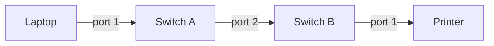

# Delivery Across One Local Network

**Part:** Part I — From Signals to Local Networks

**Concept Level:** Level 2, per concept-graph.md

**Prerequisites:** Chapter 3 (frame, header, encapsulation)

**New concepts introduced:** network interface, MAC address, Ethernet and Wi-Fi, shared medium, switch, forwarding table, broadcast

---

## Opening Question

*Once messages have boundaries, how do they reach the correct device on a local network?*

## Real-World Story

A large apartment building has one shared mailroom where every piece of mail for every resident first arrives. On day one, the mail carrier has no idea which mailbox slot belongs to which apartment; a new building attendant starts by literally holding up each envelope and asking, out loud, in the lobby, "does anyone here live at 4B?" — until whoever's listening for that number claims it. That's slow and disruptive, but it works, and it only has to happen for names or apartments the attendant hasn't encountered yet.

After a few days on the job, the attendant has learned, purely from watching who claims what, that 4B is the door at the end of the third-floor corridor, 2A is the first door on the second floor, and so on. Now, most envelopes get walked straight to the right corridor without any shouting in the lobby. The attendant never memorized a master list from building management, and never asked residents to fill out a registration form; the mapping from name to location was learned entirely from observing real deliveries and where they were claimed.

This is a strikingly close model for how devices on a local network actually find each other. There is no central authority that hands out a master map of "this device is over there." A local network's equipment learns where each device physically is, in the same incremental, observation-based way the mailroom attendant did: by watching which direction traffic comes from and where it gets claimed, and remembering that for next time.

## Worked Example

A small office has two switches connecting three devices: a laptop plugged into the first switch, and a printer plugged into the second switch, with the two switches connected to each other by a cable. Neither switch has been powered on before; both are starting with nothing learned yet.

The laptop sends a print job addressed to the printer's link-layer address. The first switch receives this frame on the port the laptop is connected to. It has never seen a frame from the laptop before, so it makes a note: this specific link-layer address lives out that port. But it has no idea yet where the printer's address lives — it hasn't learned that yet — so, lacking any better option, it does the equivalent of the mailroom attendant's opening-day shout: it sends a copy of the frame out every other port it has, except the one it arrived on. This is a **broadcast**-like flood, not a targeted delivery; the switch is deliberately over-delivering because it doesn't yet know enough to be precise.

That flood reaches the second switch, which learns something from it too: the laptop's address arrives from the direction of the first switch, so it makes the same kind of note. The second switch also doesn't know where the printer lives yet, so it floods the frame out its own remaining ports — including the one the printer is actually plugged into. The printer receives the frame, recognizes the destination address as its own, and processes the print job.

Now the printer sends a reply, addressed back to the laptop. The second switch receives this on the printer's port and learns, for the first time, exactly where the printer's address lives: right there, on that port. It also already knows, from a moment ago, that the laptop's address lives out the port toward the first switch — so instead of flooding this reply everywhere, it sends it precisely out that one port. The first switch receives it, and it, too, now learns where the printer's address lives: out the port toward the second switch. It already knew where the laptop was, from the very first frame, so it delivers this reply directly, with no flooding at all.

Within a single request-and-reply exchange, both switches went from knowing nothing to having learned exactly where both devices live, purely by watching real traffic pass through and noting which port each address arrived from. No switch was told this information in advance; nothing outside the traffic itself taught them anything.

## Core Intuition

A switch does not start out knowing where anything on its network is. It learns, purely by observing which port each frame's source address arrives on, and it forwards, whenever possible, only out the specific port a destination has already been observed on. When it hasn't learned a destination's location yet, it falls back to flooding the frame out every other port, the same over-broad, ask-everyone approach the mailroom attendant used before learning the building's layout. Precision replaces flooding gradually, as more real traffic is observed, not all at once.

## Technical Explanation

A **network interface** is the point where a device physically connects to a network — a laptop's Wi-Fi radio, a printer's Ethernet port. Every network interface that participates in a local network has a **MAC address**: a link-scoped identifier, assigned to that specific interface, used to address frames (Chapter 3) to a particular device on that one local network. "Link-scoped" is the operative phrase: a MAC address is meaningful for delivery purposes only within the local network the interface is directly connected to — it plays no role in identifying a device to the wider Internet, a distinction the next several chapters will make increasingly important.

**Ethernet** and **Wi-Fi** are the two most common technologies actually used to build a local network's physical links and framing, one typically over cable, the other over radio. Despite the very different physical media involved (Chapter 2), both ultimately deliver frames addressed by MAC address within one local network, and this chapter's model of learning and forwarding applies to both. Wi-Fi additionally involves a **shared medium**: unlike a switch's individual cabled ports, every device connected to the same wireless access point is, at the radio level, transmitting into and listening on the same shared airspace, which introduces coordination problems (avoiding multiple devices transmitting at the exact same instant) that cabled Ethernet mostly avoids by giving each device its own dedicated wire.

A **switch** is the device responsible for delivering frames within a local network, using exactly the learn-then-forward behavior demonstrated in the worked example. A switch maintains a **forwarding table**: a record mapping observed MAC addresses to the specific port they were last seen arriving from. Before a switch has learned where a given destination address lives, or when a frame is genuinely meant for every device on the network at once, it falls back to **broadcast**-style flooding, sending a copy out every port except the one the frame arrived on.

| Forwarding table | Before any traffic | After the print job and its reply |
|---|---|---|
| First switch | (empty) | laptop → port 1; printer → port 2 (toward second switch) |
| Second switch | (empty) | laptop → port 1 (toward first switch); printer → port 2 |

*Alt text: A simple local-network topology showing a laptop connected to Switch A's port 1, Switch A connected to Switch B via Switch A's port 2, and Switch B connected to a printer on its port 1 — the path a frame travels between laptop and printer, learned incrementally rather than known in advance.*

## Packet-Journey Checkpoint

Before the café visitor's HTTPS request can go anywhere beyond the building, it first has to cross the café's own local network: from the laptop's Wi-Fi interface, over the shared wireless medium, to the café's access point, and from there through whatever switches connect that access point to the café's router. Every one of those local hops is governed by exactly this chapter's mechanism, MAC addresses and switch forwarding, learned from observed traffic rather than configured in advance, regardless of how many more layers this book will stack on top of it before that request actually leaves the building.

## Common Misconceptions

### *"A switch and a router are interchangeable."*

**Why it's wrong:** Both are small boxes with several cable ports that "connect devices," which makes them easy to treat as the same kind of thing, especially since consumer home equipment often bundles both jobs into one physical box.

**Correct intuition:** A switch delivers frames within one local network using link-scoped MAC addresses, exactly as this chapter describes; a router, covered starting in Part II, connects separate networks to each other using a completely different addressing scheme. They solve different problems, even when packaged in the same case.

**Analogy:** The mailroom attendant routes mail within one building using apartment-to-corridor knowledge; getting a letter to a different building entirely is a different job, requiring different information, even if the same person happens to also handle both.

### *"Switches normally inspect IP addresses to forward Ethernet frames."*

**Why it's wrong:** Because IP addresses are the more commonly discussed identifier in everyday conversation, it's natural to assume they're what everything, including local delivery, is based on.

**Correct intuition:** A switch's forwarding decisions in this chapter are based entirely on MAC addresses and its own learned forwarding table; IP addresses, introduced starting in Chapter 6, belong to a separate layer that a basic switch does not need to examine at all to do its job.

**Analogy:** The mailroom attendant delivers based on apartment number, not on the resident's passport number — a different, unrelated identifier that happens to also uniquely identify the person, just not one relevant to this particular delivery job.

### *"A MAC address identifies a person or permanently identifies a device worldwide."*

**Why it's wrong:** Because a MAC address is often described as "unique," it's tempting to treat it as a stable, permanent, globally meaningful identity, similar to a serial number.

**Correct intuition:** A MAC address identifies a network interface for delivery purposes within one local network; it says nothing about who owns or operates that device, it is not meaningful for addressing beyond the local network, and on many modern devices it can be randomized or reassigned rather than being a fixed, lifelong identity.

**Analogy:** An apartment number identifies where mail should go within one building; it says nothing about who currently lives there, and the same number is reused by a completely different resident once someone moves out.

### *"Wi-Fi removes the need for link-layer rules."*

**Why it's wrong:** Because there's no visible cable and no visible switch involved, it's easy to imagine wireless connections as somehow simpler or exempt from the addressing and forwarding concepts that apply to wired networks.

**Correct intuition:** Wi-Fi devices still use MAC addresses, still rely on an access point performing switch-like delivery, and additionally have to coordinate access to a shared radio medium that wired Ethernet's individual cabled ports mostly avoid needing.

**Analogy:** Talking on a shared radio channel still requires callsigns and turn-taking rules; removing the physical wire doesn't remove the need for an agreed way to address and coordinate who's talking to whom.

## Practical Implications

Understanding that switches learn incrementally, rather than being pre-configured with a full map, explains a familiar real-world symptom: a newly connected or recently changed device can be briefly unreachable, or a network can seem to "flood" traffic right after a topology change, simply because forwarding tables haven't caught up yet. It also clarifies why "the network is slow" complaints inside one building are usually about something other than the switches themselves; local delivery, once learned, is close to the fastest, least complicated part of the entire journey a message will make.

## Key Takeaway

**A local network delivers frames by using link-scoped identifiers and forwarding decisions that matter only on that link.**

## What to Remember

- A network interface is a device's physical connection point to a network; a MAC address identifies that interface for delivery purposes within one local network only.
- Ethernet and Wi-Fi both deliver MAC-addressed frames within a local network, despite using very different physical media.
- A switch learns which MAC addresses live behind which port purely by observing real traffic, building a forwarding table incrementally.
- Before a switch has learned a destination's location, it floods the frame out every other port, the same broad, ask-everyone fallback the mailroom attendant used before learning the building.
- A switch and a router solve different problems: link-scoped delivery within a network, versus connecting separate networks, even when bundled into the same physical device.
- A MAC address is not a permanent, globally meaningful identity — it's a link-scoped label, sometimes even randomized on modern devices.

## The Next Obvious Question

*If switches can connect local devices, why not build one enormous local network?*

---

**Glossary terms added this chapter:** network interface, MAC address, Ethernet, Wi-Fi, shared medium, switch, forwarding table, broadcast → append to `/glossary.md`

**Misconceptions logged this chapter:** `switch-router-same-job`, `mac-permanent-global-identity` → already seeded in `/misconceptions.md`

**Concept-graph entries checked off:** network-interface, mac-address, ethernet-wifi, shared-medium, switch, forwarding-table, broadcast → update `/concept-graph.yaml`, regenerate `/concept-graph.md`

**Diagrams used this chapter:** topology (one) plus one plain-markdown forwarding-table state snapshot (not a Mermaid diagram, doesn't count against the two-diagram limit)
