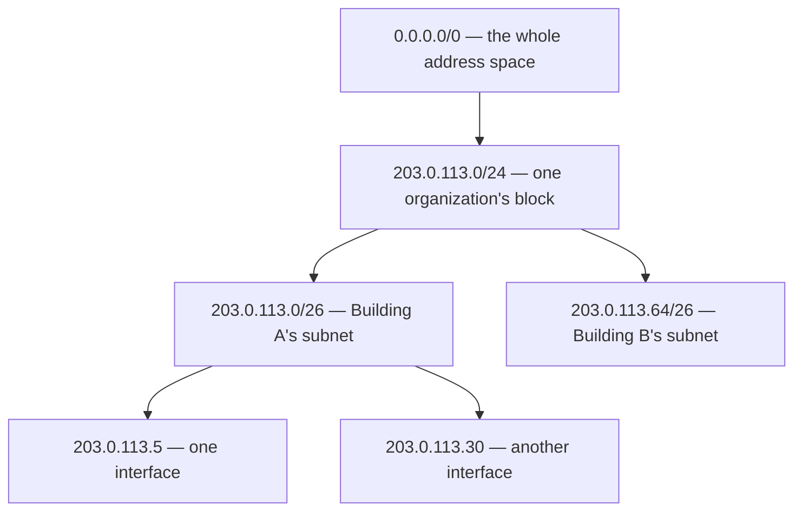

# Addresses That Describe Where to Route

**Part:** Part II — Building an Internet

**Concept Level:** Level 3, per concept-graph.md

**Prerequisites:** internetwork (Ch. 5), header and payload (Ch. 3)

**New concepts introduced:** IP packet, IPv4, IPv6, address, prefix, subnet, network and host portions, hierarchical allocation

---

## Opening Question

*If many local networks exist, how can a destination be identified across them?*

## Real-World Story

A package addressed simply "Marcus, Apartment 4B" makes sense inside one building — there's exactly one 4B, and the doorman knows where it is. Mail it from another country, though, and "Apartment 4B" alone is useless. It only starts to work again once it's wrapped in more context: country, then city, then street, then building number, then apartment. Each layer of that address narrows the search. A sorting facility in another country doesn't need to know who Marcus is, or even that apartment 4B exists — it only needs to read the country, route the parcel toward that country's postal system, and let the next facility down the chain worry about the next, more specific layer.

Nobody designed the world's postal systems around a single global list mapping every person's name to their exact location. That would be unworkable — a single point of failure, updated by nobody in particular, searched linearly for every letter. Instead, addresses are hierarchical: coarse information first, progressively finer information as the parcel gets closer to its destination. A facility only ever needs to understand the part of the address relevant to its own job.

Chapter 5 established that the Internet is many separately bounded local networks connected by an internetworking mechanism, not one giant flat network. That raises an immediate problem: MAC addresses, from Chapter 4, only mean something within one local network. A switch's forwarding table has no entry for a device on a network on the other side of the planet, and it never will — MAC addresses aren't organized by location, so there'd be no way to even guess which direction to send a frame toward. Getting a message across many networks needs an addressing scheme built the way postal addresses are: hierarchical, so a piece of it can be read and acted on without understanding the whole thing.

## Worked Example

Consider two IPv4 addresses: `192.168.1.42` and `192.168.1.107`. Both start with the same first three numbers — `192.168.1`. That shared prefix isn't decoration; it's a claim that both addresses belong to the same network, the same way "same street" is a claim two postal addresses can share. A device holding an address of `192.168.1.1` can look at a destination address of `192.168.1.42` and immediately tell, without asking anyone, that the destination shares its network — the equivalent of "same building." It can also look at `203.0.113.9` and tell that this destination does *not* share its network — the equivalent of "different country entirely" — without needing to know a single further detail about where `203.0.113.9` actually lives.

This is written formally as `192.168.1.0/24`: the `/24` says the first 24 bits (three of the four 8-bit numbers) are the shared **prefix** — the "which network" part — and the remaining 8 bits are free to vary within that network, identifying individual interfaces. This is a **subnet**: a block of addresses sharing one prefix, treated as one local network for addressing purposes. The prefix is the **network portion**; what's left is the **host portion**.

IPv6 addresses work by the same hierarchical logic, just with a much larger address and a different customary split. An IPv6 address like `2001:db8:85a3::8a2e:370:7334` written with a `/64` prefix means the first 64 bits identify the network, leaving a full 64 bits — vastly more than IPv4's typical 8 or 16 — for the host portion within that one subnet. The notation and exact bit-widths differ, but the underlying idea is identical: a shared prefix means "same local network," and everything outside the prefix is free to vary within it.

Now extend the postal analogy one step further, the way real address hierarchies actually nest. A `/24` isn't a fixed atomic unit; it's just one address block at one useful granularity, the way "street" is one useful granularity of a postal address. Blocks can themselves be grouped into larger blocks with shorter, less specific prefixes — a `/16` contains 256 different `/24`s, the way a country contains many cities. An organization that's been allocated a `/16` can subdivide it into `/24`s and hand different ones to different departments or buildings, each of which can be treated, from outside, as one single, more coarsely described block. Nothing on the wider Internet needs to know that block is further subdivided internally — it only needs to route toward the `/16` as a whole, exactly the way an international sorting facility only needs to route toward a country, not toward a specific apartment.

## Core Intuition

An IP address isn't a name tag glued onto a device. It's a piece of hierarchical, structured information — like a postal address — where a shared prefix means "reachable via the same path so far," and that prefix can be read and acted on without understanding or caring about anything more specific than what's needed at that point in the journey.

## Technical Explanation

The unit this chapter introduces is the **IP packet** — the fundamental thing that moves between networks (as opposed to the frame, which only ever moves across one link). Like a frame, a packet is built from encapsulation (Chapter 3): a header holding addressing and control information, wrapped around a payload. Unlike a frame, an IP packet's header is meant to remain meaningful all the way from source to destination, potentially crossing dozens of separately owned networks, where a frame's header is only ever meaningful across one hop.

Two versions of the Internet Protocol are in active use today, and this book treats them as two dialects of the same idea rather than an old protocol and its replacement. **IPv4** addresses are 32 bits, conventionally written as four decimal numbers separated by dots (`192.168.1.42`), giving about 4.3 billion possible addresses — a number that felt enormous in the 1980s and has been under real pressure for decades since. **IPv6** addresses are 128 bits, written as eight groups of hexadecimal digits separated by colons (with runs of zeros abbreviatable using `::`), giving a number of possible addresses large enough that per-device exhaustion isn't a realistic concern. Both versions organize their address space the same hierarchical way: a **prefix** (written as `/N`, meaning the first N bits) identifies the network, and what remains identifies a specific interface within it.

A **subnet** is the practical unit this creates: a contiguous block of addresses, described by one prefix, that's treated as one local network for addressing and routing purposes — typically corresponding to one broadcast domain from Chapter 5. The **network portion** (the prefix bits) tells you which subnet an address belongs to; the **host portion** (everything after the prefix) distinguishes individual interfaces within that subnet.

The most important consequence of this structure is **hierarchical allocation**. Large address blocks are allocated to regional registries, which allocate smaller blocks to ISPs, which allocate smaller blocks still to organizations, which subdivide further into individual subnets for individual local networks. At every level, the party responsible only needs to route packets toward the correct next block — verifying a destination's prefix matches, then handing it further down the chain — without knowing anything about how blocks are organized inside a level below it. This is precisely the property that let Chapter 5's giant flat network problem be solved: instead of one global system needing a complete, current map of every single device, each level only needs to understand blocks one step more specific than its own.

*Alt text: A tree diagram showing address hierarchy narrowing from the entire address space, to one organization's allocated block, to two subnets carved from that block, to individual host addresses within one subnet — each level only needing to distinguish the blocks one step more specific than itself.*

It's worth being precise about what a prefix does and doesn't establish. Sharing a prefix means two addresses are administratively grouped as one local network — nothing more. It says nothing about physical proximity (a `/24` can span a single room or, with the right underlying links, a much larger area), and it says nothing about reachability from the wider Internet. Many addresses, especially blocks like `192.168.0.0/16`, `10.0.0.0/8`, and `172.16.0.0/12` in IPv4, are set aside by convention as **private** — meaningful and unique only within one organization's own network, and not something the wider Internet knows how to route toward at all. Chapter 16 covers what happens when a device with a private address needs to reach something outside its own network. For now, the important fact is only that not every valid-looking address is globally reachable — an address's scope is a separate fact from its structure.

## Packet-Journey Checkpoint

The laptop from Chapter 1, sitting in the café, hasn't yet been given an address of its own — that's Chapter 7's problem. But once it has one, that address will need to encode which network the laptop is considered part of (the café's local network, some `/24` or `/64` the café's router has been allocated) as a prefix, so that later, when the laptop sends a packet toward `example.net`, both the laptop and every router along the way can tell at a glance whether the destination shares the laptop's own local network or lies somewhere else entirely — the first, most basic routing decision every one of those packets will need to make.

## Common Misconceptions

### *An IP address permanently identifies one machine.*

**Why it's wrong:** Consumer intuition treats an IP address like a fixed serial number, similar to how a MAC address is sometimes (also incorrectly, per Chapter 4) imagined to work.

**Correct intuition:** An IP address identifies an interface's position within a routing hierarchy, at a point in time. The same physical device can be assigned a different address after reconnecting to a network, can share one public address with many other devices via translation (Chapter 16), and can hold entirely different addresses on different interfaces.

**Analogy:** A postal address identifies a location within a hierarchy of regions, not a specific person — someone moving apartments gets a new address without becoming a different person.

### *A subnet is just an administrative label.*

**Why it's wrong:** "Subnet" sounds like organizational vocabulary — team boundaries, departments — rather than something a packet's routing actually depends on.

**Correct intuition:** A subnet's prefix is load-bearing routing information. Every device and router along a packet's path uses that prefix to decide whether a destination is local or must be forwarded elsewhere (Chapter 8 covers exactly how). Get the prefix wrong, and packets get misrouted or dropped — this is not a cosmetic label.

**Analogy:** A ZIP code isn't decoration on an envelope; sorting machines read it mechanically to route the letter, without ever reading the name on the address.

### *IPv6 is just IPv4 with more digits.*

**Why it's wrong:** Both use the prefix/host-portion structure and dotted-or-grouped notation, which can make IPv6 look like a cosmetic size upgrade.

**Correct intuition:** IPv6's vastly larger address space changes real design decisions downstream — how addresses get assigned (Chapter 7's SLAAC has no real IPv4 equivalent), how translation pressure works (Chapter 16), and how fragmentation is handled (Chapter 10). Treating IPv6 as "IPv4 but longer" will produce wrong mental models later in the book.

**Analogy:** A ten-digit phone number and a two-digit extension aren't just "longer and shorter versions of the same thing" — the ten-digit number's structure (area code, exchange) enables routing decisions a two-digit extension never needs to make.

## Practical Implications

Reading a CIDR block like `10.4.0.0/22` in an architecture diagram or cloud console should immediately answer two questions: how many addresses does this block contain (a `/22` leaves 10 host bits, so 1,024 addresses), and is it meant to be globally reachable (a `10.0.0.0/8`-derived block is private by convention, so no, not without translation). Subnet sizing decisions — how large a `/N` to carve out for one application tier, one team, one availability zone — are hierarchical-allocation decisions with the same trade-off postal systems face: too coarse a grant wastes address space, too fine a grant runs out and forces a disruptive re-allocation later.

## Key Takeaway

**An IP address is useful for routing because its prefix places an interface within a hierarchical address space.**

## What to Remember

- IP packets, unlike link-layer frames, are meant to stay meaningful across many networks and hops, not just one link.
- IPv4 addresses are 32 bits; IPv6 addresses are 128 bits; both use a shared prefix to mean "same local network."
- A subnet is a block of addresses sharing one prefix, generally corresponding to one broadcast domain.
- Hierarchical allocation lets each level of the Internet route toward a block one step more specific than its own, without needing a complete global map.
- Sharing a prefix says nothing about physical proximity, and having a valid-looking address says nothing about global reachability — some blocks are private by convention.
- IPv6 is not "IPv4 with more digits" — its scale changes real downstream mechanisms, not just notation.

## The Next Obvious Question

*How does a newly connected device learn its address and its way out?*

---

**Glossary terms added this chapter:** IP packet, IPv4, IPv6, address, prefix, subnet, network portion, host portion, hierarchical allocation, private address (preview) → append to `/glossary.md`

**Misconceptions logged this chapter:** ip-permanently-identifies-machine, subnet-just-a-label, ipv6-is-ipv4-with-more-digits (in-chapter coverage; the first two mirror pre-seeded misconceptions.md rows, enriched below) → append to `/misconceptions.md`

**Concept-graph entries checked off:** ip-packet, ipv4-ipv6-address, prefix-and-subnet, network-host-portion, hierarchical-allocation → update `/concept-graph.yaml`, regenerate `/concept-graph.md`

**Diagrams used this chapter:** topology (address-hierarchy tree, Mermaid)
