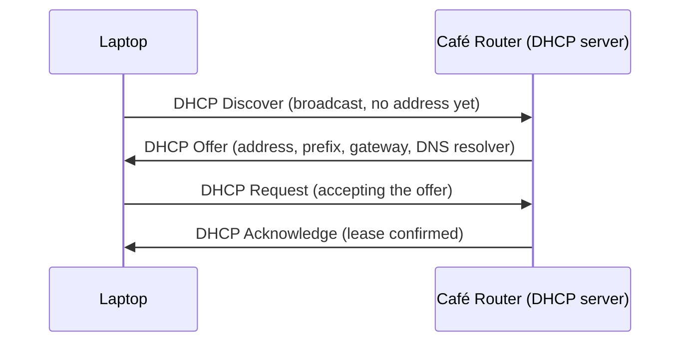

# Joining a Network

**Part:** Part II — Building an Internet

**Concept Level:** Level 3, per concept-graph.md

**Prerequisites:** IPv4/IPv6 address, prefix and subnet (Ch. 6)

**New concepts introduced:** interface configuration, DHCP, SLAAC, default gateway, DNS resolver address, lease, local configuration state

---

## Opening Question

*How does a newly connected device learn its address and its way out?*

## Real-World Story

A guest arrives at a large conference with nothing but a name. Before she can participate in anything, she needs a badge (proof of who she is on-site), a room assignment (where she's expected to be), a map (how the venue's layout works), and the help desk's phone number (who to ask when something doesn't make sense). None of this is printed anywhere until she checks in. Check-in is quick — a minute at a desk — but skipping it isn't an option; without it, she's physically present at the venue but functionally unable to do anything the conference actually offers.

A laptop joining a new network is in exactly this position. Chapter 6 explained what an IP address and prefix mean once a device has them, but a laptop arriving at a café for the first time has neither. It doesn't know its own address, doesn't know which prefix it belongs to, doesn't know which device on the local network can forward packets elsewhere, and doesn't know how to translate a name like `example.net` into an address at all. Being physically connected to the café's Wi-Fi — having a working link at the level Chapter 4 described — is necessary but nowhere near sufficient. Just like the conference guest, the laptop needs a fast, automatic check-in process before it can do anything useful.

## Worked Example

Picture the moment a phone joins a hotel's guest Wi-Fi for the first time, and follow, in order, what has to happen before it can load any actual webpage.

First, the phone needs its own address and prefix — the specific things Chapter 6 explained the *meaning* of, but not how a device actually acquires. Second, it needs to learn which local device is responsible for forwarding traffic destined anywhere outside the hotel's own network — its **default gateway**. Third, it needs the address of a **DNS resolver**, a service that (Chapter 17 will cover in full) turns names into addresses, without which typing `example.net` into a browser goes nowhere. All three of these are pieces of **local configuration state**: facts specific to this network, at this moment, that the phone needs but doesn't inherently know.

For IPv4, this typically happens through **DHCP** (Dynamic Host Configuration Protocol): the phone broadcasts a request onto the local network the instant it associates with the Wi-Fi, and a DHCP server — often built into the hotel's router — replies with an address, a prefix, a default gateway, and DNS resolver addresses, all bundled into one exchange. That address comes with a **lease**: a fixed period of time it's valid for, after which the phone needs to check back in and either renew it or receive a different one. Leases exist because address blocks are finite and shared — a phone that leaves the hotel and never returns shouldn't permanently tie up an address nobody's using.

IPv6 offers a second path to the same goal that has no real IPv4 equivalent: **SLAAC** (Stateless Address Autoconfiguration). Instead of asking a server for an address and waiting for a reply, the phone listens for router advertisements the local router sends out periodically, learns the network's prefix from them, and *constructs* its own address by combining that prefix with a value it derives itself (historically drawn from its network interface, more commonly today randomized for privacy). No server keeps a table of who currently holds which address; there's nothing centrally maintained to run out of, lease, or renegotiate — a "stateless" configuration in the sense that no per-device state has to be tracked anywhere to make it work. A single modern network often runs both mechanisms side by side: SLAAC handling address construction, with DNS resolver information delivered separately — either tucked into the same periodic router advertisement SLAAC already listens to, or through a DHCPv6 exchange run alongside it. Address autoconfiguration and DNS-resolver delivery are genuinely separate jobs; SLAAC only ever does the first one.

## Core Intuition

Before a device can use a network, it needs to acquire, on the fly, a small bundle of facts specific to that network — an address, a way out, and a way to resolve names — and it gets that bundle either by explicitly asking a server for it (DHCP) or by listening for a periodic public announcement and deriving its own address from it (SLAAC). Either way, this is a distinct, necessary step that happens before any application traffic can be sent at all.

## Technical Explanation

**Interface configuration** is the general term for the set of facts a network interface needs before it can meaningfully participate in a network: an address and prefix (Chapter 6), a default gateway, and typically a DNS resolver address. None of these is inherent to the device — a laptop carries no built-in knowledge of any specific network it might someday join.

**DHCP** operates as a request-and-reply exchange. A device broadcasts a discovery message onto the local network (it has no address yet, so it can't send anything targeted); a DHCP server — commonly integrated into a home router, but potentially a dedicated server on a larger network — replies with an offer containing an address, prefix, default gateway, DNS resolver address, and a lease duration. The device requests that specific offer, and the server acknowledges it, at which point the address is usable. The DHCP server maintains a table mapping which addresses are currently leased to which devices, freeing an address back into its pool once its lease expires without renewal — this table is exactly the kind of tracked, per-device state SLAAC is built to avoid needing.

**SLAAC**, IPv6's stateless path, works differently: the local router periodically multicasts a router advertisement containing the network's prefix (and, often, its own address, serving double duty as the eventual default gateway announcement). A device that hears this advertisement combines the announced prefix with a self-generated interface identifier to construct a complete address, without needing to ask permission or wait for a reply from anything. Because no server is keeping a lease table, the same address can technically be constructed independently, in principle, by more than one device — in practice, a device performs a quick "is anyone already using this?" check (Chapter 8's Neighbor Discovery makes an appearance here) before considering the address safely its own.

The **default gateway** is the address of the local device — almost always a router — that a host should hand a packet to whenever the destination lies outside its own subnet. This chapter only introduces what the gateway *is*; Chapter 8 covers how a host actually determines, per packet, whether the destination counts as local or needs the gateway at all, and how it then reaches that gateway at the link layer. A **DNS resolver address** is simply the address of a service the device will query later, when it needs to turn a name into an address (Chapter 17) — interface configuration hands the device this address without yet explaining what it's used for.

*Alt text: A four-message sequence diagram showing a laptop broadcasting a DHCP discovery request with no address of its own, the café router offering configuration details, the laptop requesting that specific offer, and the router acknowledging it — completing before any application data is sent.*

## Packet-Journey Checkpoint

This is the exact moment the laptop from Chapter 1 becomes usable at the café. Having associated with the Wi-Fi at the link layer (Chapter 4), it now runs DHCP (or SLAAC, if the café's network is IPv6-enabled) to obtain an address, a prefix telling it which addresses count as "the café's local network," a default gateway to send everything else through, and a DNS resolver address it will need the moment it tries to resolve `example.net`. Only after this exchange completes does the laptop have anything it needs to send a single packet toward the actual website.

## Common Misconceptions

### *Connecting to Wi-Fi means Internet access is already complete.*

**Why it's wrong:** The visible step — selecting a network name and entering a password — feels like the whole process, especially since DHCP usually completes in well under a second.

**Correct intuition:** Wi-Fi association is a link-layer event (Chapter 4); it says nothing about whether the device has usable interface configuration yet. A device can be fully associated with a Wi-Fi network and still have no address, no gateway, and no way to resolve a single name until DHCP or SLAAC completes.

**Analogy:** Walking through a conference venue's front doors isn't the same as checking in at the registration desk — you're physically present, but not yet equipped to participate.

### *DHCP carries ordinary application traffic.*

**Why it's wrong:** DHCP is easy to imagine as part of the "getting online" pipeline application traffic flows through, especially since it happens automatically and invisibly right before browsing starts working.

**Correct intuition:** DHCP is a distinct, self-contained local exchange whose entire purpose is handing over configuration facts. Once it completes, it's finished — no application data passes through it, and it doesn't run again until the lease needs renewing.

**Analogy:** Checking in at a conference registration desk isn't part of any talk or session itself; it's a separate, prerequisite step that happens once and is then simply done.

### *The default gateway is used for every destination.*

**Why it's wrong:** Since the gateway is described as "the way out," it's tempting to assume all outbound traffic passes through it.

**Correct intuition:** The gateway is only used for destinations outside the device's own subnet. Chapter 8 covers exactly how a device decides, per packet, whether a destination is local (handled directly, no gateway involved) or remote (sent to the gateway).

**Analogy:** A hotel's guest-services desk is the way to reach the outside world (booking a taxi, forwarding a package) — nobody uses it to walk to the room next door.

## Practical Implications

When a device "can't get online" despite showing a connected Wi-Fi icon, interface configuration is one of the first places a systematic diagnosis (Chapter 29 formalizes this fully) should look — a link-layer connection with no address, a stale lease, or a missing DNS resolver address all look identical to a user staring at a spinning browser tab. In network design, DHCP scope sizing and lease duration are direct, practical trade-offs from this chapter's material: short leases return unused addresses to the pool faster on a network with high device turnover (a café, an airport), at the cost of more frequent renewal traffic.

## Key Takeaway

**Before sending useful traffic, a host needs enough local configuration to identify itself, recognize nearby destinations, and choose a path outward.**

## What to Remember

- A device arriving at a network has no inherent knowledge of that network's address, prefix, gateway, or DNS resolver — all of it is acquired on the fly.
- DHCP is a request-and-reply exchange with a server that hands out addresses (with a time-limited lease) and other configuration in one bundle.
- SLAAC (IPv6) is stateless: a device constructs its own address from a router-advertised prefix, with no server tracking who holds what.
- Many networks run both simultaneously — SLAAC for IPv6 address construction, with DNS resolver information delivered either through the same router advertisement or through a separate DHCPv6 exchange.
- The default gateway is only used for destinations outside the device's own subnet, not for every packet.
- Wi-Fi association (link layer) and interface configuration (this chapter) are separate steps — completing one doesn't imply the other is done.

## The Next Obvious Question

*Once it knows the destination and gateway, how does it reach the next device on the local link?*

---

**Glossary terms added this chapter:** interface configuration, DHCP, SLAAC, default gateway, DNS resolver address, lease, local configuration state → append to `/glossary.md`

**Misconceptions logged this chapter:** wifi-connected-means-internet-complete, dhcp-carries-app-traffic, gateway-used-for-every-destination (in-chapter coverage, no pre-seeded registry row for Ch. 7) → append to `/misconceptions.md`

**Concept-graph entries checked off:** interface-configuration, dhcp, slaac, default-gateway, dns-resolver-address, dhcp-lease → update `/concept-graph.yaml`, regenerate `/concept-graph.md`

**Diagrams used this chapter:** sequence (DHCP discover/offer/request/acknowledge, Mermaid)
