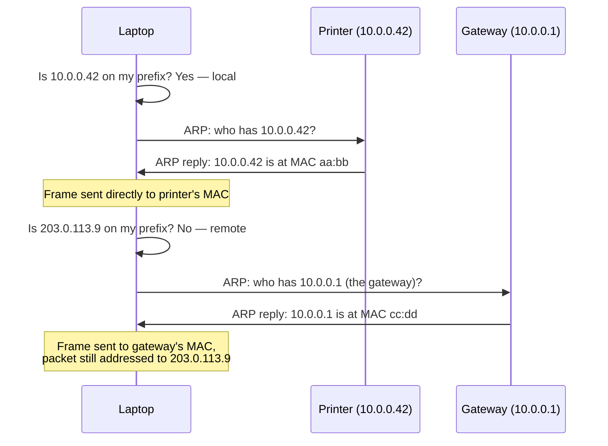

# Finding the Next Device

**Part:** Part II — Building an Internet

**Concept Level:** Level 3, per concept-graph.md

**Prerequisites:** default gateway (Ch. 7), MAC address (Ch. 4), IPv4/IPv6 address (Ch. 6)

**New concepts introduced:** next hop, local-versus-remote decision, ARP, Neighbor Discovery, neighbor cache, address resolution

---

## Opening Question

*Once it knows the destination and gateway, how does it reach the next device on the local link?*

## Real-World Story

Knowing a colleague works in "Suite 400" of a large office building doesn't get a courier to her desk. Suite 400 has to actually be found: which floor, which door, which hallway, which specific office within the suite. The building's directory gives a room number; someone still has to physically locate that room and knock on its door. A room number and a physical location are two different kinds of information, resolved by two different means, and a courier needs both before delivery can actually happen.

Chapter 6 explained what IP addresses and prefixes mean, and Chapter 7 got a device its own address plus the address of its default gateway. But an IP address, like a room number, isn't something a physical link can act on directly. Chapter 4 established that frames move across a link using MAC addresses — link-scoped identifiers, nothing to do with IP addresses at all. So a device holding an IP address for its next hop — whether that's a same-subnet destination or the default gateway — has exactly the courier's problem: it knows *where*, in IP terms, but has no way yet to actually reach that device across the physical link it's sitting on.

## Worked Example

Follow one packet to a local printer and a second packet to a remote website, sent moments apart from the same laptop, and watch where their paths diverge.

**To the printer**, on the same subnet: the laptop compares the printer's IP address against its own prefix (from Chapter 6, this is a direct comparison — does the printer's address share my network portion?) and finds a match. The destination is local. The laptop now needs the printer's MAC address to actually frame the packet, so it broadcasts a request onto the local network: *whoever has this IP address, tell me your MAC address.* The printer, recognizing its own address in the request, replies directly with its MAC address. The laptop now has everything needed to build a complete frame — printer's MAC address as destination, packet as payload — and sends it.

**To the website**, at a remote IP address: the same prefix comparison this time finds no match — the address doesn't share the laptop's local prefix, so the destination is remote. Critically, the laptop does *not* attempt to resolve the website server's MAC address directly; a broadcast asking "whoever has this IP" would never reach a machine that isn't even on the same local network, and no reply would arrive if it somehow did. Instead, the laptop resolves the MAC address of its own default gateway — a local device, from Chapter 7's configuration — and frames the packet with the gateway's MAC address as the destination, even though the packet's IP header still names the far-away website as the ultimate destination. The gateway will receive that frame, strip it, and (Chapter 9 covers exactly how) decide where to forward the IP packet inside it next.

The two packets leave the laptop through the exact same network interface. What differs entirely is which device's MAC address gets resolved and placed in the frame — the actual destination for a local delivery, but only the next hop, the gateway, for anything remote.

## Core Intuition

An IP address tells a device *where*, in routing terms, a destination sits — but delivering an actual frame across one physical link always requires the *link-layer* address of whichever device sits at the other end of that specific link. For a local destination, that's the destination itself. For anything remote, it's only ever the next hop toward it — usually the default gateway — because link-layer addressing has no reach beyond one link.

## Technical Explanation

The **local-versus-remote decision** is the first thing that has to happen: given a destination IP address and the device's own prefix (Chapter 6), does the destination share that prefix? If yes, the destination is on the same local network, and its own MAC address is what needs to be resolved. If no, the packet needs to leave the local network, and the **next hop** — the device responsible for forwarding it onward, ordinarily the default gateway from Chapter 7 — is what actually needs its MAC address resolved, regardless of how far away the ultimate destination is.

**Address resolution** is the general name for turning an IP address into the MAC address needed to frame a packet toward it. IPv4 performs this with **ARP** (Address Resolution Protocol): a broadcast request asking, in effect, "who has this IP address?", answered directly by whichever device recognizes the address as its own. IPv6 performs the equivalent job with **Neighbor Discovery**, specifically its Neighbor Solicitation and Neighbor Advertisement messages — conceptually the same request-and-reply pattern, sent via IPv6 multicast rather than a link-layer broadcast, and built as part of the same protocol family that also supplies SLAAC's router advertisements from Chapter 7.

Both mechanisms are strictly **link-local**: a request only ever reaches devices on the same local network, and only ever produces a reply from a device that is actually present there. This is precisely why address resolution is never performed for a remote destination directly — there's no path for the request to even travel, let alone return an answer.

Resolved mappings are stored in a **neighbor cache** (ARP maintains its own cache; IPv6 Neighbor Discovery maintains an analogous one), so a device doesn't need to re-resolve the same address for every packet — a direct parallel to Chapter 4's switch forwarding table, though a neighbor cache maps IP addresses to MAC addresses rather than MAC addresses to switch ports. Cache entries expire after a period of disuse, since MAC addresses can change (a device gets replaced, a network card fails and is swapped) and stale entries would otherwise cause an unrecoverable delivery failure.

*Alt text: A sequence diagram contrasting two packets from the same laptop: one to a local printer, resolved and framed directly to the printer's own MAC address after ARP; one to a remote website, where only the default gateway's MAC address gets resolved and framed, while the IP packet inside still names the remote website as its ultimate destination.*

Notice what the gateway's MAC address resolution has in common with the printer's: both are ordinary ARP (or Neighbor Discovery) exchanges with a device on the *same local link* as the laptop. The gateway is never treated specially by the resolution mechanism itself — it's just the specific local device that happens to be the next hop for anything remote.

## Packet-Journey Checkpoint

The laptop's request toward `example.net` needs this chapter's mechanism the moment it's ready to send its very first packet. `example.net`'s IP address (once Chapter 17's DNS resolves it) will not share the café's local prefix, so the laptop resolves — via ARP or Neighbor Discovery — the MAC address of its own default gateway (learned back in Chapter 7), and frames that first packet to the gateway's MAC address, even though the IP header inside still names the far-away web server as its real destination.

## Common Misconceptions

### *ARP finds a remote server's MAC address across the Internet.*

**Why it's wrong:** Since ARP is what ultimately gets a packet toward a remote destination moving, it's easy to imagine it doing the resolution work for that remote destination directly.

**Correct intuition:** ARP (and Neighbor Discovery) only ever resolves addresses for devices on the same local link. For a remote destination, only the next hop's — usually the gateway's — MAC address is ever resolved.

**Analogy:** A courier doesn't personally locate a recipient three cities away; they hand the parcel to a local transfer point that's actually reachable, and that point handles the next leg.

### *An IP packet is sent without a link-layer frame.*

**Why it's wrong:** IP addressing feels like the "real" addressing, especially after Chapters 6-7's focus on it, making the frame around it feel like an afterthought.

**Correct intuition:** No IP packet ever travels across a physical link without being wrapped in a link-layer frame first (Chapter 3's encapsulation, applied here) — the frame's MAC addresses are what a link actually delivers on, every single hop.

**Analogy:** A letter never travels without an envelope, however carefully the letter itself is addressed.

### *The destination MAC address remains unchanged from source to destination.*

**Why it's wrong:** Since the destination *IP* address inside the packet stays the same for the whole journey, it's natural to assume the destination MAC address does too.

**Correct intuition:** The destination MAC address is rewritten at every hop, to always name whichever device is next on the current link — Chapter 9 shows this happening again at every router along a multi-hop path. Only the IP addresses inside the packet stay constant end to end (barring translation, Chapter 16).

**Analogy:** A relay racer's baton keeps the same "get this to the finish" purpose throughout the race, but at every handoff a *different* runner's hand is the immediate, correct one to place it in.

## Practical Implications

When a connection to a local device works but anything beyond the local network fails, checking whether the default gateway's MAC address actually resolves — versus the destination never being locally resolvable in the first place, which would be expected — separates a genuinely broken gateway from a normal, correct local-versus-remote decision. This local-versus-remote split is also exactly why moving a device to a different subnet, or misconfiguring its prefix, can silently break reachability to devices that used to be "local": the resolution mechanism used depends entirely on that one comparison.

## Key Takeaway

**IP identifies the intended network-layer destination, while each link separately resolves and reaches only the next local hop.**

## What to Remember

- Before framing a packet, a device decides whether the destination shares its own prefix (local) or not (remote).
- For a local destination, the destination's own MAC address is resolved and used.
- For a remote destination, only the next hop's (usually the default gateway's) MAC address is ever resolved — never the far-away destination's.
- ARP (IPv4) and Neighbor Discovery (IPv6) are both strictly link-local request-and-reply mechanisms.
- Resolved mappings are cached (a neighbor cache) so repeated resolution isn't needed for every packet.
- The destination MAC address changes at every hop; the destination IP address generally does not.

## The Next Obvious Question

*Once a router receives a packet, how does it choose the next hop?*

---

**Glossary terms added this chapter:** next hop, local-versus-remote decision, ARP, Neighbor Discovery, neighbor cache, address resolution → append to `/glossary.md`

**Misconceptions logged this chapter:** arp-finds-remote-machines (pre-seeded row, enriched below), ip-packet-sent-without-frame, destination-mac-unchanged-end-to-end (in-chapter coverage) → append to `/misconceptions.md`

**Concept-graph entries checked off:** next-hop, local-vs-remote-decision, arp, neighbor-discovery, neighbor-cache, address-resolution → update `/concept-graph.yaml`, regenerate `/concept-graph.md`

**Diagrams used this chapter:** sequence (local vs. remote ARP resolution, Mermaid)
