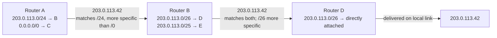

# One Hop at a Time

**Part:** Part II — Building an Internet

**Concept Level:** Level 4, per concept-graph.md

**Prerequisites:** next hop, address resolution (Ch. 8), prefix and subnet (Ch. 6)

**New concepts introduced:** router, forwarding, routing table, longest-prefix match, default route, data plane

---

## Opening Question

*Once a router receives a packet, how does it choose the next hop?*

## Real-World Story

A regional parcel-sorting center doesn't know a package's entire remaining journey the moment it arrives. A worker there doesn't trace out "this parcel needs to go to this exact address across the country, so I'll personally plan every remaining leg." Instead, they read the destination's region on the label and select the single best outbound truck for that region — maybe a truck heading toward a specific distant sorting center, maybe a general "everything else" truck heading toward the nearest major hub. That truck's destination sorting center will make its own next, similarly local decision when the parcel arrives there. Nobody at any single facility holds a complete route; the parcel's full path only exists as the sum of many independent, local, one-step decisions, each made by whichever facility currently holds it.

Chapter 8 got a packet as far as the laptop's default gateway — the first router on its path. That router is now facing exactly the sorting center's problem: it has one packet, addressed to some possibly-distant IP address, and it needs to decide, using only information it has locally, which direction to send it next.

## Worked Example

Trace one packet, addressed to `203.0.113.42`, through three routers whose tables partially overlap, and see exactly how each one picks its next hop.

**Router A** (the café's gateway) has a table with these entries, among others: a route for `203.0.113.0/24` pointing toward Router B, and a default route (covering everything, matched only when nothing more specific matches) pointing toward Router C, a different upstream connection. The destination `203.0.113.42` matches both — it falls within `203.0.113.0/24`, and it also falls within "everything." Router A picks the more specific match: `/24` is more specific than the default route's effective `/0`, so the packet goes to Router B, not Router C.

**Router B** has a table containing `203.0.113.0/26` (pointing toward Router D, not shown) and `203.0.113.0/25` (pointing toward Router E). The destination `203.0.113.42`, in binary, falls within both of these overlapping ranges — a `/25` and a `/26` covering the same starting address are nested, the smaller block entirely contained in the larger one. Router B again picks the more specific of the two matching entries: `/26` beats `/25`, so the packet goes toward Router D.

**Router D**, finally, has a direct route for `203.0.113.0/26` pointing out a local interface — the destination is now on a locally attached network, and delivery proceeds the way Chapter 8 described: the address is resolved, a frame is built, and the packet is delivered on that final link.

At no point did Router A, B, or D know about each other's tables, or about the packet's full remaining path. Each one looked at its own table, found every entry whose prefix matched the destination, and — this is the one consistent rule across all three — chose the *most specific* matching entry it had. The packet's actual route only exists as the trail these three independent, local decisions happened to produce.

## Core Intuition

A router doesn't know a packet's whole path. It knows a table of prefixes and which direction to send packets matching each one, and for every packet it makes exactly one decision: among all the entries whose prefix matches the destination, forward toward whichever one is the most specific.

## Technical Explanation

A **router** is a device that forwards IP packets between networks, using IP addressing rather than the MAC addressing a switch (Chapter 4) uses. Where a switch's forwarding table maps MAC addresses to output ports within one local network, a router's **routing table** maps address *prefixes* to next hops — a structural difference that matters because it lets one table entry cover an entire range of destinations rather than needing one entry per individual address.

**Forwarding** is the act of receiving a packet, consulting the routing table, and sending the packet out toward the chosen next hop — this per-packet, per-router work is what this book calls the **data plane** (a term that will matter more once Chapter 11 introduces the separate mechanisms that actually populate a routing table's entries in the first place). A routing table entry pairs a prefix with a next hop and, typically, the local interface to send the packet out of.

Because prefixes of different lengths can overlap — as the worked example showed, a `/24`, `/25`, and `/26` covering the same starting address all "contain" the same specific destination — a router needs a consistent rule for choosing among multiple matching entries. That rule is **longest-prefix matching**: among every entry whose prefix matches the destination address, the router always selects the one with the longest (most specific) prefix. A `/26` is preferred over a `/24` covering the same range, because a longer prefix describes a smaller, more precisely known set of destinations — matching the same logic Chapter 6 built up with hierarchical addressing, where more specific information should win whenever it's available.

A **default route** is a special table entry — commonly written as `0.0.0.0/0` for IPv4 or `::/0` for IPv6 — that matches every possible destination, but with the shortest possible prefix. Longest-prefix matching guarantees it is used only when nothing more specific matches: a router's "catch-all, send this somewhere reasonable if I don't have anything better" entry, exactly analogous to a sorting center's general truck for destinations it doesn't have a dedicated route for.

*Alt text: A left-to-right topology diagram showing one packet forwarded through three routers, each independently applying longest-prefix matching against its own routing table to choose the next hop, with no router aware of the full remaining path.*

## Packet-Journey Checkpoint

Every router between the café and `example.net`'s server — the café's own gateway, the café's ISP's routers, and every router further upstream — performs exactly this one-hop decision on the laptop's packet, independently and without any of them holding the packet's complete path. The packet's actual route across potentially a dozen or more hops is nothing more than the trail these independent longest-prefix-match decisions happen to produce.

## Common Misconceptions

### *The source chooses every router on the path.*

**Why it's wrong:** Applications sometimes talk about "connecting to" a server as if establishing one deliberate, pre-planned route, and address bars don't expose any of the routing happening underneath.

**Correct intuition:** The sending device only ever chooses its own default gateway (Chapter 7-8). Every router downstream makes its own independent forwarding decision from its own table — nothing upstream dictates or even knows the full path in advance.

**Analogy:** A letter-writer addresses an envelope and drops it in a mailbox; they don't personally route it through every subsequent sorting facility.

### *Each router knows the complete physical path.*

**Why it's wrong:** Since a packet reliably arrives, it's tempting to imagine some component held a map of the whole journey.

**Correct intuition:** No single router holds more than its own table, mapping prefixes to next hops. The complete path is an emergent trail of independent one-hop decisions, not something planned or known anywhere in full.

**Analogy:** No single sorting-center worker in the worked example above knew the parcel's full route — each only knew the single best next truck for the parcel's destination region.

### *A route names a full end-to-end circuit.*

**Why it's wrong:** "Route" sounds like a full, connected path — the kind a GPS app draws from origin to destination.

**Correct intuition:** A routing table entry is a single prefix-to-next-hop mapping, local to one router, saying nothing about anything beyond that router's own next hop.

**Analogy:** A single road sign pointing "Downtown →" isn't a complete map of every remaining turn to get there — it's one local decision point.

### *The default route is always the fastest route.*

**Why it's wrong:** "Default" can sound like "recommended" or "optimal," rather than what it actually is.

**Correct intuition:** A default route is simply the least specific possible match — used only because nothing more specific is available, not because it's been evaluated as fastest or best.

**Analogy:** A sorting center's general "everything else" truck isn't necessarily the fastest option for a given parcel — it's just where parcels go when no better, more specific route has been set up for them.

## Practical Implications

Reading a `traceroute` output (Chapter 29 covers this tool properly) as a list of independent, local forwarding decisions — rather than a pre-planned circuit — explains why a path can change between two runs of the same command, or differ for the return trip versus the forward trip: nothing about longest-prefix matching guarantees symmetry or stability, only that each hop, at the moment it's asked, makes the most specific decision its current table supports. When diagnosing "traffic isn't reaching subnet X," checking whether a route for that specific prefix actually exists in the relevant router's table — versus only a broader route that happens to also match — is a direct, practical application of this chapter's longest-prefix-match rule.

## Key Takeaway

**A router forwards a packet by making one local next-hop decision from the most specific route it currently knows.**

## What to Remember

- A router forwards IP packets between networks using a routing table that maps address prefixes to next hops.
- Forwarding is the per-packet act of consulting that table and sending a packet toward the chosen next hop — the data plane.
- When multiple table entries match a destination, longest-prefix matching always selects the most specific (longest-prefix) one.
- A default route matches everything but has the shortest possible prefix, so it's only ever chosen when nothing more specific matches.
- No router holds a packet's complete path — only its own table, applied one hop at a time.
- A packet's actual route is an emergent trail of independent, local decisions, not a pre-planned circuit.

## The Next Obvious Question

*What happens when the expected path fails or the packet cannot continue?*

---

**Glossary terms added this chapter:** router, forwarding, routing table, longest-prefix match, default route, data plane → append to `/glossary.md`

**Misconceptions logged this chapter:** routers-know-full-path (pre-seeded row, enriched below), source-chooses-every-router, route-is-full-circuit, default-route-always-fastest (in-chapter coverage) → append to `/misconceptions.md`

**Concept-graph entries checked off:** router, routing-table, longest-prefix-match, default-route, data-plane → update `/concept-graph.yaml`, regenerate `/concept-graph.md`

**Diagrams used this chapter:** topology (three-router longest-prefix-match forwarding chain, Mermaid)
