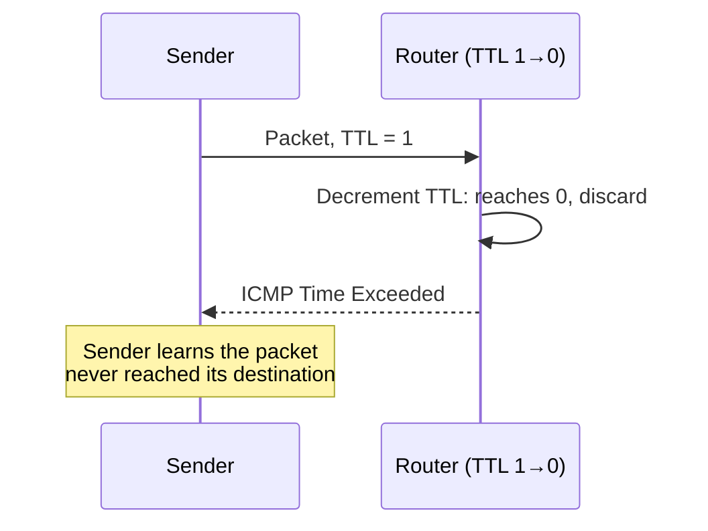

# Best Effort, Limits, and Failure Signals

**Part:** Part II — Building an Internet

**Concept Level:** Level 4, per concept-graph.md

**Prerequisites:** forwarding, routing table (Ch. 9), IP packet (Ch. 6)

**New concepts introduced:** best-effort delivery, TTL, Hop Limit, ICMP, MTU, Path MTU, fragmentation, packet loss

---

## Opening Question

*What happens when the expected path fails or the packet cannot continue?*

## Real-World Story

A courier company's standard terms are honest about what they actually promise: they will make a genuine attempt to deliver a parcel, using their best available route. They do not promise the parcel will arrive. They do not promise it will arrive only once. They do not promise it will be the first of several copies to arrive, if a mistake causes it to be sent twice. If a parcel is too large for a particular delivery van, they don't simply crush it to fit — they either use a different vehicle or refuse the shipment and say so. None of this makes the courier company unreliable in a meaningful sense; it makes their promise precise, and it means anyone who actually needs guaranteed, in-order, exactly-once delivery has to build that guarantee themselves, on top of the courier's honest best-effort service.

Every chapter so far has shown packets successfully reaching their next hop. But Chapter 9's picture — one router making one local decision, then handing off to the next — has an obvious gap: what if a router's table is wrong, or a link is down, or the packet is simply too big for the next link to carry? Chapter 5 already insisted the network be treated as fallible from the start; this chapter is where IP's actual contract for failure gets made explicit.

## Worked Example

Follow two packets that don't arrive cleanly, and see what actually happens to each.

**A routing loop.** Suppose a misconfiguration causes Router X to send packets destined for a certain prefix to Router Y, while Router Y's table sends packets for that same prefix back to Router X. A packet destined there bounces between X and Y indefinitely — with nothing to stop it, it would consume link capacity and router processing forever, for a destination it will never actually reach. Every IP packet carries a **TTL** (IPv4) or **Hop Limit** (IPv6) — a number, decremented by one at every router it passes through, regardless of how much time each hop actually took. When forwarding would decrement it to zero, the router discards the packet instead — and, to avoid that being a silent dead end, normally sends back an **ICMP** "Time Exceeded" message to the original sender, using the sender's address recorded in the packet's own header. The hop limit itself reliably stops the loop from consuming resources forever; whether the sender actually learns why is a separate question — assuming that ICMP message isn't filtered somewhere along its own way back, the sender finds out something went wrong instead of just waiting silently.

**An oversized packet.** Suppose a packet built where the **MTU** (Maximum Transmission Unit — the largest IP packet a link carries without IP-layer fragmentation) is large needs to cross a link with a smaller MTU. In IPv4 the router either splits it into smaller pieces (**fragmentation**) reassembled at the destination, or, if it's marked "don't fragment," drops it and returns an ICMP "Fragmentation Needed" message. IPv6 is firmer: routers never fragment in transit — an oversized packet is dropped with an ICMPv6 "Packet Too Big" message, leaving any fragmentation to the sender (the Technical Explanation returns to that). Same idea as the TTL case: a failure that would otherwise be silent produces an explicit signal — when that signal is actually generated and actually arrives.

**A congested link.** Now suppose neither of those specific things is wrong — every route is correct, every packet is properly sized — but a router's outbound queue for one link is simply full, because more traffic is arriving than that link can carry right now. The router has no ICMP message for this. It drops the packet and moves on; nothing is sent back to the sender at all. This is, in practice, one of the most common ways a packet is actually lost on a real network, and it is entirely silent at the IP layer — the sender only ever learns about it indirectly, if at all, through mechanisms built at the transport layer (Chapter 14's retransmission) or above, not through any explicit signal from IP itself.

None of these three vanished for no reason: a broken route, an oversized packet, and a full queue are each a real limit. But only two are designed to signal the sender at all, and even that signal isn't guaranteed to be generated or to arrive. The third — the most common in practice — was never designed to produce one. Best-effort delivery means exactly that: a genuine attempt, not a promise to always explain a failure.

## Core Intuition

IP promises to make a genuine attempt at delivery, using whatever path a router's current table indicates — nothing more. Packets can be lost, delayed, duplicated, or arrive out of order, and none of that violates IP's actual contract. What IP does provide, on top of that honest best-effort promise, are limits that prevent failures from consuming resources forever, and control messages that turn otherwise-silent failures into signals the sender can actually act on.

## Technical Explanation

**Best-effort delivery** is IP's core contract: every router along a path makes a genuine, honest attempt to forward each packet toward its destination using its current routing table, but nothing in IP itself guarantees the packet will arrive, will arrive only once, or will arrive in the order it was sent. This isn't a flaw to be patched — it's a deliberate design choice that keeps the network layer itself simple, leaving stronger guarantees, where an application actually needs them, to be built at the transport layer (Chapters 13-15).

**TTL** (Time to Live, IPv4) and **Hop Limit** (IPv6, functionally identical despite the different name) are a field in every packet's header, set by the sender to some starting value and decremented by exactly one at every router that forwards it. A router that would decrement this value to zero discards the packet instead of forwarding it — bounding, absolutely, how many hops any single packet can traverse before being removed from the network, which is what actually stops a routing loop (Chapter 9's forwarding mechanism has no mechanism of its own to detect one) from consuming resources indefinitely.

**ICMP** (Internet Control Message Protocol, with ICMPv6 for IPv6) reports certain failures back to a packet's sender — "Time Exceeded" (TTL/Hop Limit hit zero), "Destination Unreachable" (no route, or the destination refuses it), "Fragmentation Needed" / "Packet Too Big" (the MTU problem below). Carried directly over IP like any other packet, it turns failures that would otherwise be silent into something the sender can observe and act on. But it doesn't cover every loss, and even when generated it isn't guaranteed to arrive: a router with a full queue drops packets silently, sending nothing — not a case ICMP was built for — and routers or firewalls often rate-limit or filter ICMP (it's been used for reconnaissance and denial-of-service traffic). ICMP narrows the range of silent failures; it doesn't eliminate them.

**MTU** is the largest IP packet, including its IP header, a link carries without IP-layer fragmentation — a limit of that specific link, not of IP. It's about the IP packet, not the link-layer frame carrying it: the frame is a little larger, since it adds its own header (an Ethernet link with a 1500-byte MTU carries a 1500-byte IP packet inside a slightly bigger frame). A path crosses several links with possibly different MTUs, and the smallest anywhere along it — the **Path MTU** — constrains how large a packet can travel the whole way. **Fragmentation** is IPv4's in-transit fix when a packet exceeds a link's MTU: a router splits it into pieces reassembled at the destination. IPv6 removed in-transit fragmentation from routers entirely — an oversized packet is dropped with a "Packet Too Big" message; the sender may still fragment using IPv6's Fragment extension header, but usually just sizes packets down up front using Path MTU Discovery's ICMPv6 feedback, pushing size-limiting to the network's edge rather than every router.

*Alt text: A sequence diagram showing a sender's packet arriving at a router with a TTL that would reach zero, the router discarding it instead of forwarding, and the router sending an ICMP Time Exceeded message back to the original sender — turning a silent drop into an observable signal.*

Together, TTL/Hop Limit, ICMP, and MTU handling keep best-effort delivery from meaning *unaccountable* delivery: packets that can't continue are bounded in the damage they do, and for well-defined failure types, someone finds out. But not always — the most common loss, a full queue, produces no signal at all, which is why the transport layer (Chapter 13 on) can't assume IP will report trouble.

## Packet-Journey Checkpoint

Every packet the café laptop sends toward `example.net` carries a TTL or Hop Limit that's decremented at every router from Chapter 9's forwarding chain; if a misconfigured route ever created a loop somewhere upstream, that value — not any cleverness in the routers themselves — is what would eventually stop the packet from consuming resources forever. The router would normally also send back an ICMP Time Exceeded message, though — as this chapter's own Technical Explanation covers — that diagnostic message could itself be filtered or lost, so the loop being bounded and the laptop actually being told why are two different guarantees.

## Common Misconceptions

### *IP guarantees delivery.*

**Why it's wrong:** Because web pages and downloads usually arrive completely and correctly, it's easy to assume something in the network itself is guaranteeing that outcome.

**Correct intuition:** IP is explicitly best-effort — no delivery, ordering, or single-delivery guarantee exists at this layer. Reliable delivery, where it exists, is built by the transport layer on top (Chapters 13-15), not provided by IP itself.

**Analogy:** A courier's honest terms promise a genuine attempt, not a guarantee — anyone needing a stronger guarantee (proof of delivery, insurance) has to arrange that separately, on top of the base shipping service.

### *ICMP is only used by `ping`.*

**Why it's wrong:** `ping` is most people's only conscious encounter with ICMP, so it's easy to assume that's ICMP's whole purpose.

**Correct intuition:** ICMP carries a range of control and error messages — Time Exceeded, Destination Unreachable, Fragmentation Needed/Packet Too Big — used continuously by the network to report failures, entirely independent of whether anyone is running `ping`.

**Analogy:** A courier's tracking-and-exception system does far more than answer "are you still there?" pings — it's the same infrastructure that reports "undeliverable," "package too large for this route," and other real delivery problems.

### *A packet can be arbitrarily large.*

**Why it's wrong:** Application data — a file, a page of text — has no inherent size limit, which can make it feel like packets shouldn't either.

**Correct intuition:** Every link a packet crosses has a maximum IP packet size it can carry without fragmenting (MTU), and a packet exceeding the smallest MTU on its path either gets fragmented (IPv4) or rejected with a signal to size it down (IPv6, and IPv4 packets marked "don't fragment").

**Analogy:** A delivery van has a maximum cargo size regardless of how much a customer wants shipped in one box — oversized shipments get split into multiple boxes or rejected, not force-fit.

### *Fragmentation behaves identically in IPv4 and IPv6.*

**Why it's wrong:** Both use the same word and solve the same underlying MTU-mismatch problem, which can suggest the mechanism itself is identical.

**Correct intuition:** IPv4 allows routers to fragment packets in transit. IPv6 does not — only the sending endpoint may fragment, guided by ICMPv6 feedback from Path MTU Discovery, pushing size-limiting work to the edges rather than every router along the path.

**Analogy:** One courier network lets any depot along the route repack an oversized shipment into smaller boxes; a stricter courier network insists the sender package everything correctly before it ever leaves the origin warehouse.

### *Disabling or blocking ICMP is always the safer choice.*

**Why it's wrong:** ICMP sounds like diagnostic chatter at best and a reconnaissance/attack vector at worst, so blocking it everywhere feels like a conservative, no-downside security posture.

**Correct intuition:** ICMP is load-bearing, not optional chatter — Path MTU Discovery depends entirely on the "Packet Too Big" / "Fragmentation Needed" messages this chapter describes to work at all. Blocking ICMP indiscriminately doesn't just silence `ping`; it can turn an oversized-packet failure that was designed to be reported into one more silent, unexplained failure, trading a diagnosable problem for a mysterious one.

**Analogy:** Refusing all delivery-exception notices from a courier because a few of them are spam doesn't just stop the spam — it also stops the one notice telling you a package genuinely needs repackaging before it can proceed.

## Practical Implications

An application that silently hangs rather than erroring out on an unreachable destination is often a sign that ICMP messages are being filtered somewhere along the path — a common, sometimes well-intentioned firewall practice that has the side effect of destroying the very failure signals this chapter describes, including the ones Path MTU Discovery depends on to work at all. Recognizing best-effort delivery as IP's actual, deliberate contract — not a shortcoming — also reframes what "the network dropped my packet" means in a postmortem: a drop within IP's own best-effort promise isn't necessarily a bug anywhere; it's what happens when a link or router genuinely can't continue, and the real question is whether the failure was at least reported.

## Key Takeaway

**IP moves packets on a best-effort basis, using limits and control messages to prevent failures from remaining completely invisible.**

## What to Remember

- IP's actual contract is best-effort: a genuine attempt at delivery, with no guarantee of arrival, single delivery, or order.
- TTL (IPv4) / Hop Limit (IPv6) bounds how many hops a packet can traverse, stopping routing loops from consuming resources forever.
- ICMP reports specific failures — like TTL expiry or an unreachable destination — back to the original sender, turning some silent drops into observable signals; it does not cover every kind of loss.
- A packet dropped because a router's outbound queue is simply full generates no ICMP message at all — silent, congestion-caused loss is common and is not something IP itself ever reports.
- MTU is a property of a specific link; the smallest MTU on a path constrains how large a packet can travel that whole path.
- IPv4 allows in-transit fragmentation by routers; IPv6 does not — only the sending endpoint fragments, guided by Path MTU Discovery.
- Disabling or filtering ICMP can silently break Path MTU Discovery and other failure-reporting mechanisms this chapter describes.

## The Next Obvious Question

*How do independently operated networks exchange enough information to connect the world?*

---

**Glossary terms added this chapter:** best-effort delivery, TTL, Hop Limit, ICMP, MTU, Path MTU, fragmentation, packet loss → append to `/glossary.md`

**Misconceptions logged this chapter:** ip-guarantees-delivery (pre-seeded row, enriched below), icmp-only-for-ping, packet-arbitrarily-large, fragmentation-identical-ipv4-ipv6 (in-chapter coverage) → append to `/misconceptions.md`

**Concept-graph entries checked off:** best-effort-delivery, ttl-hop-limit, icmp, mtu, path-mtu, fragmentation, packet-loss → update `/concept-graph.yaml`, regenerate `/concept-graph.md`

**Diagrams used this chapter:** sequence (TTL expiry and ICMP Time Exceeded, Mermaid)
