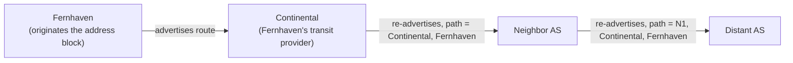

# The Internet Is a Network of Networks

**Part:** Part III — End-to-End Conversations

**Concept Level:** Level 4, per concept-graph.md

**Prerequisites:** Routing tables and next-hop forwarding (Ch. 9); best-effort delivery (Ch. 10)

**New concepts introduced:** autonomous system, ISP, peering, transit, route advertisement, control plane, BGP, policy, route convergence

---

## Opening Question

*How do independently operated networks exchange enough information to connect the world?*

## Real-World Story

Long-distance rail travel in nineteenth-century Europe worked, and it worked across dozens of independently owned railway companies, none of which answered to a single continental authority. A passenger could buy one ticket in Paris and step off a train in Vienna without ever thinking about how many different companies' tracks, locomotives, and staff carried them there.

That worked because railway companies did two things that had nothing to do with any single company owning the whole route. First, each company published which stations and regions its own tracks actually reached — Vienna's network told the world "we reach these forty towns," not "we reach everywhere." Second, neighboring companies negotiated agreements about whose trains could run on whose tracks, and under what terms: a company might let a neighbor's freight through for a fee, while refusing another neighbor's cargo entirely for reasons that had nothing to do with distance — an old dispute, a competing route they'd rather not help, a business relationship that hadn't been negotiated at all.

Nobody ran the whole system. There was no central dispatcher holding a map of all of Europe's rail lines, deciding the best route for every passenger. What existed was many independently operated networks, each publishing what it could reach, each negotiating bilaterally with its neighbors about what it would carry and for whom — and a workable continent-spanning system emerged from that web of local agreements, not from anyone controlling it centrally.

## Worked Example

A small hosting company, call it Fernhaven, runs servers in one data center and wants the rest of the Internet to be able to reach them. Fernhaven doesn't own any long-distance fiber. What it has is a contract with an upstream Internet provider — call it Continental — which does have far-reaching connections.

Fernhaven tells Continental, in effect: "I am now responsible for this specific block of addresses; send me anything addressed there." Continental doesn't just quietly start forwarding Fernhaven's traffic — it turns around and tells its own neighboring networks the same thing: "I can now reach that address block, through Fernhaven." Those neighbors, in turn, pass the same information to their neighbors, each one adding itself to the path description as the announcement spreads. Within a few minutes, a network on the other side of the world that has never heard of Fernhaven has learned some path, several networks long, that eventually leads back to Fernhaven's servers — not because anyone told that distant network specifically about Fernhaven, but because the announcement propagated hop by hop through a chain of independent agreements.

Now suppose Fernhaven's single link to Continental fails. Fernhaven can no longer be reached through that path, so Continental withdraws its earlier announcement, telling its neighbors "that path is gone." That withdrawal propagates the same way the original announcement did — network by network, each one updating what it believes and passing the update onward. For a short window, different parts of the Internet may disagree about whether Fernhaven is still reachable at all, simply because the withdrawal hasn't reached every corner yet. There is no single authority that could resolve that disagreement instantly, because there is no single authority holding the whole picture in the first place.

## Core Intuition

The Internet reaches global scale for the same structural reason the railway network did: no organization owns the whole thing, and none needs to. Each independently operated network announces what it can reach, propagates what its neighbors have announced to it, and applies its own business and technical judgment about which of several available paths to actually use. Global reachability is not administered from anywhere — it is the emergent result of many separate, self-interested networks continuously exchanging and re-exchanging small pieces of "here's what I can reach" information.

## Technical Explanation

An **autonomous system (AS)** is a network (or collection of networks) under one organization's administrative control, running its own internal routing decisions, and presenting a single, coherent face to the outside world. A university, a cloud provider, a national **ISP** (Internet service provider), and a large enterprise can each be its own autonomous system. Every autonomous system is identified by a globally unique number, but the number itself is just a label — what matters is the boundary it marks: everything inside is one organization's responsibility; everything outside is someone else's.

Autonomous systems connect to each other in two broad kinds of relationship. In **transit**, one AS pays another to carry its traffic onward to the rest of the Internet — a small ISP typically buys transit from a larger one, the way Fernhaven bought a path to the wider Internet through Continental. In **peering**, two autonomous systems agree to exchange traffic destined for each other's own customers directly, usually without money changing hands, because it's mutually cheaper than routing that traffic through paid transit. Whether a given link between two networks is transit or peering is a business relationship, not a technical fact visible in the packets themselves.

**Route advertisement** is the mechanism by which an autonomous system tells its neighbors which address blocks it can deliver traffic to — either because it owns those addresses directly, as Fernhaven did, or because it has already learned a path to them from some other neighbor and is willing to pass that reachability along. **BGP** (Border Gateway Protocol) is the protocol autonomous systems actually use to exchange these advertisements. A BGP advertisement isn't just "I can reach this address block" — it also carries the chain of autonomous systems the announcement has already passed through, so that any network receiving it can see, and reason about, the path an accepted route would actually take.

Crucially, an autonomous system is never obligated to accept or forward every advertisement it hears, or to prefer the technically shortest one. Each AS applies its own **policy** — a set of business and operational preferences — when deciding which of several available paths to actually use and which to advertise onward to its own neighbors. A network might prefer a longer path through a settlement-free peer over a shorter one through a paid transit provider, simply because the peered path is free. This is the mechanism behind the misconception that BGP finds the geographically shortest route: it doesn't optimize for distance at all. It selects among policy-acceptable paths, and "shortest" is, at best, one weak tiebreaker among many that individual networks may or may not even use.

This entire announce-and-select process is an example of the **control plane** at work: the exchange of information and decisions about how traffic *should* flow, as distinct from the data plane's job (Ch. 9) of actually forwarding individual packets along whatever path the control plane has settled on. BGP is a pure control-plane protocol — it never touches the packets themselves, only the routing information that determines where those packets will eventually be sent.

Because there is no central authority, and because updates propagate hop by hop across thousands of independently operated networks, changes take real time to settle. **Route convergence** is the process by which the Internet's collective view of reachability updates after an advertisement or withdrawal — during which different networks may briefly hold different, temporarily inconsistent beliefs about how (or whether) to reach a given address block. This is not a bug to be engineered away; it is the necessary cost of having no single source of truth.

*Alt text: A route advertisement originates at Fernhaven, propagates to its transit provider Continental, and then hop by hop to increasingly distant autonomous systems, each one prepending itself to the path.*

## Packet-Journey Checkpoint

The café laptop's request to `example.net` doesn't stay inside the café's ISP. Somewhere past the café's own network, the packet crosses into other autonomous systems — the café ISP's own transit provider, possibly one or more networks purely in the business of carrying other people's traffic, and finally the autonomous system hosting `example.net` itself. None of those networks were told in advance about this specific laptop or this specific request. The packet reaches its destination because, sometime earlier, the AS hosting `example.net` advertised that it could be reached, and that advertisement propagated, hop by hop, into the routing table of every autonomous system now sitting along the path — including, eventually, the café's own.

## Common Misconceptions

### *One organization controls Internet routing.*

**Why it's wrong:** There is no global router, dispatcher, or authority that decides how all Internet traffic should flow. Reachability is the emergent product of thousands of independent networks each making their own advertisement and path-selection decisions.

**Correct intuition:** Global routing is coordinated the way railway travel across many countries was — through bilateral agreements between neighbors, not centralized planning.

**Analogy:** Independent railway companies (see registry).

### *BGP always selects the geographically shortest path.*

**Why it's wrong:** BGP path selection is driven by each network's own policy — cost, business relationships, contractual preferences — not by physical distance. AS-path length is, at most, a weak tiebreaker among policy-acceptable options.

**Correct intuition:** A "shorter" AS path in hop count says nothing about physical distance, and even hop count is routinely overridden by policy.

**Analogy:** Independent railway companies (see registry): companies chose routes by agreement and business terms, not by which physical route was shortest.

### *Every network shares every internal route with everyone.*

**Why it's wrong:** Autonomous systems advertise only what their own policy permits. Many internal routes — a private data-center backbone, an internal-only address range — are never advertised outward at all.

**Correct intuition:** Route advertisement is selective and policy-controlled at every hop, not an automatic broadcast of everything a network knows.

**Analogy:** A railway company publishes which regions it serves; it doesn't publish its internal maintenance yards.

### *Routing convergence is instantaneous.*

**Why it's wrong:** An advertisement or withdrawal has to propagate hop by hop across potentially thousands of autonomous systems, each processing and re-advertising it in turn. That takes real, measurable time — seconds to minutes, not zero.

**Correct intuition:** Different parts of the Internet can briefly, legitimately disagree about reachability while an update is still propagating.

**Analogy:** News in the railway story spread from company to company by messenger, not by a single continent-wide broadcast.

### *A reachable prefix proves that the advertised origin is legitimate.*

**Why it's wrong:** BGP, as described here, trusts that an autonomous system advertising an address block is actually authorized to do so. Nothing in the base mechanism verifies that claim.

**Correct intuition:** Reachability and legitimacy are separate questions; a route being accepted and propagated doesn't by itself confirm who's really supposed to hold that address block.

**Analogy:** A shipping company that announces "I can deliver to this address" and is believed — nothing in the announcement itself proves the company was ever actually assigned that territory.

## Practical Implications

When a service becomes unreachable from some locations but not others, or reachable only after a delay following a network change, this chapter is often why: routing information takes time to propagate, and different networks can hold different, both locally-correct views during that window. When reading about a real-world "BGP incident" — traffic for a major service suddenly routing somewhere unexpected — the mechanism at fault is almost always a route advertisement that shouldn't have been trusted, not a packet-forwarding failure. And when evaluating an architecture claim like "our multi-region setup guarantees instant failover," it's worth asking specifically what's guaranteeing the DNS or routing change involved actually propagates as fast as claimed.

## Key Takeaway

**Global Internet reachability emerges from independently operated networks exchanging route information according to technical and business policy.**

## What to Remember

- An autonomous system is a network under one organization's control, identified by a unique number, presenting one coherent routing face to the outside world.
- Autonomous systems connect via transit (paid, one network carries another's traffic onward) or peering (mutual, for traffic destined between the two networks' own customers).
- BGP is the control-plane protocol autonomous systems use to advertise which address blocks they can reach, including the AS-path the advertisement has already traveled.
- Path selection is driven by each network's own policy, not physical shortest distance — AS-path length is at most a weak tiebreaker.
- Route convergence takes real time because advertisements and withdrawals propagate hop by hop with no central authority.
- Reachability being advertised is not proof that the advertiser is actually authorized to originate that address block.

## The Next Obvious Question

*Once a packet reaches the correct machine, how does it reach the correct application?*

---

**Glossary terms added this chapter:** Autonomous system (AS), ISP, Transit, Peering, Route advertisement, BGP, Policy (routing), Control plane, Route convergence → append to `/glossary.md`

**Misconceptions logged this chapter:** `bgp-shortest-physical-path` (enriched); one-organization-controls-routing, every-route-shared, convergence-instantaneous, and reachable-prefix-proves-legitimate covered in-chapter only (not separately tracked in the curated registry)

**Concept-graph entries checked off:** autonomous-system, isp, peering-and-transit, route-advertisement, control-plane, bgp, routing-policy, route-convergence → `written: true`, `key_takeaway` set

**Diagrams used this chapter:** topology (AS route-advertisement propagation)
