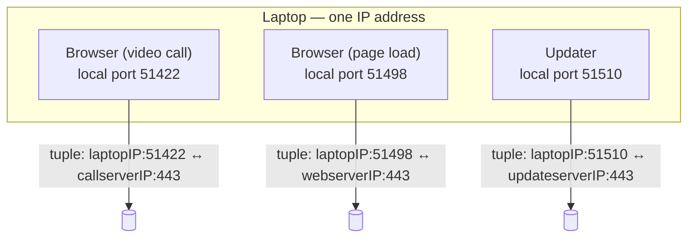

# From a Host to a Process

**Part:** Part III — End-to-End Conversations

**Concept Level:** Level 5, per concept-graph.md

**Prerequisites:** IP addresses identify interfaces, not applications (Ch. 6); packets are delivered to a host via routing (Ch. 9-11)

**New concepts introduced:** process, port, socket, source and destination port, five-tuple, demultiplexing

---

## Opening Question

*Once a packet reaches the correct machine, how does it reach the correct application?*

## Real-World Story

A courier arrives at a large apartment building with a package addressed simply to "24 Willow Street." That address gets the courier to the right building, and the building's front desk can confirm this is indeed 24 Willow Street — but the package still can't be delivered. Willow Street has forty apartments, each with its own occupant, and the street address alone says nothing about which one the package is actually for.

What makes final delivery possible is the apartment number. "24 Willow Street, Apt 12B" narrows things down to exactly one door, out of forty, inside a building the courier has already correctly located. The building's address gets the courier to the right place; the apartment number gets the package to the right recipient inside that place. These are two different jobs, solved by two different pieces of information, and conflating them — treating the street address as if it alone specified a person — would make delivery to any multi-unit building impossible.

## Worked Example

A single laptop, at a single moment, might have all of the following running at once: a browser with a video call open in one tab and a page loading in another, plus a background software updater quietly checking for new versions. All three of these are exchanging data with the outside world *right now*. All three are doing so using the *same* IP address — the one assigned to this one laptop's network interface.

If IP addresses were the whole story, every one of these would be indistinguishable at the network layer: three separate streams of packets, all arriving at the same address, with nothing in the addressing scheme itself to say which stream belongs to the video call, which to the page load, and which to the updater. Something else has to tell the operating system, for every single incoming packet, which of these three running programs should actually receive it — and correspondingly, when each of these three programs sends something out, something has to mark it clearly enough that the far end (and this laptop, on the way back) can keep the three conversations straight without ever mixing their data together.

## Core Intuition

An IP address gets a packet to the correct *machine* — the equivalent of getting the courier to the correct building. It does nothing to identify which specific running program on that machine the packet is actually for. That job belongs to a second, separate piece of addressing information, layered on top of the IP address, that identifies not a machine but a specific ongoing conversation happening on that machine.

## Technical Explanation

A **process** is a running instance of a program — the browser, the video-call software, the update-checker, each a separate process on the laptop, each independently capable of sending and receiving network traffic.

A **port** is a number, from 0 to 65535, used at the transport layer to identify a specific communication endpoint on a host. When a process wants to receive network traffic, it doesn't just wait for anything addressed to the host's IP — it asks the operating system to associate it with a specific port, and, ordinarily, only traffic explicitly directed to that port gets handed to that process. In the common case that's a clean one-to-one relationship, but the port itself identifies a transport-layer endpoint, not a process directly: the operating system's binding rules are what connect a port to whichever process (or, in some configurations, processes) is actually listening on it at a given moment, and a single process can hold many ports open at once just as easily as one port can, under specific configuration, be shared. A web server conventionally listens on port 443 for encrypted traffic; that's a convention, not a physical or permanent binding — nothing stops a different application from using that same number on a machine that isn't running a web server.

Every packet carrying transport-layer information includes both a **source port** and a **destination port** — the port the sending process used, and the port the receiving process is expected to be listening on. Combined with the source and destination IP addresses, and the transport protocol in use (Ch. 13-14 introduce the two main options, UDP and TCP), these five values together form what's conventionally called a **five-tuple**: (source IP, source port, destination IP, destination port, protocol). At any given moment, this five-tuple is what actually, uniquely identifies one specific ongoing conversation — not the IP address alone, and not the port alone, but the specific combination of all five together. ("At any given moment" matters: once a conversation ends, the same five values can eventually be reused for an entirely new, unrelated one.)

This is what makes it possible for a server to hold open connections with thousands of different clients on the very same listening port at once. Each client has a different source IP (and often a different source port too), so even though every one of those connections shares the same destination IP and destination port on the server side, every five-tuple is still unique. The server isn't tracking "the connection on port 443" as if there could only be one; it's tracking many separate tuples that all happen to share that one destination port.

A **socket** is the operating system's own handle representing a transport-layer endpoint — the object a process actually reads from and writes to, through which the operating system quietly handles matching incoming packets to the right conversation and outgoing data to the right destination. A socket in the middle of an established TCP conversation does correspond to one full five-tuple, remote endpoint included, but that's the most specific case, not the only one: a TCP *listening* socket is bound only to a local address and port, with no remote endpoint yet, since it exists to accept connections from whoever shows up; a UDP socket may likewise stay unconnected, with no fixed remote endpoint at all, sending to and receiving from whichever address a given datagram specifies each time.

**Demultiplexing** is the general name for this matching process: given an incoming packet, using its five-tuple (or, for a listening socket, just its destination port) to determine which one process, out of everything running on the machine, should actually receive it. It is the mirror image of what the operating system did when the outgoing packets from three different processes were, in the reverse direction, all sent out sharing the same source IP address.

*Alt text: One laptop with one shared IP address running three separate processes, each bound to a different local port, producing three distinct five-tuples even though the destination port (443) is the same in every case.*

## Packet-Journey Checkpoint

When the café laptop's browser goes to fetch `example.net`'s page, the operating system doesn't just address the outgoing packets to `example.net`'s IP address — it also picks a source port for this specific request and marks the destination port as 443 (the conventional port for encrypted web traffic). Every reply from `example.net`'s server comes back addressed to that exact source port, which is how the operating system delivers it specifically to the browser's own socket, rather than to the updater or any other process that happens to be running on the same laptop at the same time. The port gets the reply to the right *process* — the browser itself; from there, it's the browser's own internal bookkeeping, not anything at the port level, that further sorts the reply to the specific tab or request that originated it.

## Common Misconceptions

### *A port is a physical connector.*

**Why it's wrong:** The word invites the image of a physical socket, but a transport-layer port is purely a number carried inside a packet's header — bookkeeping, not hardware.

**Correct intuition:** A port is an address-like number the operating system uses to route incoming data to the correct process; nothing about it corresponds to a physical jack.

**Analogy:** An apartment number is a label on a mailbox, not a physical connector plugged into anything.

### *One application permanently owns one port everywhere.*

**Why it's wrong:** Port numbers are conventions, agreed defaults for specific protocols (443 for encrypted web traffic, 53 for DNS), not permanent, exclusive, or physically enforced assignments.

**Correct intuition:** Any process, on any given machine, can bind to almost any available port; conventions make things predictable, but nothing stops another application from using the same number on a different machine, or a nonstandard one on this one.

**Analogy:** Apartment 12B is a label the building assigns, not something the number "12B" inherently means everywhere.

### *An IP address and port identify the same thing.*

**Why it's wrong:** An IP address identifies a machine's interface (Ch. 6); a port identifies a transport-layer endpoint on that machine, which the operating system's binding rules then connect to a specific process. They answer different questions at different layers.

**Correct intuition:** The IP address gets you to the right building; the port gets you to the right apartment inside it. Conflating them collapses two genuinely separate jobs into one.

**Analogy:** Building address and apartment number (see registry).

### *A server can support only one client per listening port.*

**Why it's wrong:** A listening port accepts connections from many different clients simultaneously; what keeps them distinct isn't the port, it's the full five-tuple, which differs by client IP (and often client port) even when the destination port is identical for all of them.

**Correct intuition:** Thousands of clients can be talking to a server's port 443 at once, each one a separate, fully distinguishable conversation.

**Analogy:** A building's front desk (port) can receive deliveries for many different apartments (client tuples) throughout the day without confusing one resident's mail for another's.

## Practical Implications

This is the mechanism behind "port 443 is blocked" or "the service isn't listening on that port" as debugging statements — they're claims about which processes on which machines are configured to receive traffic on a specific number, not claims about physical wiring. It also explains why a single server can genuinely serve enormous numbers of simultaneous clients on one public IP and one listening port: the scaling constraint isn't "how many clients can share this port," it's the (much larger) space of distinguishable five-tuples and the server's own capacity to handle them.

## Key Takeaway

**IP reaches an interface; transport-layer ports and socket state let the operating system deliver traffic to the correct process and conversation.**

## What to Remember

- A process is a running program; a port is a number identifying a specific communication endpoint on a host, used at the transport layer.
- Every transport-layer packet carries a source port and a destination port alongside its source and destination IP addresses.
- A five-tuple — source IP, source port, destination IP, destination port, protocol — is what actually, uniquely identifies one conversation at a given moment; the same five values can be reused later for a different one.
- A socket is the operating system's handle for a transport-layer endpoint — a full five-tuple's worth in an established TCP conversation, but a listening TCP socket or an unconnected UDP socket has no fixed remote endpoint at all.
- A destination port gets a reply to the right process; sorting it further (to a specific tab or request) is the application's own job, not the port's.
- Demultiplexing is how the operating system routes an incoming packet to the correct process based on its five-tuple.
- A shared destination port (like 443) does not limit a server to one client — different client tuples keep every connection distinct.

## The Next Obvious Question

*What is the simplest useful service the transport layer can provide?*

---

**Glossary terms added this chapter:** Process, Port, Source port, Destination port, Five-tuple, Socket, Demultiplexing → append to `/glossary.md`

**Misconceptions logged this chapter:** `ports-are-physical-connectors` (enriched)

**Concept-graph entries checked off:** process-and-port, socket, multiplexing-transport → `written: true`, `key_takeaway` set

**Diagrams used this chapter:** state-snapshot (three simultaneous five-tuples sharing one IP)
