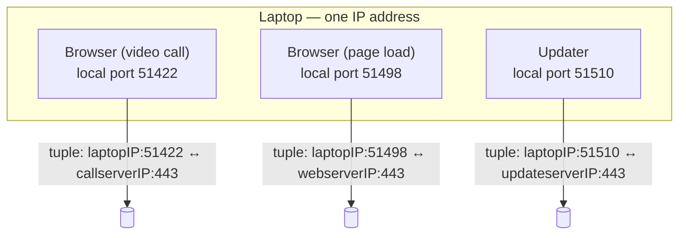

# From a Host to a Process

**Part:** Part III — End-to-End Conversations

**Concept Level:** Level 5, per concept-graph.md

**Prerequisites:** IP addresses identify interfaces, not applications (Ch. 6); packets are delivered to a host via routing (Ch. 9-11)

**New concepts introduced:** process, port, socket, source and destination port, five-tuple, demultiplexing

---

## Opening Question

*Once a packet reaches the correct machine, how does it reach the correct application?*

## Real-World Story

A courier arrives at a large apartment building with a package addressed simply to "24 Willow Street." That address gets the courier to the right building, and the building's front desk can confirm this is indeed 24 Willow Street — but the package still can't be delivered. Willow Street has forty apartments, each with its own occupant, and the street address alone says nothing about which one the package is actually for.

What makes final delivery possible is the apartment number. "24 Willow Street, Apt 12B" narrows things down to exactly one door, out of forty, inside a building the courier has already correctly located. The building's address gets the courier to the right place; the apartment number gets the package to the right recipient inside that place. These are two different jobs, solved by two different pieces of information, and conflating them — treating the street address as if it alone specified a person — would make delivery to any multi-unit building impossible.

## Worked Example

A single laptop, at a single moment, might have all of the following running at once: a browser with a video call open in one tab and a page loading in another, plus a background software updater quietly checking for new versions. All three of these are exchanging data with the outside world *right now*. All three are doing so using the *same* IP address — the one assigned to this one laptop's network interface.

If IP addresses were the whole story, every one of these would be indistinguishable at the network layer: three separate streams of packets, all arriving at the same address, with nothing in the addressing scheme itself to say which stream belongs to the video call, which to the page load, and which to the updater. Something else has to tell the operating system, for every single incoming packet, which of these three running programs should actually receive it — and correspondingly, when each of these three programs sends something out, something has to mark it clearly enough that the far end (and this laptop, on the way back) can keep the three conversations straight without ever mixing their data together.

## Core Intuition

An IP address gets a packet to the correct *machine* — the equivalent of getting the courier to the correct building. It does nothing to identify which specific running program on that machine the packet is actually for. That job belongs to a second, separate piece of addressing information, layered on top of the IP address, that identifies not a machine but a specific ongoing conversation happening on that machine.

## Technical Explanation

A **process** is a running instance of a program — the browser, the video-call software, the update-checker, each a separate process on the laptop, each independently capable of sending and receiving network traffic.

A **port** is a number, from 0 to 65535, identifying a communication endpoint on a host at the transport layer. A process that wants to receive network traffic asks the operating system to associate it with a specific port, and ordinarily only traffic addressed to that port reaches it. The port identifies the endpoint, though, not the process directly — the OS's binding rules connect a port to whoever is actually listening on it, and a process can hold many ports at once just as one port can, in some configurations, be shared. Port 443 is conventionally the encrypted-web port; that's convention, not physical or permanent binding.

Every UDP datagram and TCP segment carries a **source port** and **destination port** — the two transport protocols this book covers, and not the only pattern above IP: ICMP, Chapter 10's control protocol, carries no ports at all. Combined with the source and destination IP addresses and the transport protocol, these five values form a **five-tuple**: (source IP, source port, destination IP, destination port, protocol). Within a given network context, at a given moment, that combination — not the IP alone, not the port alone — identifies one transport flow, and for TCP specifically, one established connection. The TCP case is exact because TCP's handshake state makes it so; UDP has no connection to establish, so the same five values can carry more than one independent exchange without anything having "ended," and even a TCP five-tuple gets reused once its connection genuinely closes.

That's what lets a server hold thousands of simultaneous connections on one listening port: every connection shares the server's destination IP and port, but each has its own source IP and port, so every five-tuple stays unique — even behind NAT (Chapter 16), where many clients sharing one public address are still kept apart by their distinct source ports.

A **socket** is the OS's handle for a transport-layer endpoint — what a process reads from and writes to. An established TCP socket corresponds to one full five-tuple, but that's the specific case, not the only one: a *listening* TCP socket has no remote endpoint yet, and an unconnected UDP socket may never fix one, sending to and receiving from whatever address each datagram names.

**Demultiplexing** is how an incoming packet's addressing gets it to the right process: by five-tuple for an established connection, or by whatever a listening socket is actually bound to — at minimum destination port and protocol (a TCP and a UDP listener can share a port number, since protocol tells them apart), plus a specific local address if the socket was bound to one rather than all of them.

*Alt text: One laptop with one shared IP address running three separate processes, each bound to a different local port, producing three distinct five-tuples even though the destination port (443) is the same in every case.*

## Packet-Journey Checkpoint

When the café laptop's browser goes to fetch `example.net`'s page, the operating system doesn't just address the outgoing packets to `example.net`'s IP address — it also picks a source port for this specific request and marks the destination port as 443 (the conventional port for encrypted web traffic). Every reply from `example.net`'s server comes back addressed to that exact source port, which is how the operating system delivers it specifically to the browser's own socket, rather than to the updater or any other process that happens to be running on the same laptop at the same time. The port gets the reply to the right *process* — the browser itself; from there, it's the browser's own internal bookkeeping, not anything at the port level, that further sorts the reply to the specific tab or request that originated it.

## Common Misconceptions

### *A port is a physical connector.*

**Why it's wrong:** The word invites the image of a physical socket, but a transport-layer port is purely a number carried inside a packet's header — bookkeeping, not hardware.

**Correct intuition:** A port is an address-like number the operating system uses to route incoming data to the correct process; nothing about it corresponds to a physical jack.

**Analogy:** An apartment number is a label on a mailbox, not a physical connector plugged into anything.

### *One application permanently owns one port everywhere.*

**Why it's wrong:** Port numbers are conventions, agreed defaults for specific protocols (443 for encrypted web traffic, 53 for DNS), not permanent, exclusive, or physically enforced assignments.

**Correct intuition:** Any process, on any given machine, can bind to almost any available port; conventions make things predictable, but nothing stops another application from using the same number on a different machine, or a nonstandard one on this one.

**Analogy:** Apartment 12B is a label the building assigns, not something the number "12B" inherently means everywhere.

### *An IP address and port identify the same thing.*

**Why it's wrong:** An IP address identifies a machine's interface (Ch. 6); a port identifies a transport-layer endpoint on that machine, which the operating system's binding rules then connect to a specific process. They answer different questions at different layers.

**Correct intuition:** The IP address gets you to the right building; the port gets you to the right apartment inside it. Conflating them collapses two genuinely separate jobs into one.

**Analogy:** Building address and apartment number (see registry).

### *A server can support only one client per listening port.*

**Why it's wrong:** A listening port accepts connections from many different clients simultaneously; what keeps them distinct isn't the port, it's the full five-tuple, which differs by source address, source port, or both — even when the server's own address and port are identical for all of them, and even when several clients reach the server through one shared NAT'd source address, since their source ports still differ.

**Correct intuition:** Thousands of clients can be talking to a server's port 443 at once, each one a separate, fully distinguishable conversation.

**Analogy:** A building's front desk (port) can receive deliveries for many different apartments (client tuples) throughout the day without confusing one resident's mail for another's.

## Practical Implications

This is the mechanism behind "port 443 is blocked" or "the service isn't listening on that port" as debugging statements — they're claims about which processes on which machines are configured to receive traffic on a specific number, not claims about physical wiring. It also explains why a single server can genuinely serve enormous numbers of simultaneous clients on one public IP and one listening port: the scaling constraint isn't "how many clients can share this port," it's the (much larger) space of distinguishable five-tuples and the server's own capacity to handle them.

## Key Takeaway

**IP reaches an interface; transport-layer ports and socket state let the operating system deliver traffic to the correct process and conversation.**

## What to Remember

- A process is a running program; a port is a number identifying a specific communication endpoint on a host, used at the transport layer.
- UDP datagrams and TCP segments carry a source port and a destination port alongside their source and destination IP addresses; not every protocol carried by IP uses ports (ICMP doesn't).
- A five-tuple — source IP, source port, destination IP, destination port, protocol — identifies one transport flow within a given network context at a given moment, and for TCP specifically, one established connection; the same five values can be reused later for an unrelated one, and for connectionless UDP, may not even guarantee a single conversation to begin with.
- A socket is the operating system's handle for a transport-layer endpoint — a full five-tuple's worth in an established TCP conversation, but a listening TCP socket or an unconnected UDP socket has no fixed remote endpoint at all.
- A destination port gets a reply to the right process; sorting it further (to a specific tab or request) is the application's own job, not the port's.
- Demultiplexing is how the operating system routes an incoming packet to the correct process — using its full five-tuple for an established TCP connection, or whatever's actually bound (port, protocol, and optionally local address) for a listener or unconnected UDP socket.
- A shared destination port (like 443) does not limit a server to one client — different client tuples keep every connection distinct.

## The Next Obvious Question

*What is the simplest useful service the transport layer can provide?*

---

**Glossary terms added this chapter:** Process, Port, Source port, Destination port, Five-tuple, Socket, Demultiplexing → append to `/glossary.md`

**Misconceptions logged this chapter:** `ports-are-physical-connectors` (enriched)

**Concept-graph entries checked off:** process-and-port, socket, multiplexing-transport → `written: true`, `key_takeaway` set

**Diagrams used this chapter:** state-snapshot (three simultaneous five-tuples sharing one IP)
