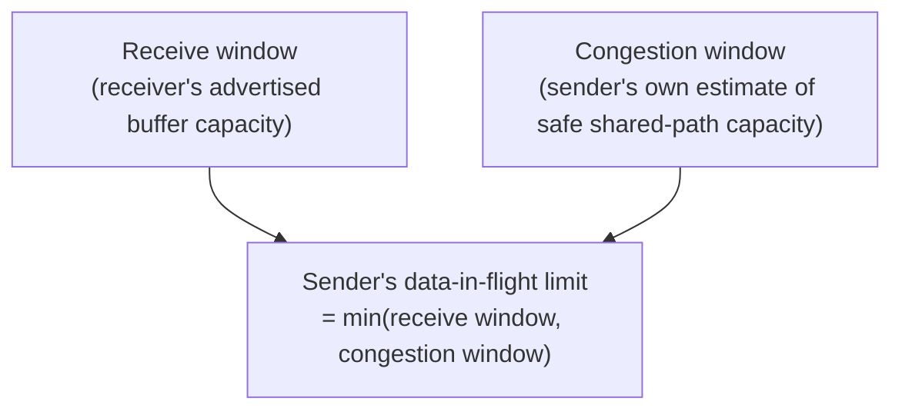

# Reliability Without Collapse

**Part:** Part III — End-to-End Conversations

**Concept Level:** Level 5, per concept-graph.md

**Prerequisites:** TCP sequence numbers, acknowledgements, and retransmission (Ch. 14); packet loss as a normal condition (Ch. 10)

**New concepts introduced:** receive window, flow control, congestion, congestion window, acknowledgement clocking, retransmission timeout, fairness, backoff

---

## Opening Question

*How can reliability avoid overwhelming the receiver or the network itself?*

## Real-World Story

A warehouse's loading dock can physically unload and process about ten boxes at a time. If a supplier's truck shows up with two hundred boxes and simply starts unloading as fast as its crew can carry, boxes end up stacked in the driveway, blocking the dock, with nowhere to actually put them. The problem here has nothing to do with the road: the truck reached the warehouse just fine. The problem is entirely local to the warehouse's own processing capacity.

Now consider a completely separate problem: the road leading to that same warehouse is a single-lane route shared by deliveries to a dozen other businesses. If every supplier tries to send full trucks down that road at the same time, the road itself becomes the bottleneck — not because any one warehouse's dock is overwhelmed, but because there simply isn't enough shared road capacity for everyone's trucks to move freely at once.

These are genuinely different problems, needing genuinely different responses. Overwhelming the dock is fixed by the supplier simply sending fewer boxes per trip, matched to what this one dock can actually handle. Overwhelming the shared road is fixed by every supplier using that road backing off together, whether or not their own destination dock happens to have capacity to spare — because the constraint isn't at any one destination, it's on the shared path everyone depends on.

## Worked Example

Consider two very different TCP connections happening at the same time. In the first, a fast receiver — a well-provisioned server with plenty of memory and processing power — sits behind a heavily congested network path, shared with dozens of other high-volume connections competing for the same limited capacity. In the second, a slow, resource-constrained receiver — an old embedded device with very little memory to spare — sits behind an essentially empty, uncongested path with capacity to spare.

In the first case, the receiver could easily accept data as fast as the sender could produce it; the actual constraint is entirely on the shared path in between, where sending too aggressively would mean packets queuing up and eventually being dropped — not because the receiver couldn't keep up, but because the network itself is oversubscribed by everyone using it.

In the second case, the exact opposite is true: the path itself has plenty of spare capacity, and packets could easily flow through as fast as the sender could send them — but the receiver's own limited memory means that sending too fast would simply overwhelm its ability to buffer and process incoming data, regardless of how uncongested the path getting there was.

A sender that only watched one of these two signals would handle one of these connections correctly and the other one badly. TCP has to watch both, independently, because they're telling it about two entirely different constraints that happen to have nothing to do with each other.

## Core Intuition

Reliable delivery isn't just about resending lost data — it's also about not causing that loss unnecessarily in the first place, by sending faster than either the receiver or the shared network path can actually handle. TCP tracks two separate limits, corresponding to two separate real-world constraints — the receiver's own capacity, and the shared network's capacity — and paces its sending according to whichever one is currently more restrictive.

## Technical Explanation

**Flow control** protects the receiver. As part of every acknowledgement, a TCP receiver advertises its **receive window** — how much additional data it's currently willing and able to buffer, based on its own available memory. The sender is expected to never send more unacknowledged data than the receiver's advertised window permits. This is a purely local, per-connection negotiation between the two specific endpoints involved, entirely independent of what's happening anywhere else on the network — it solves exactly the warehouse-dock problem: don't send faster than *this specific receiver* can actually handle.

**Congestion**, by contrast, is a property of the shared network path, not of either endpoint specifically — it's what happens when the combined traffic from many connections exceeds what some shared link or device along the path can actually carry, causing queues to build up and, eventually, packets to be dropped. Congestion control addresses a fundamentally different question from flow control: not "can this receiver keep up," but "is the shared path between sender and receiver currently oversubscribed."

TCP's sender maintains a **congestion window** — its own internal estimate of how much data it can safely have in flight without contributing to (or getting caught by) congestion along the path. Unlike the receive window, nothing directly tells the sender what this number should be; there is no equivalent of a receiver openly advertising "the shared path can handle exactly this much." Instead, the sender has to infer network conditions indirectly, generally starting conservatively and gradually increasing its congestion window as acknowledgements confirm data is getting through cleanly — a pattern often called **acknowledgement clocking**, where the steady rhythm of incoming acknowledgements itself paces how quickly the sender ramps up. The moment packet loss is detected — inferred, in the absence of an acknowledgement, once a **retransmission timeout** expires — the sender treats that loss as a signal that it (or the aggregate of everyone sharing that path) pushed too hard, and shrinks its congestion window sharply rather than gradually, before cautiously growing again from there.

At any given moment, the actual amount of data TCP is willing to have outstanding and unacknowledged is the *smaller* of the receive window and the congestion window — whichever constraint is currently tighter wins, exactly mirroring the warehouse story's two independent bottlenecks.

Because many independent connections share the same underlying network links, and none of them can see what the others are doing, congestion control also has to produce reasonable **fairness** — no single connection should be able to indefinitely starve every other connection sharing the same path of its share of capacity. The **backoff** behavior described above — sharply reducing the congestion window on detected loss rather than only growing — is part of what keeps aggressive senders from permanently dominating a shared, congested link: everyone experiencing loss backs off, which tends to converge toward multiple connections sharing available capacity rather than one connection monopolizing it indefinitely.

*Alt text: The sender's actual sending limit is the smaller of two independently tracked values — the receiver's advertised receive window and the sender's own inferred congestion window.*

## Packet-Journey Checkpoint

As the café laptop downloads `example.net`'s page and its accompanying resources, the TCP connection carrying them starts cautiously — a small congestion window — and grows it as acknowledgements confirm data is arriving cleanly. If the café's own Wi-Fi link, or some congested link further along the path, is shared with other busy connections at that moment, the download's effective speed adapts to that shared congestion, not just to how fast the laptop itself could theoretically receive data.

## Common Misconceptions

### *Flow control and congestion control solve the same problem.*

**Why it's wrong:** Flow control is about the receiver's own local capacity; congestion control is about the shared network path's capacity. A connection can be flow-control-limited with an empty network, or congestion-limited with an idle, plenty-of-memory receiver — the two constraints are independent and can bind at completely different times.

**Correct intuition:** They're two separate mechanisms addressing two separate bottlenecks, and TCP has to respect whichever one is currently more restrictive.

**Analogy:** Warehouse dock capacity versus shared road congestion (see registry).

### *Packet loss always means a broken cable.*

**Why it's wrong:** In modern networks, the overwhelming majority of packet loss comes from congestion — queues filling up and overflowing at some shared, oversubscribed link — not physical faults.

**Correct intuition:** TCP is actually designed to expect and interpret loss primarily as a congestion signal, not a hardware failure signal.

**Analogy:** A traffic jam isn't caused by a broken road; it's caused by more vehicles trying to use the road than it can currently carry.

### *TCP always uses all available bandwidth immediately.*

**Why it's wrong:** TCP deliberately starts with a small congestion window and grows it gradually, rather than assuming the full path capacity is safe to use from the very first packet.

**Correct intuition:** A new TCP connection ramps up cautiously; this is why a fresh download can feel like it's "speeding up" over its first second or two.

**Analogy:** A newly arrived supplier doesn't send a full truck on the first trip down an unfamiliar shared road — they start smaller and build up as they learn the road can handle it.

### *More buffering always improves performance.*

**Why it's wrong:** Deep buffers at congested links can let queues grow very large before any packet is actually dropped, delaying the loss signal TCP relies on to notice congestion — this can make delay far worse without actually preventing the underlying congestion (a problem sometimes called bufferbloat, covered further in Chapter 21).

**Correct intuition:** Buffering smooths brief bursts, but excessive buffering can mask congestion signals rather than resolve the underlying overload.

**Analogy:** A warehouse driveway that can hold an enormous backlog of trucks doesn't fix a dock that's too slow — it just hides the problem behind a longer and longer wait.

### *Reliability has no cost.*

**Why it's wrong:** Every mechanism in this and the previous chapter — handshakes, acknowledgements, retransmissions, window negotiation, congestion backoff — takes time and consumes bandwidth that a connectionless, unreliable protocol like UDP simply doesn't spend.

**Correct intuition:** Reliability is a real, deliberate trade-off with real overhead, chosen because the application's need for complete, ordered, uncorrupted data outweighs that cost — not a free upgrade over UDP.

**Analogy:** Tracking and confirming a numbered stack of pages takes real extra time and paperwork compared to simply dropping unnumbered postcards in the mail.

## Practical Implications

This is the mechanism behind advice like "don't just increase buffer sizes to fix slow downloads" and behind why a download can visibly ramp up in speed over its first second rather than starting at full speed instantly. It also explains why a single congested link, shared by many users, tends to degrade gracefully across everyone's connections rather than catastrophically for a random few — the backoff-and-fairness behavior described here is specifically designed to spread the pain of congestion rather than let one aggressive sender monopolize a shared, oversubscribed path.

## Key Takeaway

**A reliable transport must adapt both to the receiver's capacity and to signs that the shared network is becoming overloaded.**

## What to Remember

- Flow control protects the receiver, using its advertised receive window; congestion control protects the shared network path, using the sender's own inferred congestion window.
- The sender's actual data-in-flight limit is the smaller of these two independently tracked values.
- Congestion isn't directly observable by the sender — it's inferred, primarily from loss detected via a retransmission timeout.
- TCP starts sending cautiously and grows its congestion window gradually, rather than assuming full path capacity is immediately safe.
- Detected loss triggers a sharp reduction in the congestion window, not just a pause — this backoff behavior is what produces reasonable fairness among connections sharing a congested path.
- Reliability (handshakes, acknowledgements, retransmission, congestion control) is a genuine trade-off with real overhead, not a free upgrade over UDP.

## The Next Obvious Question

*What happens when intermediaries rewrite, filter, or relay traffic?*

---

**Glossary terms added this chapter:** Receive window, Flow control, Congestion, Congestion window, Acknowledgement clocking, Retransmission timeout, Fairness (congestion control), Backoff → append to `/glossary.md`

**Misconceptions logged this chapter:** `flow-congestion-control-same` (enriched)

**Concept-graph entries checked off:** flow-control, congestion-control, ack-clocking, retransmission-timeout, fairness-and-backoff → `written: true`, `key_takeaway` set

**Diagrams used this chapter:** state-snapshot (sending limit as min of two independent windows)
