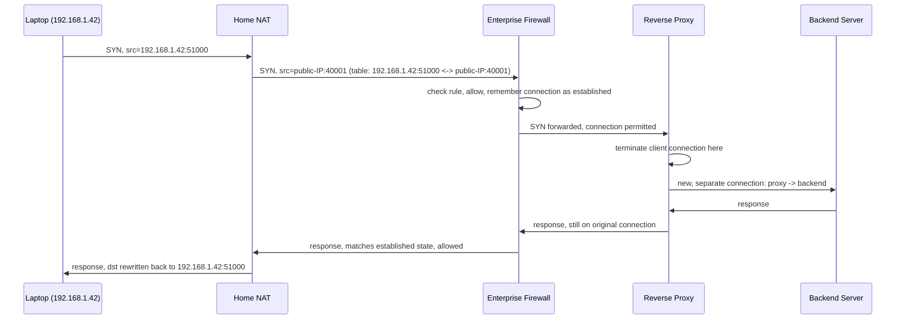

# The Network in the Middle

**Part:** Part IV — Names, Trust, and the Web

**Concept Level:** Level 6, per concept-graph.md

**Prerequisites:** Sockets and ports (Ch. 12), TCP (Ch. 14), private vs. public addressing (new this chapter, built on IPv4/IPv6 addressing from Ch. 6)

**New concepts introduced:** private address, public address, NAT, port translation, stateful firewall, forward proxy, reverse proxy, tunnel, VPN, middlebox

---

## Opening Question

*What happens when intermediaries rewrite, filter, or relay traffic?*

## Real-World Story

A mid-sized company's mailroom does more than pass envelopes from the loading dock to desks. Incoming packages get screened against a list of expected deliveries — anything unexpected or suspicious gets held at the desk instead of being routed upstairs. Outgoing mail gets its return address replaced with the company's official PO box instead of the individual employee's desk number, so replies come back to the mailroom to be re-sorted rather than arriving at a desk number that means nothing to the outside world. And some outgoing packages don't go to the addressee directly at all — they're first sent to the company's shipping partner, who repackages them, attaches new labels, and forwards them onward under different terms.

None of these three things — screening, address rewriting, and repackage-and-forward — is the same operation, even though a single busy mailroom might do all three to the same envelope in sequence. A envelope that gets its return address rewritten hasn't necessarily been screened for content. A screened envelope hasn't necessarily been repackaged. Someone watching only the outside of the building, seeing packages go in and out, could easily assume it's all one undifferentiated "mailroom thing" — but each operation has a different purpose, a different piece of information it changes or checks, and a different failure mode when it goes wrong.

Everything past this chapter's café laptop connects to its access point, and its traffic to `example.net` may pass through several devices that are neither the laptop nor the server — devices that translate its address, check its traffic against rules, or relay its connection on its behalf. Understanding what each one actually does, and refusing to blur them into one vague "network security stuff," is what this chapter is for.

## Worked Example

Trace a single outbound HTTPS connection from a laptop on a home network through three different intermediary devices, and watch what each one actually changes.

**Home NAT.** The laptop has address 192.168.1.42 — a private address, meaningful only inside this home network, guaranteed by convention never to be used as a real destination anywhere on the public Internet. When the laptop opens a connection to a public server, the home router rewrites the packet's source address to its own single public IP address, and picks a source port to remember which internal device and internal port this outbound connection belongs to. It records that translation — 192.168.1.42:51000 maps to public-IP:40001, for this specific connection — in a table. When a reply arrives addressed to public-IP:40001, the router looks up the table, rewrites the destination back to 192.168.1.42:51000, and delivers it inward. Nothing about this checks whether the traffic is safe; it exists so that many private, unreachable addresses can share one public, reachable one.

**Enterprise firewall.** Suppose this same laptop is instead on a corporate network, and the connection has to pass an enterprise firewall on its way out. The firewall doesn't rewrite any addresses. Instead, it inspects the connection attempt — its source, destination, port, and often the fact that it's the start of a new TCP handshake — against a set of rules, and either lets it proceed or drops it. Crucially, once it allows a connection, it remembers that this is now an established, permitted flow, so it doesn't have to re-evaluate every single packet against the full rule set — it can recognize "this belongs to a connection I already approved" and let those packets through quickly. That remembered state is exactly why it's called a *stateful* firewall.

**Reverse proxy.** Once the connection actually reaches `example.net`'s hosting provider, it likely doesn't go straight to whichever server happens to run the application. It first arrives at a reverse proxy — a server whose entire job is to sit in front of the real application servers, accept the incoming connection as if it were the final destination, and then open its *own*, separate connection to whichever backend server should actually handle the request. From the original laptop's perspective, it looks like a single, ordinary conversation with `example.net`. From the backend application's perspective, every request appears to come from the reverse proxy, not from the original laptop, unless the proxy takes the extra deliberate step of forwarding along the original client's address in the request itself.

Three intermediaries, one connection, three entirely different jobs: translating addresses so multiple devices can share one, checking policy on a remembered per-connection basis, and terminating-then-relaying a connection on someone else's behalf. Collapsing these into "the firewall" or "the network security layer" would hide exactly the distinctions that matter when something goes wrong.

## Core Intuition

Once a packet leaves the boundary of the two communicating endpoints, it can pass through devices that are not simply routers moving it toward its destination unchanged. Some rewrite the addressing information itself. Some check the traffic against rules and decide whether it may continue. Some don't relay the original connection at all — they end it and start an entirely new one on the sender's or receiver's behalf. A single physical device might combine several of these roles, but the roles themselves stay conceptually distinct, because each one changes, checks, or replaces a different piece of the conversation.

## Technical Explanation

**Private and public addresses.** Certain IPv4 ranges (10.0.0.0/8, 172.16.0.0/12, 192.168.0.0/16 — defined in RFC 1918) and a corresponding IPv6 range are set aside as *private*: routers on the public Internet are configured never to forward packets addressed to them, so they're only meaningful within one local or organizational network. Everything outside those ranges is, at least in principle, *public* — globally unique and potentially reachable. Private addressing exists partly because IPv4's total address space (about 4.3 billion addresses) is nowhere near large enough for every device in the world to hold a permanent, unique public one.

**NAT (Network Address Translation).** A NAT device, typically a home or office router, sits at the boundary between a private network and the public Internet. For outbound traffic, it rewrites the packet's private source address (and often its source port too — this specific, common case is technically PAT, Port Address Translation, though "NAT" is used loosely to cover it) to one of its own public addresses, and records the mapping in a translation table, keyed by the connection's full tuple. For inbound replies, it reverses the process using that same table. This is why NAT devices generally can't accept unsolicited inbound connections from the public Internet by default — there's no existing table entry to reverse the mapping against, so there's no home to deliver an unexpected inbound packet to.

**Stateful firewall.** A firewall enforces policy: which connections are permitted, based on source, destination, port, protocol, and direction. A *stateful* firewall additionally tracks ongoing connections it has already approved, so that packets belonging to an established, permitted flow don't need to be re-evaluated individually against the full rule set — only new connection attempts get the full policy check. This state is exactly analogous to a NAT device's translation table in spirit (a remembered per-connection record), but it's used to answer a different question: not "how do I route this back?" but "should I allow this at all?"

**Proxies.** A *forward proxy* sits in front of clients, relaying their outbound requests on their behalf — the destination server sees the proxy's address, not the original client's, and the client is deliberately using the proxy as an intermediary it knows about. A *reverse proxy* sits in front of servers, accepting inbound connections that appear to be with the final destination and relaying them to whichever real backend should handle them — the client typically doesn't know, or need to know, that a reverse proxy is involved at all. Both terminate one connection and originate a separate one; neither is a passive relay of the same, unmodified TCP connection all the way through.

**Tunnels and VPNs.** A tunnel carries one packet, header and all, encapsulated inside the payload of another packet, so it can cross a network that wouldn't otherwise carry it directly — including, potentially, carrying a private address across the public Internet by wrapping it inside a publicly addressed outer packet. A VPN (Virtual Private Network) combines a tunnel with encryption: it wraps the original traffic, encrypts it, and sends it to a VPN server, which decrypts it and forwards the original traffic onward as if it originated there. Every device between the client and the VPN server sees only encrypted tunnel traffic to the VPN server's address — they cannot see the original destination or content. But the VPN server itself sees the decrypted, unwrapped traffic and its real destination, since it has to, in order to forward it. A VPN shifts who can observe your traffic; it does not eliminate the possibility of observation.

**Middlebox** is the general term for any of these devices — anything on a network path that does something to traffic beyond ordinary forwarding of an unmodified packet toward its destination.

*Alt text: A laptop's connection passes through a home NAT (which rewrites the source address and records a translation), an enterprise firewall (which checks and then remembers the connection as established), and a reverse proxy (which terminates the original connection and opens a distinct one to the backend server), before a response returns by reversing each step.*

## Packet-Journey Checkpoint

The café laptop's connection toward `example.net` almost certainly passes through NAT at the café's own router — its 192.168.x.x address gets translated to the café's public IP before the packet ever reaches the wider Internet. Depending on `example.net`'s hosting setup, the connection may also terminate at a reverse proxy before reaching whichever backend server actually holds the article. None of this has been about the article's content yet — it's about how the connection between the laptop and *something claiming to be* `example.net` gets established and permitted at all. Nothing here has established whether that something is genuinely trustworthy — Chapter 18 (Establishing Trust on an Untrusted Network) is where that becomes possible.

## Common Misconceptions

### *NAT and firewalling are the same thing.*

**Why it's wrong:** Both live on the same box in most home routers, and both feel like generic "network protection," so it's easy to assume one implies the other.

**Correct intuition:** NAT rewrites addresses so multiple private devices can share one public one; a firewall enforces policy about which connections are allowed. A device can NAT without any firewall rules beyond the default "don't accept unsolicited inbound," and a device can firewall without any address translation at all.

**Analogy:** The mailroom's return-address rewriting and its package screening are different desks, doing different jobs, even in the same room.

### *NAT is required for security.*

**Why it's wrong:** Because home NAT happens to block unsolicited inbound connections as a side effect (no table entry to reverse the mapping against), people conflate that side effect with deliberate security.

**Correct intuition:** NAT exists to conserve public IPv4 addresses. Its inbound-blocking behavior is incidental, not a designed security control — a firewall's explicit rules are the actual security mechanism, and IPv6 deployments, which don't need NAT for address conservation, still need firewalls.

**Analogy:** A mailroom's return-address rewriting happens to make random strangers unable to address a package straight to a desk — but that's a side effect of the addressing scheme, not the same as the mailroom's actual screening process.

### *A VPN makes your activity anonymous.*

**Why it's wrong:** "Encrypted tunnel" and "nobody can see what I'm doing" sound like the same claim.

**Correct intuition:** A VPN prevents networks between you and the VPN server from seeing your traffic's content or destination — but the VPN server itself decrypts and forwards your traffic, and can see exactly what you send and where it goes. You've shifted who can observe you, not eliminated observation.

**Analogy:** Sealing a letter inside another envelope addressed to a trusted forwarding service hides its contents from the postal carriers along the way — but the forwarding service still opens the inner envelope to send it onward.

## Practical Implications

When an architecture diagram shows a box labeled "firewall/NAT" or "gateway," it's worth asking which of these distinct jobs that box is actually doing — because their failure modes differ completely. A NAT table filling up under too many simultaneous connections is a capacity problem; a firewall rejecting legitimate traffic is a policy problem; a reverse proxy that can't reach a healthy backend is an entirely different kind of outage, even though a user experiencing any of the three might just see "the site is down." Knowing which mechanism sits where on a path is often the fastest way to narrow down where an unreachable service is actually failing.

## Key Takeaway

**Middleboxes do more than forward packets: they may maintain state, rewrite identifiers, enforce policy, terminate connections, or create tunnels.**

## What to Remember

- Private addresses (RFC 1918 ranges and their IPv6 equivalent) are only meaningful inside one local network; public addresses are globally unique.
- NAT rewrites source addresses/ports on outbound traffic and reverses the mapping on inbound replies, using a per-connection translation table.
- A stateful firewall enforces policy and remembers already-approved connections so it doesn't have to re-check every packet.
- Forward proxies relay on a client's behalf; reverse proxies relay on a server's behalf — both terminate one connection and originate a separate one.
- A tunnel carries one packet's header and payload encapsulated inside another; a VPN adds encryption to a tunnel.
- A VPN shifts who can observe your traffic to the VPN operator — it does not remove observability entirely.
- "Middlebox" is the general term for any of these — a device that does something to traffic beyond plain, unmodified forwarding.

## The Next Obvious Question

*How can people use stable names instead of numerical addresses?*

---

**Glossary terms added this chapter:** Private address, Public address, NAT, Port translation, Stateful firewall, Forward proxy, Reverse proxy, Tunnel, VPN, Middlebox → append to `/glossary.md`

**Misconceptions logged this chapter:** `nat-firewall-same-mechanism` (enriched), `nat-required-for-security` (enriched), `vpn-guarantees-anonymity` (enriched)

**Concept-graph entries checked off:** private-public-address, nat, stateful-firewall, proxy, vpn-tunnel, middlebox → `written: true`, `key_takeaway` set

**Diagrams used this chapter:** sequence (connection passing through NAT, firewall, and reverse proxy)
