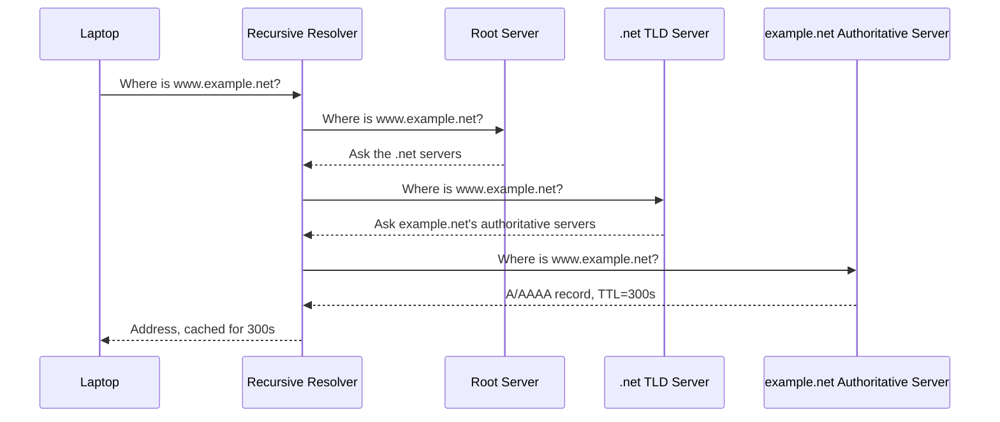

# Naming a Moving World

**Part:** Part IV — Names, Trust, and the Web

**Concept Level:** Level 6, per concept-graph.md

**Prerequisites:** IPv4/IPv6 addressing and hierarchical allocation (Ch. 6), UDP (Ch. 13)

**New concepts introduced:** domain name, DNS hierarchy, root, top-level domain, authoritative server, recursive resolver, delegation, record, TTL (DNS), cache, A, AAAA, CNAME

---

## Opening Question

*How can people use stable names instead of numerical addresses?*

## Real-World Story

A large university doesn't maintain one central desk that personally knows the office location of every one of its forty thousand students, staff, and faculty. Instead, it delegates: the registrar's office knows which college each student belongs to; each college's office knows which department each student is enrolled in; each department knows its own students' actual office or dorm assignments. Ask the registrar "where is student Alex Chen," and they don't know Alex's building number — but they know exactly which college to forward the question to, and that college knows exactly which department to ask next.

Nobody at the top holds the whole directory. Nobody needs to. The question gets progressively narrowed, one referral at a time, until it reaches someone who actually holds the specific answer — and once someone has asked and received that answer, whoever asked can remember it for a while, rather than repeating the whole multi-step referral for the same question a minute later.

This is close to how the Internet answers "what address does `example.net` actually have," at a scale of hundreds of millions of names rather than forty thousand students — and understanding the delegation-plus-caching structure, rather than picturing "the Internet's giant phonebook," is what makes DNS's behavior, and its occasional confusing lag, make sense.

## Worked Example

Trace what happens the first time a laptop looks up `www.example.net`, then trace what happens the second time, a minute later, and notice exactly what's different.

**First lookup.** The laptop's operating system doesn't know the answer and doesn't try to find it alone. It asks a *recursive resolver* — typically operated by the café's ISP, or a public resolver the laptop is configured to use — to find the answer on its behalf. The recursive resolver, if it has never seen this name before, starts at the top: it asks one of the Internet's *root* servers, which don't know `www.example.net`'s address either, but know exactly which servers are responsible for the `.net` top-level domain, and say so. The resolver then asks one of those `.net` servers, which likewise don't know the final answer, but know which servers are *authoritative* for `example.net` specifically — the ones the domain's owner actually configured — and say so. Finally, the resolver asks one of those authoritative servers directly, which returns the actual answer: an A record (an IPv4 address) and/or an AAAA record (an IPv6 address) for `www.example.net`, each tagged with a TTL — a number of seconds the resolver is allowed to treat that answer as still valid without asking again.

**Second lookup, a minute later.** This time, the recursive resolver doesn't repeat any of that. It checks its own cache first, finds the answer it stored a minute ago, confirms the TTL hasn't expired yet, and returns it immediately — no root server, no `.net` server, no authoritative server involved at all. The full delegation chain only runs again once that TTL expires, or if a different resolver, with an empty cache, asks the same question independently.

The entire structure — start broad, get referred progressively narrower, then remember the answer for a bounded time — is what lets a system with no single central directory answer hundreds of billions of queries a day, most of them served straight from a cache, without collapsing under its own weight.

## Core Intuition

No single machine holds the whole mapping from names to addresses. Instead, responsibility for pieces of the naming space is delegated downward — the root delegates top-level domains, top-level domains delegate individual domains, and each domain's own authoritative servers hold the actual final answers for names under it. A resolver finds an unfamiliar name by following that delegation chain one referral at a time, and avoids repeating the work by caching what it learns for as long as the answer's own TTL says it's safe to.

## Technical Explanation

A **domain name** (`www.example.net`) is a human-readable name organized as a hierarchy, read right to left: the rightmost label (`net`) is a **top-level domain (TLD)**; `example` is a domain registered under it; `www` is a specific name within that domain.

The **DNS hierarchy** starts at the **root** — a small, well-known set of root servers that don't answer final queries directly, but know which servers are authoritative for every top-level domain. Each TLD's servers, in turn, don't hold final answers for every domain under them — they know which servers are **authoritative** for each specific domain, a relationship called **delegation**: the TLD delegates responsibility for `example.net` to whichever servers `example.net`'s owner has designated.

A **recursive resolver** is the component, typically run by an ISP, a company, or a public service, that a client actually asks. It performs the multi-step delegation walk (root → TLD → authoritative) on the client's behalf, so the client itself only ever makes one request and gets back one final answer.

An authoritative server's actual answers come in the form of **records** — the most common being an **A record** (mapping a name to an IPv4 address) and an **AAAA record** (mapping a name to an IPv6 address); both should generally exist together for a modern dual-stack service, exactly as this book's IPv4/IPv6-together approach would suggest. A **CNAME record** maps one name to another name rather than directly to an address, letting one domain point at another's already-resolved name.

Every record carries a **TTL (Time To Live)**, a number of seconds specifying how long a resolver may **cache** that answer — serve it from local memory — before it must be treated as stale and re-fetched. TTLs create a fundamental, deliberate property of DNS: a change to a record doesn't take effect everywhere the instant it's made. Different resolvers around the world, holding cached copies with different remaining TTLs, may see the old answer for anywhere up to the TTL's duration after the change, even though the authoritative server itself has already updated.

*Alt text: A laptop asks its recursive resolver for www.example.net's address; the resolver walks the delegation chain from a root server, to a .net top-level-domain server, to example.net's own authoritative server, then caches and returns the final answer.*

## Packet-Journey Checkpoint

Before the café laptop's HTTPS request to `example.net` can be sent anywhere, its hostname has to become an address. This chapter is exactly that step: the laptop's DNS resolver — likely already configured during Chapter 7's DHCP exchange — performs the delegation walk (or serves a cached answer) and hands back an IP address. Only with that address in hand can Chapter 12's process of establishing a connection to a specific host and port actually begin.

## Common Misconceptions

### *DNS is one central phonebook.*

**Why it's wrong:** From a user's perspective, "type a name, get an address" feels like one lookup against one directory, with no visible structure underneath.

**Correct intuition:** DNS is a distributed, delegated hierarchy — no single server holds every name's answer; responsibility is divided among root, TLD, and authoritative servers, each responsible only for its own slice.

**Analogy:** The registrar doesn't personally know every student's room — they know exactly which college to forward the question to next.

### *A DNS change takes effect everywhere the instant it's made.*

**Why it's wrong:** Updating a record at the authoritative server feels like it should be immediate and universal, the way editing a single shared document would be.

**Correct intuition:** Resolvers around the world may be holding a cached answer with a TTL that hasn't expired yet, and will keep serving that stale answer until it does — a change becomes universally visible only after every relevant cache's TTL has run out.

**Analogy:** Updating the registrar's master directory doesn't retroactively correct the sticky note a department wrote down for itself last week — it'll use the sticky note until the note itself says to check again.

## Practical Implications

When someone changes a DNS record and reports "it's not working yet," the TTL is often the first thing worth checking — a low TTL set in advance of a planned change is a common, deliberate way to make a cutover propagate faster. When troubleshooting "the site is unreachable for some users but not others," different resolvers holding different cached answers, or an outright misconfigured authoritative server for only part of the delegation chain, are both plausible causes that "just restart it" won't fix. And DNS resolution succeeding at all says nothing about the safety of what's on the other end — that's a distinct claim, made in the next chapter.

## Key Takeaway

**DNS scales by delegating authority and caching answers, which makes naming resilient and efficient but not instantly consistent.**

## What to Remember

- A domain name's hierarchy reads right to left: TLD, then domain, then subdomain/host name.
- The root delegates TLDs; TLDs delegate individual domains to their authoritative servers — nobody holds the entire mapping centrally.
- A recursive resolver performs the multi-step delegation walk on a client's behalf so the client makes only one request.
- A records map names to IPv4 addresses; AAAA records map names to IPv6 addresses; a name should generally have both.
- Every record's TTL bounds how long a resolver may cache it before re-checking with the authoritative source.
- Because of caching, a DNS change propagates gradually, bounded by TTLs, not instantly and universally.
- Successful DNS resolution only produces an address — it says nothing about whether the destination is trustworthy.

## The Next Obvious Question

*How can a client verify a server and keep the conversation private?*

---

**Glossary terms added this chapter:** Domain name, DNS hierarchy, Root (DNS), Top-level domain (TLD), Authoritative server, Recursive resolver, Delegation (DNS), Record (DNS), TTL (DNS), Cache (DNS), A record, AAAA record, CNAME record → append to `/glossary.md`

**Misconceptions logged this chapter:** `dns-one-central-server` (enriched), `dns-instant-global-propagation` (enriched)

**Concept-graph entries checked off:** domain-name, dns-hierarchy, authoritative-recursive-resolver, dns-delegation, dns-record-types, dns-caching-ttl → `written: true`, `key_takeaway` set

**Diagrams used this chapter:** sequence (recursive resolution walking root → TLD → authoritative server)
