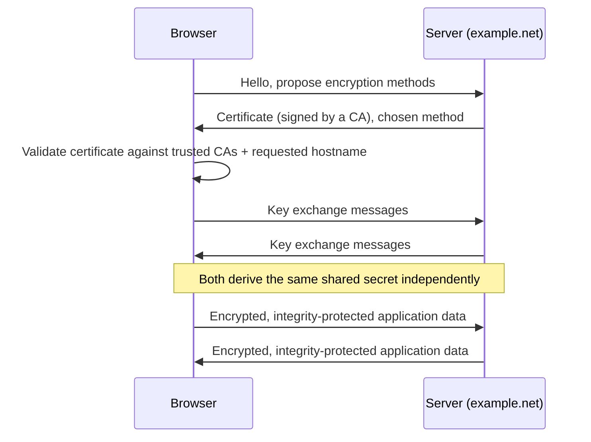

# Establishing Trust on an Untrusted Network

**Part:** Part IV — Names, Trust, and the Web

**Concept Level:** Level 6, per concept-graph.md

**Prerequisites:** TCP (Ch. 14), middleboxes (Ch. 16), DNS resolution (Ch. 17)

**New concepts introduced:** plaintext, ciphertext, encryption, integrity, authentication, certificate, certificate authority, key exchange, TLS session

---

## Opening Question

*How can a client verify a server and keep the conversation private?*

## Real-World Story

Two strangers need to exchange sensitive information across a city, but the only courier available is one neither of them controls or trusts — a courier who could, in principle, read every letter passed through them, or swap one letter for a forged replacement without either party immediately noticing. Simply sealing the letters isn't enough on its own: a sealed envelope can still be steamed open and resealed. And even if the contents stay private, there's a separate problem — how does the sender know the courier actually delivered the letter to the real intended recipient, and not to an imposter who's simply claiming to be them?

Solving this requires two genuinely different things: some way to make the letter's contents unreadable to anyone except the intended recipient, and some way to actually verify who that recipient is before trusting them with anything sensitive at all. Confusing these two problems, or assuming that solving one automatically solves the other, is exactly where most misunderstandings about "is this connection secure" come from.

The café laptop's connection to `example.net` crosses NAT devices, firewalls, and possibly a proxy — every one of them capable, in principle, of reading or altering the traffic passing through. This chapter is about how a private, verified conversation gets established anyway, on top of a path built from equipment neither the laptop nor the server controls.

## Worked Example

Walk conceptually through what happens, in order, when a browser connects to an HTTPS site — no cryptographic math, just the shape of the exchange and what each step actually accomplishes.

**Step one: negotiate how to talk.** The browser and server first agree on which specific encryption methods they'll use for this conversation — this negotiation itself happens in the clear, since neither side has a shared secret yet to protect it with.

**Step two: the server proves who it is.** The server presents a certificate — a signed statement, issued by a certificate authority, asserting "the entity holding the private key that matches this public key controls the domain name `example.net`." The browser checks this certificate against a built-in list of certificate authorities it's willing to trust, and also checks that the certificate is being presented for the exact domain name the browser actually asked to connect to. If either check fails, the browser refuses to proceed silently — it raises a loud warning, because this is exactly the situation where a hostile intermediary could be impersonating the real server.

**Step three: agree on a shared secret.** Through a key exchange, the browser and the verified server establish a secret value that only the two of them know — critically, an eavesdropper watching every message of this exchange still cannot derive that shared secret just from having observed the negotiation.

**Step four: everything from here on is protected.** Using that shared secret, both sides derive encryption keys, and from this point forward, every message is both encrypted (unreadable to anyone without the key) and integrity-protected (any tampering with a message in transit becomes detectable, because it would break a check tied to the same secret). The actual HTTP request and response — Chapter 19's subject — travel entirely inside this protected channel.

Notice what this sequence does and does not establish. It establishes that the browser is talking to whoever legitimately controls `example.net`'s certificate, and that nobody along the path can read or silently alter the conversation from here on. It does not establish that `example.net`'s operator is trustworthy, competent, or honest about anything it says over that now-private channel — verifying identity and verifying content are different problems, and TLS only solves the first one.

## Core Intuition

Two separate problems get solved together, but they are not the same problem: proving that the party on the other end really is who they claim to be, and making the conversation itself unreadable and tamper-evident to everyone else along the path. A certificate, checked against a trusted authority, solves the first. Encryption and integrity checks, built from a secret only the two verified parties share, solve the second. Neither one substitutes for the other.

## Technical Explanation

**Plaintext** is the original, readable content before protection is applied; **ciphertext** is what it looks like after encryption — unreadable without the corresponding key. **Encryption** is the transformation between the two. **Integrity** is a separate property: a way to detect whether ciphertext (or, in general, any message) was altered in transit, independent of whether it's also readable — encryption without integrity checking can still be silently tampered with in ways that produce corrupted-but-plausible-looking plaintext. **Authentication**, in this context, is verifying that a party genuinely is who it claims to be, before trusting anything else it says.

A **certificate** is a signed statement binding a domain name to a public key, issued by a **certificate authority (CA)** — an organization whose signature browsers and operating systems are configured, in advance, to trust. When a server presents a certificate, the client checks the CA's signature against its own built-in trust list, and separately checks that the certificate actually names the domain the client intended to reach. This is why a certificate for `example.net` presented while connecting to `example.com` fails validation — the identity claim doesn't match the destination actually being asked for.

A **key exchange** lets two parties who have never met derive a shared secret over a channel that a third party may be fully observing, in a way that an observer cannot feasibly reconstruct the same secret from what they saw. This shared secret is then used to derive the actual encryption and integrity keys used for the rest of the conversation, which together constitute a **TLS session** — a stateful, protected channel that both endpoints maintain for as long as the connection lasts.

Two guardrails worth being explicit about. First: TLS authenticates the identity named in the certificate once validation succeeds — it makes no claim whatsoever about whether that identity is trustworthy, honest, or safe to interact with; a certificate can be perfectly valid for a phishing site that legitimately controls the domain name it's impersonating something else through. Second: encryption protects the content of messages, not all the metadata surrounding the connection — the destination IP address and port remain visible to anything on the path, the approximate timing and size of the exchange remain visible, and depending on configuration, even the hostname being requested (via the TLS handshake's Server Name Indication) may be visible before encryption fully engages.

*Alt text: A browser and server negotiate encryption methods, the server presents a certificate the browser validates against trusted certificate authorities and the requested hostname, both sides perform a key exchange to derive a shared secret, and all further data is encrypted and integrity-protected.*

## Packet-Journey Checkpoint

Once the café laptop's TCP connection to `example.net`'s server (or reverse proxy, per Chapter 16) is established, this chapter's exchange runs on top of it before a single byte of the actual article is requested: certificate validation, key exchange, and the transition into an encrypted, integrity-protected session. Only once this TLS session exists does Chapter 19's HTTP request actually get sent — and it's sent entirely inside the protection this chapter builds.

## Common Misconceptions

### *HTTPS proves that a website is trustworthy.*

**Why it's wrong:** The padlock icon reads, to most people, as a general "this is safe" signal rather than a specific, narrow technical claim.

**Correct intuition:** TLS authenticates that you're talking to whoever legitimately controls the named domain, and protects the channel from eavesdropping and tampering — it says nothing about whether that operator is honest, competent, or safe to trust with anything you send them.

**Analogy:** Verifying a courier's identity badge confirms you're handing the letter to the right courier — it says nothing about whether that courier's employer is a business you should trust with sensitive information.

### *Encryption hides all network metadata.*

**Why it's wrong:** "Encrypted" sounds like a total, all-or-nothing property covering everything about the connection.

**Correct intuition:** Encryption protects message content. Destination IP, port, connection timing and size, and often the requested hostname remain visible to anything observing the path.

**Analogy:** A sealed envelope hides a letter's contents from a courier, but the courier can still see the size of the envelope, when it was handed over, and the address written on the outside.

## Practical Implications

A certificate warning is not a nuisance to click past — it's specifically the signal that identity verification, the first of TLS's two jobs, has failed, which is exactly the situation a hostile intermediary impersonating a real server would produce. Conversely, "the site has a valid certificate" answers only "am I talking to the real, verified operator of this domain," never "should I trust what this operator does with my data" — those are separate questions, and conflating them is how legitimate-looking phishing infrastructure succeeds. And because metadata isn't hidden by encryption, claims like "nobody can tell what site I'm visiting" over an ordinary TLS connection need real scrutiny — the destination and rough traffic pattern are often still observable even when the content isn't.

## Key Takeaway

**TLS creates a protected channel by combining authenticated identity, shared cryptographic secrets, integrity checks, and encryption.**

## What to Remember

- Encryption (unreadability) and authentication (verified identity) are separate problems; TLS solves both together but they don't imply each other.
- A certificate binds a domain name to a public key and is signed by a certificate authority the client already trusts.
- Certificate validation checks both the CA's signature and that the certificate actually names the destination the client intended to reach.
- A key exchange lets two parties derive a shared secret even while a third party observes every message of the negotiation.
- Integrity protection detects tampering with a message in transit, independently of whether the message is also encrypted.
- TLS authenticates the domain's legitimate operator — it makes no claim about that operator's trustworthiness or honesty.
- Encryption protects message content, not connection metadata like destination IP, port, timing, size, or (often) the requested hostname.

## The Next Obvious Question

*Once a secure channel exists, how does the Web exchange meaningful requests and responses?*

---

**Glossary terms added this chapter:** Plaintext, Ciphertext, Encryption, Integrity, Authentication, Certificate, Certificate authority (CA), Key exchange, TLS session → append to `/glossary.md`

**Misconceptions logged this chapter:** `https-proves-trustworthy` (enriched), `encryption-hides-all-metadata` (enriched)

**Concept-graph entries checked off:** encryption-integrity-authentication, certificate-and-ca, key-exchange, tls-session → `written: true`, `key_takeaway` set

**Diagrams used this chapter:** sequence (conceptual TLS handshake: negotiation, certificate validation, key exchange, protected data)
