# Where Time Goes

**Part:** Part V — Speed, Scale, and Modern Protocols

**Concept Level:** Level 7, per concept-graph.md

**Prerequisites:** Bandwidth and propagation latency (Ch. 2), TCP and its handshake (Ch. 14), routers and queueing at hops (Ch. 9)

**New concepts introduced:** throughput, serialization delay, propagation delay, processing delay, queueing delay, round-trip time, jitter, buffering, bufferbloat, bandwidth-delay product (intuition)

---

## Opening Question

*Why can two working connections feel radically different in speed and responsiveness?*

## Real-World Story

A shipping company owns a fleet of enormous cargo ships and a small, dedicated cargo plane. The cargo ship route to a distant port can move ten thousand containers per crossing — a staggering carrying *capacity*. But each crossing takes three weeks, no matter how many containers are aboard. The cargo plane carries a single container at a time, a tiny capacity by comparison, but it lands in fourteen hours.

If someone needs to move ten thousand containers of goods that aren't urgent, the ship is clearly better: enormous capacity, low cost per container, and the three-week delay is irrelevant to a shipment nobody is waiting on urgently. But if someone needs one urgent container of medical supplies on the other side of the ocean by tomorrow, the ship is useless no matter how much spare capacity it has sitting unused in its hold. Capacity did not help, because capacity was never the bottleneck for that request — the three weeks of travel time was.

This is the confusion at the heart of "network speed." People routinely describe a connection as "fast" or "slow" as though speed were one quantity, the way a car has one speed. But the cargo-ship-versus-cargo-plane story shows two genuinely different quantities hiding under that one word: how *much* can move at once, and how *long* a single thing takes to arrive. A connection can have enormous capacity and still feel sluggish for the exact task someone is actually doing right now, and a connection with modest capacity can feel snappy if what's being asked of it is small and time-sensitive.

## Worked Example

Consider three links, each asked to do two different jobs: fetch one small interactive response (a search suggestion, a few hundred bytes), and download one large file (a hundred megabytes).

**A geostationary satellite link.** Huge coverage, and modern satellite services offer respectable capacity — tens of megabits per second is common. But a geostationary satellite sits roughly 36,000 kilometers above the equator. A signal has to travel up to the satellite and back down — twice, for a round trip — covering something like 144,000 kilometers total, at the speed of light. That alone costs around 480 milliseconds, before any data is even processed. For the tiny interactive request, that fixed delay dominates completely; the reply feels sluggish no matter how much capacity sits unused. For the hundred-megabyte download, that same 480 milliseconds is a rounding error spread across many seconds of actual transfer — the large capacity gets to matter.

**A congested fiber link.** Physically capable of huge capacity and genuinely short travel distance — maybe a few milliseconds each way to a nearby data center. But if that link is currently saturated by other traffic, incoming data queues up waiting for a turn, the way cars queue at a tollbooth during rush hour even though the highway itself is wide. The tiny interactive request might sit behind other people's large downloads in that queue, adding delay that has nothing to do with distance or the link's rated capacity — it's congestion, a resource being asked to do more than it can currently keep up with.

**A local Wi-Fi link, otherwise idle.** Modest capacity compared to fiber, but the physical distance is a few meters, and if nothing else is competing for the same radio channel, there's no queue to wait behind. Both the tiny request and the large download feel fast — the interactive request because there was almost nothing between the laptop and its access point, the large download because even modest capacity, sustained, moves a hundred megabytes in a reasonable amount of time.

The same two jobs, three different links, three different outcomes — and none of it can be explained by a single "speed" number for each link. Explaining it requires separating capacity from delay, and separating the different *sources* of delay from each other.

## Core Intuition

"How fast is this connection" is really several independent questions bundled together: how much data can move per second once it's flowing (capacity), how long one bit takes to physically reach the other end (distance-based delay), how long a device takes to get the data ready to send or to process it on arrival (processing delay), and how long data sits waiting for a turn behind other traffic (queueing delay). A connection can score well on some of these and poorly on others — the same way the cargo ship has huge capacity and huge delay at once. There is no single number that captures all four, which is exactly why two "working" connections can feel completely different for the same task.

## Technical Explanation

**Throughput** is how much data actually moves across a connection per unit of time, once transfer is under way — related to bandwidth (Chapter 2's raw carrying capacity of a link) but measured in practice, where it's often lower than the link's theoretical maximum because of the very delays described below.

Four distinct kinds of delay accumulate between a request leaving one machine and its reply arriving back:

**Serialization delay** is the time it takes a sending device to actually push all the bits of a unit onto the link — a function of the unit's size divided by the link's capacity. A larger unit, or a slower link, means more serialization delay. This is the first delay a bit experiences, before it has traveled anywhere at all.

**Propagation delay** is Chapter 2's propagation latency: the physical travel time for a signal to cross a link, bounded by the speed of light through that link's medium. It scales with distance and is fixed for a given path — no amount of extra capacity shortens it, which is exactly what made the satellite link's 480 milliseconds unavoidable above.

**Processing delay** is the time a device — an endpoint or an intermediary like a router — spends actually handling a unit once it has arrived: inspecting a header, making a forwarding decision, running higher-layer logic. Usually small per device, but it accumulates across every hop and every layer a request passes through.

**Queueing delay** is time spent waiting in line behind other traffic before a device gets around to processing or forwarding a unit — the tollbooth backup from the fiber-link example. Unlike the other three, queueing delay isn't a fixed property of a link or a device; it depends entirely on how much *other* traffic is competing for the same resource at that moment, which is why the same link can feel fast at 3 a.m. and sluggish during a traffic spike.

The sum of these delays for one round trip — request out, reply back — is the **round-trip time (RTT)**, the number most directly felt as "responsiveness" for small, interactive exchanges. **Jitter** is variation in that delay from one packet to the next; a connection with high but *consistent* delay is often less disruptive for some applications than one with lower but wildly *inconsistent* delay, because the receiving application can't predict when the next unit will show up.

One more relationship is worth naming without deriving it in detail: the **bandwidth-delay product** — capacity multiplied by round-trip time — describes roughly how much data can be "in flight," sent but not yet acknowledged, on a given path at a given moment. A high-bandwidth, high-delay path (like that satellite link) can have a surprisingly large amount of data in flight at once even though each individual bit takes a while to arrive; this is part of why satellite and other high-delay links need particular care from protocols like TCP to use their available capacity well, a thread later chapters on real-time and adaptive applications (Chapter 25) return to.

Finally, **buffering**: devices along a path often hold a small queue of units waiting to be sent, absorbing brief bursts so they aren't simply dropped. This is generally good — but a buffer that's too large creates **bufferbloat**: instead of dropping excess traffic quickly (a clear, fast signal that a path is overloaded), an oversized buffer lets a growing backlog sit and wait, adding queueing delay that keeps climbing the longer the overload continues, sometimes to the point that interactive traffic sharing that same path becomes unusable even though nothing was ever technically lost.

```mermaid
gantt
    dateFormat X
    axisFormat %L ms
    title One request's round trip: where the milliseconds go
    section Outbound
    Serialization (sender) :0, 2
    Propagation (to server) :2, 42
    Queueing (router hop)   :42, 60
    Processing (server)     :60, 65
    section Return
    Serialization (server)  :65, 66
    Propagation (to client) :66, 106
```

*Alt text: A timeline showing one small request's round trip broken into six sequential stages — serialization, propagation, queueing, processing, serialization again, propagation again — with propagation consuming most of the total time in this example, illustrating that "slow" is rarely one uniform cause.*

## Packet-Journey Checkpoint

Every earlier chapter's mechanism silently contributed delay to the café laptop's request from Chapter 20 without the book naming it as such: the Wi-Fi association and DHCP exchange (Chapters 4, 7) cost processing and round-trip time before any request could even begin; each router hop across autonomous systems (Chapters 9, 11) added its own processing and possibly queueing delay; the TCP and TLS handshakes (Chapters 14, 18) each cost at least one additional round trip before a single byte of the actual article was requested. None of that was wasted or a design flaw — it's simply where the milliseconds actually went, now made explicit instead of invisible.

## Common Misconceptions

### *Higher bandwidth always lowers latency*

**Why it's wrong:** Bandwidth (capacity) and latency (delay) feel like they should move together, since both are casually called "speed."

**Correct intuition:** Propagation delay is fixed by distance and the medium's signal speed; adding capacity doesn't shorten the physical distance a signal has to travel. A wider highway doesn't make a car cross a longer distance any faster.

**Analogy:** Highway width and travel distance (Chapter 21) — more lanes move more cars per hour, but a single car's crossing time depends on distance and speed limit, not lane count.

### *Speed-test throughput describes every application experience*

**Why it's wrong:** A speed test measures sustained throughput for a large transfer, which is exactly the scenario where capacity matters most and fixed delays matter least.

**Correct intuition:** A small, interactive exchange is dominated by round-trip time and processing/queueing delay, not by capacity — a connection that scores well on a speed test can still feel sluggish for chat or page navigation if its RTT is high.

**Analogy:** The cargo ship's ten-thousand-container capacity is irrelevant to someone waiting on one urgent envelope.

### *Geographical distance is the only source of delay*

**Why it's wrong:** Propagation delay is the most intuitive delay, so it's easy to assume it's the whole story.

**Correct intuition:** Serialization, processing, and especially queueing delay can dominate total round-trip time even on a short physical path, as the congested-fiber-link example showed.

**Analogy:** Highway width and travel distance — a short highway can still be backed up by a traffic jam that has nothing to do with its length.

### *Zero packet loss means good performance*

**Why it's wrong:** Loss feels like the obvious failure signal, so its absence feels like proof everything is fine.

**Correct intuition:** A connection can lose nothing at all and still perform poorly, purely from accumulated queueing delay (bufferbloat) or a high fixed round-trip time — loss and delay are related but separate problems.

**Analogy:** Cargo can arrive fully intact after three weeks and still have failed the person who needed it tomorrow.

### *Adding buffers always prevents slowness*

**Why it's wrong:** A buffer's job is to absorb bursts, so more buffering intuitively sounds like more protection against dropped or delayed traffic.

**Correct intuition:** An oversized buffer lets an overloaded link's backlog grow instead of signaling overload quickly, producing bufferbloat — climbing queueing delay that can make a link feel far worse than if excess traffic had simply been dropped.

**Analogy:** A tollbooth that never turns cars away just gets a longer and longer line, instead of the road clearing once it's genuinely full.

## Practical Implications

When a product claims to be "fast," ask which of these four delays it actually improved — a CDN mainly attacks propagation delay by moving data physically closer (Chapter 22); a protocol change like QUIC mainly attacks queueing/blocking behavior (Chapter 24); more bandwidth mainly helps large transfers, not small interactive ones. When debugging a "slow" connection, check for growing, inconsistent delay (a bufferbloat or queueing signature) versus a consistently high but stable delay (a propagation-distance signature) — they call for entirely different fixes.

## Key Takeaway

**Network performance is the combined result of capacity, distance, processing, queues, loss, and protocol behavior — not one number called speed.**

## What to Remember

- Throughput (capacity) and delay are separate quantities; a connection can be strong on one and weak on the other.
- Round-trip time accumulates from four distinct sources: serialization, propagation, processing, and queueing delay.
- Propagation delay is fixed by distance and signal speed — no amount of added bandwidth shortens it.
- Queueing delay depends on competing traffic at that moment, not on any fixed property of the link.
- Jitter (delay *variation*) can disrupt some applications more than high-but-steady delay does.
- The bandwidth-delay product describes how much data can be usefully in flight on a path at once.
- Oversized buffers cause bufferbloat: growing queueing delay instead of a fast, clear overload signal.

## The Next Obvious Question

*How can one service respond quickly and reliably to millions of users?*

---

**Glossary terms added this chapter:** Throughput, Serialization delay, Propagation delay, Processing delay, Queueing delay, Round-trip time (RTT), Jitter, Buffering, Bufferbloat, Bandwidth-delay product → append to `/glossary.md`

**Misconceptions logged this chapter:** more-bandwidth-reduces-latency, more-buffering-always-better (both enriched, see `/misconceptions.md`) → append to `/misconceptions.md`

**Concept-graph entries checked off:** throughput, serialization-delay, processing-and-queueing-delay, round-trip-time, jitter, bufferbloat → update `/concept-graph.yaml`, regenerate `/concept-graph.md`

**Diagrams used this chapter:** performance-timeline → satisfies style-guide.md §4
