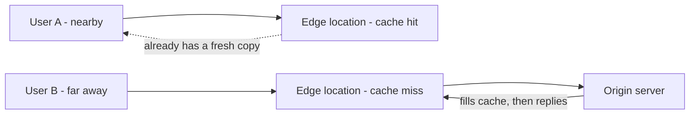

# Bringing Services Closer and Spreading the Work

**Part:** Part V — Speed, Scale, and Modern Protocols

**Concept Level:** Level 7, per concept-graph.md

**Prerequisites:** HTTP requests and responses (Ch. 19), DNS resolution (Ch. 17), propagation and queueing delay (Ch. 21)

**New concepts introduced:** cache, freshness, CDN, edge location, origin, load balancer, health check, replication, affinity, anycast (intuition)

---

## Opening Question

*How can one service respond quickly and reliably to millions of users?*

## Real-World Story

A publisher's newest book becomes an unexpected bestseller. If every copy, worldwide, had to be printed and shipped from the publisher's single headquarters printing room, two problems appear immediately. First, distance: a reader in a distant country waits weeks for a copy that a reader near headquarters gets in a day, even though the book itself is identical. Second, capacity: one printing room, however well-equipped, has a physical limit to how many copies it can produce per day — a limit that a single bestseller can blow straight through.

The publisher's actual solution isn't to build one gigantic printing room. It's to license regional printing facilities that keep already-typeset copies ready near where demand actually is, and to run multiple facilities in parallel so no single one has to absorb the entire country's demand alone. A dispatcher routes each new order to whichever facility can fill it fastest — usually the nearest one with stock and free capacity, but not always, if that facility happens to be backed up. Nothing about the book's content changed. What changed is *where copies live* and *how work gets spread across the facilities capable of producing more*.

Internet services facing millions of simultaneous requests face exactly these two problems, for exactly the same underlying reason: one origin, however powerful, is far from everyone by definition, and has a hard capacity ceiling no matter how it's built.

## Worked Example

Consider three different requests hitting a busy online retailer's website, and notice that each one gets handled by a genuinely different mechanism, even though a user sees only "the website" in every case.

**A product photo.** The exact same JPEG file is requested by thousands of different users, unchanged, over and over. This is the ideal case for keeping a copy near each user rather than fetching it from the origin every time — the response never varies with who's asking.

**A personalized recommendation, fetched from an API.** Every user's response is different, computed specifically for their account and browsing history at the moment of the request. There is no static file to place copies of — this request has to actually reach a server capable of running that computation, though which specific server among several equivalent ones handles it can still be chosen based on which is least busy right now.

**A large video segment, part of a product demo.** Like the photo, the content is identical for every viewer, but it's large enough that even a small amount of added distance-delay per byte adds up to a noticeably slower start, and enough people watch simultaneously that serving every viewer from one origin would saturate its outbound capacity even if the content were small.

Three requests, three different jobs: the photo wants **caching** near the user; the personalized API response wants **load balancing** across capable backends, because caching a per-user answer for everyone else would be simply wrong; the video wants both — cached copies placed close to viewers, delivered through infrastructure built to sustain heavy simultaneous demand. Treating all three the same way — either caching everything or caching nothing — would break at least one of them.

## Core Intuition

A service handles massive, geographically spread-out demand with two genuinely different strategies, often combined: avoid redoing work that's already been done, by keeping a copy of an unchanging answer near where it'll be asked for again (caching), and spread new, unavoidable work across multiple machines capable of doing it, so no single one becomes the bottleneck or single point of failure (load balancing). Neither strategy is "the" fix — a personalized answer can't be cached for everyone, and a truly unique piece of new work can't be replicated away; matching the right strategy to the right kind of request is the actual skill.

## Technical Explanation

A **cache** stores a copy of a response so a later, matching request can be answered from that stored copy instead of repeating the original work. **Freshness** is how a cache decides whether a stored copy is still safe to reuse or has gone stale and needs to be re-fetched from the source — governed by explicit signals (an expiration time, a validation token) rather than a guess, since serving a stale copy as if it were current is its own kind of failure.

A **content delivery network (CDN)** is infrastructure built specifically around this idea at global scale: many **edge locations** — points of presence physically distributed near clusters of users — hold cached copies of content, so a nearby edge location can usually answer a request without it ever reaching the **origin**, the server that actually owns and, when needed, generates the content. This is why the video segment above benefits doubly: distance-delay drops because an edge location is physically closer than the origin, and origin capacity is protected because most requests never reach it at all.

A **load balancer** sits in front of a pool of interchangeable backend servers and decides, per incoming request, which one should handle it — spreading demand so no single backend is overwhelmed while others sit idle. A **health check** is the load balancer's mechanism for knowing which backends are actually able to handle traffic right now: a periodic probe (often as simple as an HTTP request expecting a specific response) that removes a failing or overloaded backend from rotation automatically, without a human having to notice and intervene.

**Replication** means running multiple copies of a service or its data, which load balancing depends on — there's nothing to balance across if only one backend exists. Replication helps with both capacity (more machines, more total throughput) and resilience (one instance failing doesn't take the whole service down), but it introduces its own question: if a user's session or data is only fully consistent on one particular replica, sending their *next* request to a different replica can produce visibly wrong results. **Affinity** (also called session stickiness) is a load-balancing policy that deliberately routes a given user's repeated requests to the same backend to sidestep that problem — at the cost of losing some of load balancing's flexibility, since that backend can no longer be freely swapped out from under an in-progress session.

**Anycast**, at the level of intuition this book uses, is a routing technique (not a caching or load-balancing mechanism itself) where the same IP address is announced from multiple physical locations, and ordinary routing (Chapters 9 and 11) simply delivers each user's packets to whichever announcing location is closest in routing terms — giving many CDNs and DNS providers a way to point users at a nearby edge location without any special logic in the client at all.

*Alt text: Two users request the same content through their nearest edge location; one edge already holds a fresh cached copy and answers directly, while the other's cache is empty and must fetch once from the origin before it can answer and cache the result for future requests.*

## Packet-Journey Checkpoint

When the café laptop from Chapter 20 requested `https://example.net/article`, DNS resolution (Chapter 17) may have returned an edge location's address rather than a single fixed origin server, if the article's site uses a CDN — meaning the TLS handshake and HTTP request from Chapters 18-19 were likely conducted with a nearby edge location, not a distant origin, and the delay accounting from Chapter 21 changes accordingly: much of the propagation delay that would have been paid to a distant origin may never have been paid at all.

## Common Misconceptions

### *A CDN is simply a faster server*

**Why it's wrong:** "Content delivery network" sounds like a description of raw server performance rather than a distribution strategy.

**Correct intuition:** A CDN combines caching, edge placement, request routing, and origin shielding — caching is one part of a larger system, and much of its benefit comes from proximity and avoided origin work, not from any single machine being faster.

**Analogy:** Local warehouses and dispatchers (Chapter 22) — the warehouses aren't faster factories, they're just closer to the people ordering.

### *Load balancing means every request is distributed evenly*

**Why it's wrong:** "Balancing" sounds like it should mean an even split.

**Correct intuition:** A load balancer routes based on current backend health and load, which can mean a very uneven split at any given moment — evenness (if it happens at all) is a byproduct of the policy, not the goal itself.

**Analogy:** A dispatcher sends the next order to whichever facility is actually free right now, not to whichever facility's turn it "should" be.

### *Caching is safe for every response*

**Why it's wrong:** Caching feels like a generically good optimization to apply everywhere.

**Correct intuition:** A response that's specific to one user or one moment in time (the personalized recommendation) becomes actively wrong if served from a cache to someone else, or served stale to the same person later.

**Analogy:** The personalized recommendation worked example — caching a warehouse's inventory list makes sense; caching one specific customer's private order confirmation and handing it to the next customer would not.

### *Replication automatically gives consistency*

**Why it's wrong:** Having multiple identical-seeming copies feels like it should mean they're always identical in practice.

**Correct intuition:** Replicas can briefly diverge (one has processed an update the other hasn't yet), which is exactly why some systems use session affinity rather than trusting any replica to be perfectly interchangeable at every instant.

**Analogy:** Two regional warehouses restocked from the same shipment can briefly show different available inventory if one hasn't finished unloading yet.

### *A healthy process guarantees a healthy user experience*

**Why it's wrong:** "The server is up" sounds like the complete definition of "working."

**Correct intuition:** A backend can be running and technically healthy by a shallow health check while still being overloaded, slow, or serving degraded results — health checks are only as good as what they actually verify.

**Analogy:** A printing facility can be "open for business" while its queue is backed up for days — open is not the same as fast.

## Practical Implications

When evaluating "we use a CDN" or "we're load balanced," ask what specifically is being cached (and how staleness is handled) versus what's being load-balanced fresh every time — the two solve different problems and a system can be strong at one and weak at the other. A health check that merely confirms a process is running, rather than that it's actually serving correct, timely responses, can leave a genuinely degraded backend in rotation.

## Key Takeaway

**Internet services scale by reducing repeated work, moving reusable data closer to users, and distributing new work across multiple failure domains.**

## What to Remember

- Caching avoids repeating work for requests whose answer doesn't change between askers.
- A CDN's edge locations place cached copies near users, protecting the origin and cutting propagation delay.
- Load balancing spreads genuinely new, per-request work across multiple capable backends.
- Health checks let a load balancer automatically stop sending traffic to a failing backend.
- Replication adds both capacity and resilience, but can introduce brief inconsistency between copies.
- Session affinity trades some load-balancing flexibility for consistency within one user's session.
- Anycast lets ordinary routing deliver users to a nearby announcing location with no client-side logic.

## The Next Obvious Question

*Why did the Web need multiple simultaneous exchanges over fewer connections?*

---

**Glossary terms added this chapter:** Cache, Freshness, CDN (content delivery network), Edge location, Origin, Load balancer, Health check, Replication, Affinity (session stickiness), Anycast → append to `/glossary.md`

**Misconceptions logged this chapter:** cdn-is-just-a-cache (enriched, see `/misconceptions.md`) → append to `/misconceptions.md`

**Concept-graph entries checked off:** caching, cdn, load-balancer, health-check, replication-and-affinity → update `/concept-graph.yaml`, regenerate `/concept-graph.md`

**Diagrams used this chapter:** topology (cache hit vs. cache miss through an edge location) → satisfies style-guide.md §4
