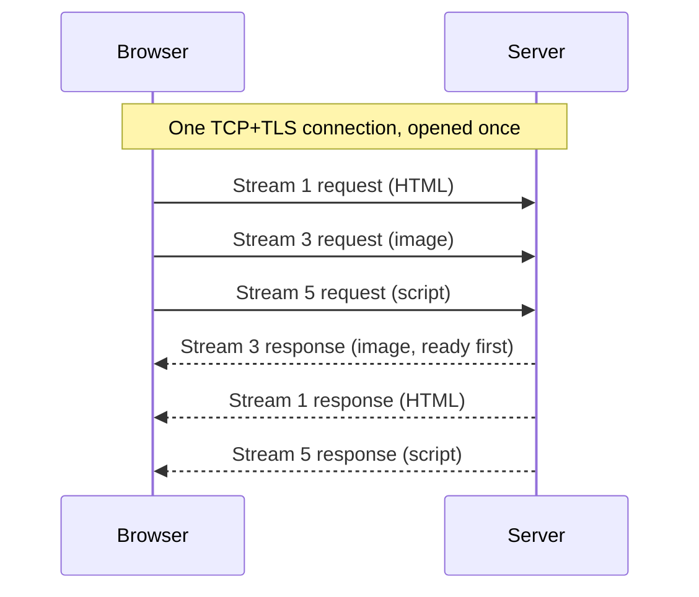

# Many Requests, Fewer Connections

**Part:** Part V — Speed, Scale, and Modern Protocols

**Concept Level:** Level 7, per concept-graph.md

**Prerequisites:** TCP connections and handshakes (Ch. 14), HTTP requests and responses (Ch. 19), queueing and round-trip time (Ch. 21)

**New concepts introduced:** connection reuse, pipelining (intuition), multiplexing, stream, HTTP/2, header compression, head-of-line blocking

---

## Opening Question

*Why did the Web need multiple simultaneous exchanges over fewer connections?*

## Real-World Story

A busy sandwich shop originally handled every single customer by opening a brand-new register, training a cashier on the spot, and closing the register the moment that one customer finished — even for a customer who wanted to place three separate orders during their visit. Opening a register isn't instant: there's a short setup routine before the first sandwich can even be rung up. During a lunch rush, most of the shop's time was spent opening and closing registers rather than actually making sandwiches.

The obvious fix isn't to open unlimited registers at once — the shop only has so much counter space, and coordinating a huge number of simultaneous one-use registers gets chaotic fast. The fix that actually works is to keep a smaller number of registers open continuously, and let each one process several customers' orders in sequence without shutting down between them. Even better: let one open register juggle several *different* customers' orders concurrently — ring up a bit of order A while order B's cashier finishes bagging — rather than forcing perfect one-at-a-time sequencing even within a single open register.

A single webpage in the mid-2000s might need fifty or more separate resources — the HTML, several stylesheets, dozens of images, a handful of scripts. Fetching each one over a brand-new TCP connection, the way early HTTP effectively did, meant paying that connection's setup cost fifty separate times for one page.

## Worked Example

Trace loading a page with fifty small resources under three different connection strategies, tracking round trips spent purely on overhead rather than actual content.

**Fifty separate connections.** Each resource gets its own new TCP connection (Chapter 14's handshake — at least one round trip) and, since this is HTTPS, its own new TLS handshake (Chapter 18 — at least one more round trip). That's a minimum of one hundred extra round trips of pure setup overhead before counting a single byte of actual content, and browsers historically had to cap how many connections could be open to one host simultaneously anyway, so most of those fifty resources ended up waiting in a queue regardless.

**One reused connection, resources fetched strictly one after another.** Now only one TCP and TLS handshake are paid, total — a huge improvement. But every resource still has to wait for the previous one to fully complete before its own request can even be sent, since only one exchange can be in flight on the connection at a time. If resource #3 happens to be a slow-generating API response, resources #4 through #50 all sit blocked behind it even though they have nothing to do with #3 and could have been fetched in parallel.

**One reused connection, resources fetched concurrently over it.** Same single setup cost as the previous case, but now the browser can have many resource requests genuinely in flight on the same connection at once, interleaved — a slow resource #3 no longer blocks #4 through #50 from making progress in the meantime. This is the strategy that actually eliminates both problems the first two approaches each had one of.

## Core Intuition

Opening a connection has a real, repeated cost — handshakes, round trips — so reusing one connection for many requests instead of opening a new one per request is a clear win. But reuse alone isn't enough if requests on that one connection still have to happen strictly in order, because one slow request can then block every request queued behind it. The full fix needs both: keep connections open and reused, *and* let multiple requests make progress on a reused connection at the same time instead of one at a time.

## Technical Explanation

**Connection reuse** means sending more than one request over a single already-established TCP (and, for HTTPS, TLS) connection instead of opening a new one per request — directly avoiding the repeated handshake overhead the sandwich-shop story illustrates. **Pipelining**, at the level of intuition this book needs, was an earlier attempt at using a reused connection more efficiently by sending several requests without waiting for each response first — but because the underlying connection is still just one ordered byte stream (Chapter 14), the responses still had to come back in the same order they were requested, so one slow response still blocked everything queued behind it on that connection. This is exactly the second scenario in the worked example, and it's why pipelining alone was never enough to fully solve the problem.

**Multiplexing** solves what pipelining couldn't: it lets multiple independent, concurrent exchanges share one underlying connection, with data from different exchanges interleaved and correctly reassembled at the other end, rather than forced into strict request-order sequencing. **HTTP/2** is the version of HTTP built specifically around multiplexing: instead of the connection carrying one flat sequence of requests and responses, it carries multiple concurrent **streams**, each an independent, bidirectional sequence of messages identified by its own stream number, all interleaved over the same TCP connection. A slow stream no longer blocks unrelated streams from making progress, because the browser and server can freely interleave data from whichever streams are ready, rather than waiting on one at a time.

HTTP/2 also introduces **header compression**: since many HTTP headers (cookies, user-agent strings, common header names) repeat nearly identically across many requests on the same connection, HTTP/2 maintains shared compression state across a connection's lifetime so repeated header data can be sent far more compactly than resending it in full on every single request — a meaningfully different kind of compression from compressing a page's actual content, and one that specifically depends on connection reuse to have anything worth compressing against.

None of this eliminates **head-of-line blocking** entirely, though — it only eliminates it at the *HTTP* level. TCP still delivers one ordered byte stream (Chapter 14): if a single packet belonging to any one of HTTP/2's multiplexed streams is lost, TCP will not deliver *any* of the bytes behind that lost packet to the application — including bytes belonging to completely unrelated streams that arrived at the network layer just fine — until the lost packet is retransmitted and TCP's ordering can resume. HTTP/2's streams are logically independent, but they still ride on one physically ordered TCP delivery guarantee underneath, and TCP has no concept of "skip ahead for this other stream." This exact residual problem is precisely what motivates Chapter 24's redesign.

*Alt text: A sequence diagram showing three HTTP/2 requests sent over one shared connection without waiting for each other, with responses arriving back out of request order — stream 3's image finishes first even though it was requested second — because each stream progresses independently over the shared connection.*

## Packet-Journey Checkpoint

If the café laptop's browser from Chapter 20 needs the article page's HTML plus its stylesheets, images, and scripts, a modern server will very likely negotiate HTTP/2 (or HTTP/3, Chapter 24) during the TLS handshake from Chapter 18, then serve all of those resources as concurrent streams over the single TCP connection already established — instead of the fifty-separate-connections scenario this chapter opened with.

## Common Misconceptions

### *More TCP connections always mean more speed*

**Why it's wrong:** More parallel connections intuitively feels like more parallel work getting done.

**Correct intuition:** Each additional connection pays its own handshake overhead and adds coordination cost; multiplexing many logical streams over fewer connections is generally more efficient than opening many parallel ones, which is exactly why the Web moved away from many-connections-per-host.

**Analogy:** Labeled orders sharing checkout lanes (Chapter 23) — a few continuously staffed lanes serving many labeled orders beats opening and closing a new lane per order.

### *Multiplexing eliminates every form of blocking*

**Why it's wrong:** "Independent streams" sounds like it should mean total independence at every layer.

**Correct intuition:** HTTP/2 multiplexing removes head-of-line blocking at the HTTP level, but a lost packet still blocks TCP's single ordered byte stream underneath, which still blocks every multiplexed HTTP stream riding on it.

**Analogy:** Several labeled orders moving through one shared checkout lane still all stop if the lane itself jams, no matter how clearly each order is labeled.

### *HTTP/2 replaces TCP*

**Why it's wrong:** HTTP/2 changes so much about how requests are exchanged that it can feel like a new transport protocol.

**Correct intuition:** HTTP/2 is an application-layer protocol that still runs over an ordinary TCP connection (Chapter 14) — it changes how HTTP itself uses that connection, not what TCP guarantees underneath it.

**Analogy:** A store reorganizing how it serves customers within its existing checkout lanes hasn't rebuilt the lanes themselves.

### *Compression here primarily means compressing page content*

**Why it's wrong:** "Compression" most readily brings to mind shrinking images, text, or video.

**Correct intuition:** HTTP/2's header compression specifically targets repeated *header* metadata across many requests on the same connection — a different mechanism from, and in addition to, any content compression happening separately.

**Analogy:** Reusing a standard, mostly-unchanging order slip instead of writing every customer's name and usual preferences out in full each time.

### *One connection means only one request can be active*

**Why it's wrong:** This was true for the earlier one-connection, strictly-sequential case in the worked example, so it's easy to assume it always holds.

**Correct intuition:** With HTTP/2 multiplexing, one connection can carry many concurrently active streams — "one connection" describes the underlying TCP/TLS session, not a limit on concurrent requests.

**Analogy:** One open checkout lane processing several customers' labeled orders concurrently, not strictly one customer fully served before the next begins.

## Practical Implications

When evaluating page-load performance, check whether resources are being served over a reused, multiplexed connection or over many separate connections — the latter is a red flag inherited from an older era of the Web. When diagnosing an unusually slow page despite HTTP/2 being in use, consider that a single lossy network path can still stall every multiplexed stream at once via TCP-level head-of-line blocking, which is exactly the scenario the next chapter addresses.

## Key Takeaway

**HTTP/2 makes application exchanges more efficient by multiplexing many logical streams over a shared transport connection, while still inheriting TCP's ordering behavior.**

## What to Remember

- Opening a connection has real, repeated cost — handshake round trips for both TCP and TLS.
- Connection reuse avoids paying that cost once per request.
- Pipelining tried to use one reused connection more efficiently but still forced strict response ordering.
- Multiplexing lets multiple independent streams share one connection with interleaved, concurrent progress.
- HTTP/2 introduces streams and header compression, both depending on a persistent, reused connection.
- HTTP/2 removes head-of-line blocking at the HTTP level, not at the TCP level underneath it.
- A single lost packet can still stall every multiplexed HTTP/2 stream via TCP's ordered byte-stream guarantee.

## The Next Obvious Question

*Why move modern Web transport into QUIC instead of continuing to modify TCP?*

---

**Glossary terms added this chapter:** Connection reuse, Pipelining (intuition), Multiplexing, Stream (HTTP/2), HTTP/2, Header compression, Head-of-line blocking → append to `/glossary.md`

**Misconceptions logged this chapter:** more-connections-always-faster (enriched, see `/misconceptions.md`) → append to `/misconceptions.md`

**Concept-graph entries checked off:** connection-reuse, multiplexing-http2, header-compression, head-of-line-blocking → update `/concept-graph.yaml`, regenerate `/concept-graph.md`

**Diagrams used this chapter:** sequence (three HTTP/2 streams interleaved over one connection) → satisfies style-guide.md §4
