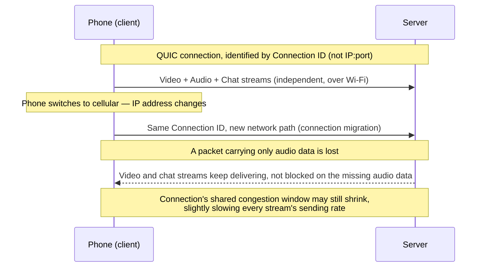

# Rebuilding Transport for the Modern Web

**Part:** Part V — Speed, Scale, and Modern Protocols

**Concept Level:** Level 7, per concept-graph.md

**Prerequisites:** UDP (Ch. 13), TCP reliability and byte streams (Ch. 14), TLS (Ch. 18), head-of-line blocking (Ch. 23)

**New concepts introduced:** QUIC, HTTP/3, encrypted transport metadata, user-space transport, independent streams, connection ID, connection migration, zero-round-trip resumption (intuition)

---

## Opening Question

*Why move modern Web transport into QUIC instead of continuing to modify TCP?*

## Real-World Story

A city's public road system is a shared, heavily regulated resource. Repainting lane markings, adding a turning lane, or changing how intersections are timed all require sign-off from multiple government bodies, coordination with utility companies, and enough advance notice that every driver, delivery service, and city department can adjust. Even a genuinely good improvement can take years to actually reach the road, because changing shared infrastructure that everyone already depends on, in exactly the way they currently depend on it, is inherently slow and risky.

A privately run shuttle service, by contrast, operates its own fleet on top of those same public roads but makes its own internal rules: how it schedules pickups, how it reroutes around a closure, how it handles a broken-down vehicle. It still has to obey traffic law and stay on the actual roads — it hasn't escaped the underlying infrastructure — but it can change its own internal operating rules on its own timeline, without waiting for every other road user in the city to agree.

TCP is the public road system: implemented deep inside operating-system kernels across billions of devices, changing its actual behavior requires updates rolling out across effectively the entire Internet's installed base, over years. QUIC took a different approach: build the improved transport as a library running in ordinary application space — like the shuttle service's own vehicles — while still riding on UDP, one of the oldest and most universally deployed parts of the actual road system, specifically because UDP itself needed no changes for this to work.

## Worked Example

Follow a phone on a video call that begins the call over home Wi-Fi and then physically leaves the house, switching to a cellular connection mid-call, while the call also happens to be carrying several logically distinct pieces of data — the video stream, the audio stream, and a text chat sidebar — over the same connection.

**Under a TCP-based design.** A TCP connection is identified, in part, by the combination of source and destination IP addresses and ports (Chapter 12's five-tuple). The moment the phone switches from Wi-Fi to cellular, its IP address changes — and that changes the five-tuple, which TCP treats as a fundamentally different connection. The existing TCP connection cannot simply continue; it has to be torn down and a brand new one established, incurring fresh handshake delay exactly at the moment connectivity was already disrupted. And if a single packet belonging to, say, the audio stream is lost, TCP's ordered byte-stream guarantee (Chapter 14) can stall delivery of the video and chat data riding on the same connection too, even though they have nothing to do with the lost audio packet — the same head-of-line-blocking problem Chapter 23 left unresolved.

**Under a QUIC-based design.** The connection is identified by a **connection ID** chosen by QUIC itself, independent of IP address or port — so when the phone's IP address changes from switching networks, QUIC can recognize the same ongoing connection continuing under a new network path and keep going, a capability called **connection migration**, without tearing anything down or renegotiating from scratch. And because QUIC's video, audio, and chat data ride on genuinely **independent streams** at the transport level itself (not just at the HTTP level, the way Chapter 23's HTTP/2 streams still shared one underlying TCP byte stream), losing a packet that happened to carry only audio data stalls just the audio stream's own delivery, with video and chat not forced to wait behind that specific gap. If that same lost packet had also been carrying a video or chat frame bundled in alongside the audio data — QUIC packs frames from multiple streams together when it can — those streams would wait too, for their own missing piece; and even when a stream's own data wasn't in the lost packet at all, the connection's shared congestion response to that loss can still nudge down the sending rate available to every stream for a moment, video and chat included. What QUIC actually guarantees is narrower but still the meaningful part: a stream with none of its own data in the lost packet is never forced to wait behind someone else's specific missing bytes, unlike TCP's single shared byte stream, which stalls everything on any loss regardless of which logical stream the lost bytes belonged to.

## Core Intuition

QUIC solves two problems TCP structurally cannot, without waiting for TCP itself to change everywhere it's deployed: it separates a connection's identity from the IP address and port carrying it, so a connection can survive a network change; and it gives each of its multiplexed streams independent delivery and ordering, so a lost stream's data no longer forces every *unrelated* stream to wait behind it the way TCP's single shared byte stream does. It does this by building a new, reliable, ordered, congestion-controlled transport as software that, unlike TCP, doesn't require operating-system kernel changes to evolve, instead of trying to extend TCP itself.

## Technical Explanation

**QUIC** is a transport protocol, standardized as RFC 9000, commonly implemented as **user-space transport**: rather than living inside the operating system kernel the way TCP traditionally does, QUIC's logic typically runs in an ordinary application-level library, using UDP (Chapter 13) purely as a substrate — the underlying, minimal delivery mechanism it builds real reliability, ordering, and congestion control on top of. Nothing about QUIC's own specification actually requires a user-space implementation — a kernel-level one is possible too — but building on UDP is exactly what *makes* a user-space implementation practical, which is why that's how QUIC is deployed almost everywhere in practice. This is precisely why "QUIC uses UDP" is not evidence of unreliability: UDP is simply the raw material QUIC uses to implement its own equivalent of everything TCP provides, plus more, entirely in software that can be updated independently, one application or library at a time, without needing kernel or router changes to roll out globally.

QUIC identifies a connection using a **connection ID** — a value chosen by the endpoints themselves — rather than the traditional IP-and-port tuple TCP relies on. Because this identifier survives an IP address change, QUIC supports **connection migration**: an ongoing connection can continue across a network transition (Wi-Fi to cellular, one Wi-Fi network to another) without being torn down and rebuilt, exactly the capability the worked example's phone call depended on.

Within one QUIC connection, multiple **independent streams** can be open concurrently, each with its own delivery order — this is the crucial structural difference from HTTP/2-over-TCP (Chapter 23): QUIC's streams are independent at the *transport* layer itself, not layered as a multiplexing trick on top of one shared ordered byte stream. Loss detection, acknowledgement, and congestion response happen at the level of the connection as a whole, tracking QUIC packets rather than keeping fully separate bookkeeping per stream — but when a packet is lost, only the specific stream data that packet was carrying needs to be resent, as a new frame, and only that stream's own delivery waits specifically on that missing data; a stream with none of its data in the lost packet is never forced to sit blocked behind someone else's gap the way TCP's one shared ordered byte stream would force it to. A single QUIC packet on the wire can still carry frames belonging to more than one stream bundled together for efficiency, so losing that one packet can delay every stream whose data happened to ride inside it — QUIC doesn't guarantee that a lost packet only ever touches one stream. And "not blocked" is narrower than "not affected at all": because congestion control (Chapter 15's logic, adapted here) operates on the connection as a whole, a lost packet can still shrink the connection's shared congestion window, which can slow the *sending rate* available to every stream, including ones that never lost a single byte of their own data — a real, if usually brief, connection-wide side effect that loss-recovery independence alone doesn't remove. What QUIC actually guarantees is specifically the removal of *unrelated*-stream head-of-line blocking, not a promise that loss is always perfectly contained to a single stream, and not a claim that unrelated streams are entirely unaffected by another stream's bad luck.

QUIC also integrates encryption (Chapter 18's TLS, specifically TLS 1.3) directly into its handshake and treats most of its own transport-level control information — not just application payload — as **encrypted transport metadata**, protecting far more of the exchange from casual observation or tampering by a network intermediary than TCP's traditionally unencrypted header ever did. One practical consequence: because the connection setup and cryptographic handshake are combined rather than sequential, a QUIC connection to a server the client has recently talked to before can, under the right conditions, begin sending application data immediately alongside its very first handshake message — an intuition usually called **zero-round-trip (0-RTT) resumption**. This early-data capability itself actually comes from TLS 1.3, not from QUIC specifically — a plain TCP connection using TLS 1.3 resumption can send early data before its own handshake finishes too, on an ordinary TCP-then-TLS connection. What QUIC's combined setup adds on top is removing the *separate* round trip a fresh TCP-then-TLS connection historically needed purely to establish the transport connection itself, before TLS's own handshake (with or without resumption) could even begin.

**HTTP/3** is the version of HTTP built to run over QUIC rather than TCP — carrying forward HTTP/2's multiplexed-streams model, but now benefiting from QUIC's independent per-stream ordering and delivery underneath (removing the cross-stream head-of-line blocking Chapter 23 identified, though not full independence — loss detection and congestion response still operate at the connection level, as this chapter's Technical Explanation covers), plus connection migration.

*Alt text: A phone maintains one QUIC connection, identified by a connection ID rather than its IP address, across a switch from Wi-Fi to cellular; losing a packet that carried only audio data delays just the audio stream's delivery, while video and chat streams — whose data was not in that packet — are not blocked waiting on it. A packet carrying more than one stream's data would delay each of those streams. The connection's shared congestion window can still shrink in response to the loss, mildly slowing every stream's sending rate for a time, even ones unaffected by the missing data itself.*

## Packet-Journey Checkpoint

If `https://example.net/article`'s server supports HTTP/3, the café laptop's browser from Chapter 20 may negotiate QUIC instead of TCP-plus-TLS entirely, potentially completing the transport-and-security setup Chapters 14 and 18 described in a single combined exchange rather than two sequential ones. And if the laptop later switches from the café's Wi-Fi to a cellular hotspot — genuinely changing its IP address, unlike simply roaming between access points on the same network, which often keeps the same address and wouldn't need migration at all — connection migration can preserve that same QUIC connection across the change rather than forcing the browser to reconnect, provided both ends support it and the new path checks out (a server can decline migration, and even when it works, the connection may briefly slow while it re-measures the new path's behavior).

## Common Misconceptions

### *QUIC is unreliable because it uses UDP*

**Why it's wrong:** UDP was introduced in Chapter 13 as the protocol that deliberately does *not* provide reliability, so "built on UDP" sounds like it should inherit that lack of reliability.

**Correct intuition:** QUIC implements its own reliable, ordered, congestion-controlled delivery in user space, using UDP only as a substrate for sending raw datagrams — the reliability lives in QUIC's own logic, not in UDP.

**Analogy:** A privately run shuttle service still gets passengers reliably to their destination even though it drives on the same public roads used by everyone else; the road being minimal doesn't make the service unreliable.

### *HTTP/3 removes congestion control*

**Why it's wrong:** Since QUIC reimplements transport from scratch, it can seem like it might have dropped less-visible mechanisms like congestion control along the way.

**Correct intuition:** QUIC implements its own congestion control, conceptually similar in spirit to Chapter 15's TCP congestion control, still adapting to network conditions rather than sending without limit. That congestion control operates for the *connection as a whole* — one shared budget for how much unacknowledged data can be in flight across the whole path — not a separate independent budget per stream; streams get independent ordering and delivery (above), but they still share one connection's view of how congested the path currently is.

**Analogy:** The shuttle service still has its own rules about how many vehicles it dispatches onto a congested road at once — running its own operation doesn't mean ignoring road conditions.

### *QUIC makes all connections instant*

**Why it's wrong:** Zero-round-trip resumption sounds like it should apply universally.

**Correct intuition:** 0-RTT resumption only applies to a server the client has recently connected to before, under specific conditions; a first-ever connection to a new server still requires a real handshake. It also comes with a real, structural limitation, not just a narrower use case: data sent in that very first 0-RTT flight is more vulnerable to replay — a network attacker who captures it can potentially resend it to the server again, which is not possible for data sent after the full handshake completes. Applications are expected to only put safely-repeatable requests in that first flight for exactly this reason, and QUIC deployments commonly restrict which kinds of requests are even allowed to use it.

**Analogy:** A shuttle service can dispatch instantly to a regular customer's known, pre-approved pickup — a brand-new customer still needs an initial booking conversation first.

### *Encryption eliminates observability entirely*

**Why it's wrong:** QUIC's heavy encryption of transport metadata can suggest a network can no longer observe anything meaningful about a connection.

**Correct intuition:** As with TLS in Chapter 18, encryption protects content and much transport metadata, but a network can still observe basic facts like packet timing, size, and the destination IP address and port being reached.

**Analogy:** A courier who won't reveal a sealed envelope's contents still visibly walks to a specific address at a specific time.

### *HTTP/3 is always faster in every environment*

**Why it's wrong:** As the newer protocol built to fix known problems, HTTP/3 sounds like a strict, universal upgrade.

**Correct intuition:** On networks that block or deprioritize UDP traffic, or where round trips are already minimal, QUIC's specific advantages (migration, removing cross-stream head-of-line blocking, combined handshake) may deliver little or no visible benefit over well-tuned HTTP/2.

**Analogy:** A shuttle service's flexibility only helps on trips where road conditions actually change or vary — on a short, empty, predictable route, its advantages may hardly show at all.

## Practical Implications

When a product claims to use QUIC or HTTP/3, the concrete benefits to expect are resilience to network changes (mobile users switching networks mid-session) and better behavior under packet loss on connections carrying multiple concurrent streams — not simply "faster" in every situation. When troubleshooting a QUIC-based service that seems to fail on some networks, consider that some firewalls and networks block or throttle UDP more aggressively than TCP, which can silently degrade or block QUIC entirely.

## Key Takeaway

**QUIC builds reliable, secure, multiplexed transport over UDP so it can evolve faster and keep one stream's loss from blocking delivery on unrelated streams.**

## What to Remember

- TCP's deep kernel-level deployment makes it slow to evolve; QUIC sidesteps this by running as user-space software over UDP.
- QUIC identifies connections by a connection ID, not IP address and port, enabling connection migration across network changes.
- QUIC's streams have independent delivery order, so a stream with no data in a lost packet is never blocked behind another stream's specific missing bytes — though loss detection and congestion response happen at the connection level, one lost QUIC packet can still carry frames from more than one stream at once, and a shrinking shared congestion window after loss can briefly slow every stream's sending rate, unrelated streams included.
- QUIC is commonly implemented as user-space software over UDP, but that's a deployment choice UDP makes practical, not a strict requirement of the QUIC specification itself.
- QUIC integrates TLS 1.3 into its own handshake and encrypts most transport metadata, not just application payload.
- Zero-round-trip resumption can let a returning client send data immediately, under specific prior-connection conditions — but that first flight of data is more vulnerable to replay, so applications restrict what it's used for.
- HTTP/3 is HTTP's multiplexed-streams model running over QUIC instead of TCP.
- QUIC still implements its own congestion control, shared across the whole connection rather than per stream — it does not send without limit.

## The Next Obvious Question

*Why do video calls, streams, games, and messages choose different trade-offs?*

---

**Glossary terms added this chapter:** QUIC, HTTP/3, User-space transport, Connection ID, Connection migration, Independent streams (QUIC), Encrypted transport metadata, Zero-round-trip (0-RTT) resumption → append to `/glossary.md`

**Misconceptions logged this chapter:** quic-unreliable-because-udp (enriched, see `/misconceptions.md`) → append to `/misconceptions.md`

**Concept-graph entries checked off:** quic, http3, connection-migration, zero-rtt-resumption → update `/concept-graph.yaml`, regenerate `/concept-graph.md`

**Diagrams used this chapter:** sequence (connection migration and independent per-stream ordering/delivery, with the connection-wide congestion caveat) → satisfies style-guide.md §4
