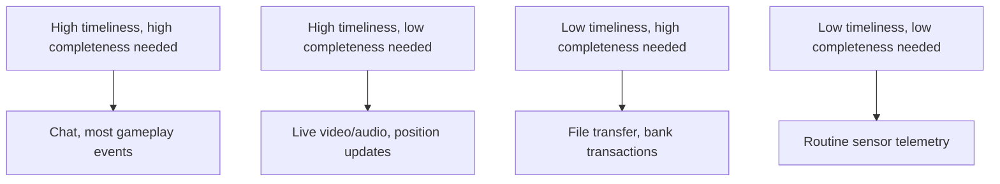

# Different Applications, Different Networks

**Part:** Part V — Speed, Scale, and Modern Protocols

**Concept Level:** Level 7, per concept-graph.md

**Prerequisites:** UDP and TCP trade-offs (Ch. 13, 14), jitter (Ch. 21), QUIC's independent streams (Ch. 24)

**New concepts introduced:** timeliness, completeness, jitter buffer, adaptive bitrate, real-time media (trade-offs), state synchronization, idempotency (intuition), backpressure

---

## Opening Question

*Why do video calls, streams, games, and messages choose different trade-offs?*

## Real-World Story

Three pieces of information arrive late to three different people. A newspaper delivered a day late is still perfectly readable — every article is exactly as true and useful as it would have been yesterday, just slightly stale. A tornado warning delivered even ten minutes late isn't merely less useful, it may be actively useless — the entire value of that message was tied to arriving *before* a specific moment, not after it. And a bank confirming a wire transfer that it silently failed to actually record isn't a timing problem at all — no amount of speed matters if the message that does arrive isn't complete and correct.

These three failures aren't variations on the same problem at different severities. They're three genuinely different things an application can need from a network, and confusing them leads to picking the wrong trade-off entirely: building a system that guarantees perfect completeness when what it actually needed was speed, or optimizing purely for speed when what it actually needed was an unshakeable guarantee that nothing gets lost or duplicated.

## Worked Example

Compare five ordinary applications against the same three questions: what happens if data is lost, what happens if it arrives late, and what happens if it arrives out of order.

**File transfer.** Every single byte must arrive, correct and in order, no matter how long it takes — a single missing byte can corrupt an entire downloaded file. This is squarely TCP's home territory (Chapter 14): complete correctness matters far more than speed.

**Live video call.** A dropped or corrupted frame from two seconds ago is worthless by the time it could be retransmitted and redisplayed — the call has already moved on. Far better to briefly glitch and continue than to freeze the entire call waiting for one lost frame to be resent. This favors UDP-like delivery (Chapter 13): timeliness over completeness.

**Online multiplayer game.** Similar to video in favoring recency over perfect history, but with an added twist: a stale position update for another player isn't just uninteresting, it can actively mislead a player into reacting to where an opponent *was*, not where they *are now* — so newer state should often simply supersede older state rather than both being processed in order.

**Text chat.** Unlike video or gaming, a chat message genuinely must eventually arrive and in the right order — losing a message in a conversation is a real problem, not a tolerable glitch. But unlike a bank transfer, chat can usually tolerate a few hundred extra milliseconds of delivery delay without anyone noticing or caring.

**Sensor telemetry** (a fleet-tracking device reporting its location every few seconds). An individual lost reading barely matters, since another one is coming shortly and supersedes it entirely — but sustained, systematic loss (every reading for an hour) would be a real problem, distinguishing "occasional loss is fine" from "loss is always fine."

Five applications, five different answers to the same three questions — and each one's networking choices only make sense once its actual tolerance for loss, delay, and ordering is made explicit.

## Core Intuition

There is no universally "better" way to move data — only a better fit for what a specific application actually needs. The right question is never "reliable or fast?" in the abstract; it's "for this specific application, what happens to the value of this specific piece of data if it's late, lost, or out of order?" Different honest answers to that question lead to genuinely different, equally correct engineering choices.

## Technical Explanation

**Timeliness** is how much a piece of data's usefulness depends on arriving promptly — high for the tornado warning and the video call, low for the newspaper and most file transfers. **Completeness** is how much an application needs every piece of data to actually arrive, with nothing missing — high for the bank transfer and the file, lower for one frame of video or one sensor reading. These are separate axes, not opposite ends of one scale: an application can score high or low on each independently, which is exactly why four distinct combinations of "important" and "not important" all show up among the five worked-example applications above.

Applications with high timeliness and lower completeness needs typically build on UDP-like delivery (Chapter 13) rather than TCP, and often add their own lightweight mechanisms suited to their specific tolerance — never TCP's full byte-stream reliability, which would reintroduce exactly the retransmission delay they're trying to avoid.

A **jitter buffer** is one such mechanism: since Chapter 21's jitter means packets for something like a video or audio call don't arrive at perfectly even intervals, a jitter buffer holds a small amount of incoming data briefly before playing or displaying it, smoothing out that uneven arrival into a steady stream — trading a small amount of fixed added delay for a much smoother playback experience, deliberately accepting slightly higher timeliness cost to avoid a much worse stuttering cost.

**Adaptive bitrate** is a technique, common in video streaming, where a client continuously measures its own currently available throughput (Chapter 21) and requests a correspondingly lower- or higher-quality version of the same content, so the video keeps playing smoothly at a quality the current network conditions can actually sustain, rather than either stalling completely or overwhelming a constrained connection at a fixed high quality.

Real-time and gaming applications often rely on **state synchronization** rather than a strict message-by-message log: instead of guaranteeing every historical update is delivered and processed in order, the application periodically sends or receives a snapshot of current state (a player's current position, not their entire movement history), where a newer snapshot can simply supersede and effectively replace an older one that's still in flight or was lost — directly explaining why the multiplayer game example above favors newest-wins over strict ordering.

**Idempotency**, at the intuition level this book needs, describes an operation that produces the same correct result whether it happens once or is accidentally repeated — a property applications with strict completeness needs (like the bank transfer) often deliberately design for, specifically so that a retried request after an uncertain or lost response doesn't risk duplicating a real-world effect like a double charge.

**Backpressure** is a signal, flowing from a receiver or downstream component back toward a sender, indicating "slow down, I can't keep up with what you're currently sending" — related to Chapter 15's flow control, but a broader idea applying anywhere one part of a system needs to tell another part to ease off before capacity is exceeded and data starts being dropped or queued excessively.

*Alt text: A simple two-by-two grid crossing timeliness needs against completeness needs, placing chat and gameplay events in the high/high quadrant, live video and position updates in high-timeliness/low-completeness, file transfer and bank transactions in low-timeliness/high-completeness, and routine telemetry in low/low — illustrating that these are two independent axes, not one reliability spectrum.*

## Packet-Journey Checkpoint

The café laptop's article request from Chapter 20 sits solidly in the low-timeliness, high-completeness quadrant — a user waiting an extra half-second for an article is a minor inconvenience, but a corrupted or incomplete article would be a real failure — which is exactly why that whole journey has been built on TCP (or QUIC's equivalent reliable delivery) throughout. A video call placed from that same laptop, by contrast, would make entirely different choices at the transport layer, favoring the timeliness-over-completeness trade-offs this chapter describes.

## Common Misconceptions

### *Every application should prefer reliable, ordered delivery*

**Why it's wrong:** "Reliable" sounds like an unqualified good, and TCP's guarantees feel like the safer default.

**Correct intuition:** Reliable, ordered delivery has a real cost — retransmission delay — that some applications' actual needs cannot afford, making an unreliable-but-timely delivery mechanism the genuinely better engineering choice for them.

**Analogy:** A late newspaper, a late warning, a missing bank transfer (Chapter 25) — the warning needed timeliness far more than perfect completeness.

### *Live video cannot tolerate packet loss*

**Why it's wrong:** "Cannot tolerate loss" sounds like the natural conclusion from valuing a smooth, uninterrupted call.

**Correct intuition:** Live video specifically tolerates occasional loss well (a brief visual glitch) in exchange for avoiding the far worse alternative of stalling entirely to wait for a retransmission.

**Analogy:** A late newspaper, a late warning, a missing bank transfer — video sits closer to "a warning" than "a bank transfer": timeliness matters far more than never losing a single frame.

### *Buffering is always bad*

**Why it's wrong:** Chapter 21 introduced bufferbloat as a real problem, which can make "buffering" sound uniformly harmful.

**Correct intuition:** A small, deliberately-sized jitter buffer trading a controlled, fixed amount of added delay for much smoother playback is a genuinely good design choice — the problem in Chapter 21 was specifically *uncontrolled, growing* buffering, not buffering itself.

**Analogy:** A jitter buffer is a small, fixed holding area used on purpose — closer to a predictable waiting line with a known length than to an ever-growing backlog.

### *A faster protocol can compensate for poor application design*

**Why it's wrong:** Since Chapters 21-24 spent considerable effort on protocol-level speed improvements, it can seem like protocol choice is the main lever available.

**Correct intuition:** An application that hasn't identified its actual timeliness/completeness needs can still make the wrong trade-off even on the fastest available transport — protocol choice can't substitute for that analysis.

**Analogy:** A privately run shuttle service (Chapter 24) still can't help a rider who boarded the wrong route entirely — speed doesn't fix a fundamentally mismatched choice.

### *"Real time" means literally zero delay*

**Why it's wrong:** "Real time" is casual shorthand that sounds like it should mean instantaneous.

**Correct intuition:** Every real-time application still has genuine delay (propagation, processing, jitter-buffer delay); "real time" actually means delay is kept low and consistent enough that the specific application's timeliness needs are met, not that delay is literally zero.

**Analogy:** The tornado warning's genuine urgency is about arriving fast enough to matter, not about arriving with literally no travel time at all.

## Practical Implications

When designing or evaluating a networked feature, name its actual timeliness and completeness requirements explicitly before choosing a transport — "we need this to be fast" and "we need this to never lose data" are different requirements that can point toward different, sometimes conflicting choices. When a real-time feature feels laggy, check whether the actual bottleneck is transport-level delay or an oversized, poorly-tuned jitter buffer trading away more timeliness than the application can afford.

## Key Takeaway

**Applications choose networking mechanisms according to which failures they can tolerate and which delays make their data lose value.**

## What to Remember

- Timeliness and completeness are separate requirements, not two ends of one scale.
- File transfer and financial transactions sit in the low-timeliness, high-completeness quadrant.
- Live video and position updates sit in the high-timeliness, low-completeness quadrant.
- A jitter buffer trades a small, fixed added delay for smoother playback against jitter.
- Adaptive bitrate matches video quality to currently available throughput in real time.
- State synchronization lets newer updates supersede older, still-in-flight ones rather than enforcing strict ordering.
- Idempotency lets a retried operation be safely repeated without duplicating its real-world effect.

## The Next Obvious Question

*How can physical networking be exposed as programmable virtual infrastructure?*

---

**Glossary terms added this chapter:** Timeliness, Completeness, Jitter buffer, Adaptive bitrate, State synchronization, Idempotency (intuition), Backpressure → append to `/glossary.md`

**Misconceptions logged this chapter:** covered in-chapter (no dedicated registry rows pre-seeded for Ch. 25) → see Common Misconceptions above

**Concept-graph entries checked off:** timeliness-vs-completeness, jitter-buffer, adaptive-bitrate, real-time-media, backpressure → update `/concept-graph.yaml`, regenerate `/concept-graph.md`

**Diagrams used this chapter:** state-snapshot (timeliness/completeness 2x2 classification) → satisfies style-guide.md §4
