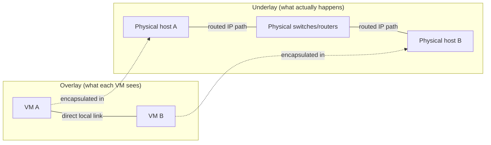

# Networks Made of Software

**Part:** Part VI — Networks in Production

**Concept Level:** Level 8, per concept-graph.md

**Prerequisites:** Encapsulation (Ch. 3), routers and routing tables (Ch. 9), control plane and data plane (Ch. 11), switches (Ch. 4)

**New concepts introduced:** virtual interface, bridge (virtual), tunnel and overlay, underlay vs. overlay, software-defined networking, cloud virtual network (VPC), virtual route table

---

## Opening Question

*How can physical networking be exposed as programmable virtual infrastructure?*

## Real-World Story

A city has one physical street grid, built once and expensive to change. But the city can paint several genuinely different transit maps onto that same grid: a bus route map, a bike-lane map, an emergency-vehicle priority map, each with its own logical connections, priorities, and rules, layered on top of the same underlying asphalt. A bus map showing a direct connection between two neighborhoods doesn't mean a new road was built — it means the city defined a route, with its own stops and rules, using streets that were already there.

Crucially, every one of those transit maps still depends entirely on the physical streets beneath it. If a street closes for repair, every map that routed through it is affected, no matter how independent those maps looked on paper. The logical maps are real and useful — they let the city reason about "the bus network" as its own coherent thing — but they don't replace the physical streets; they're a layer of organization built on top of them.

Cloud and virtual networking work the same way: a physical data center has one real, physical network. Virtual networks — a customer's isolated private network in the cloud, an overlay connecting containers across machines — are logical maps drawn on top of that same physical infrastructure, real and independently useful, but never actually independent of what's physically underneath them.

## Worked Example

Trace two virtual machines that both believe they share a simple, private, flat network — the way two computers on the same office LAN from Chapter 4 would — even though their packets are physically crossing a large, routed data-center network with many intermediate physical switches and routers in between.

Each virtual machine has a **virtual interface**: a software-defined network interface (Chapter 4's physical network interface, reimplemented in software) that the VM's operating system treats exactly like a real network card, entirely unaware that no dedicated physical wire connects it to anything. When VM A sends a frame addressed to VM B's virtual interface, the hypervisor software hosting VM A intercepts that frame before it ever reaches real hardware, wraps it inside a new outer packet addressed to the physical server actually hosting VM B — an application of Chapter 3's encapsulation, wrapping one complete frame inside another layer's payload — and sends that outer packet across the real, physical data-center network using entirely ordinary IP routing (Chapter 9).

When that outer packet arrives at VM B's physical host, the hypervisor there strips away the outer wrapping, recovers the original inner frame exactly as VM A sent it, and delivers it to VM B's virtual interface — which sees precisely what it would have seen on a real, direct, shared local link, having no visibility into the physical routing that frame actually took. Both VMs experience what feels like Chapter 4's local network, entirely unaware that their "local link" was, physically, a routed journey across a data center — this is a **tunnel**, and the logical network built from many such tunnels is an **overlay**, layered on top of the real, physical **underlay** network neither VM ever directly perceives.

## Core Intuition

A virtual network is a genuinely real, independently useful logical structure — it has its own addressing, its own topology, its own rules — built by software that intercepts, wraps, and delivers traffic using an underlying physical network that still does all the actual physical carrying. The virtual layer never replaces the physical one; it rides on top of it, the way every transit map still depends on the streets.

## Technical Explanation

A **virtual interface** is a software-implemented network interface, presented to an operating system or application exactly as a physical one would be, but with no dedicated physical hardware behind it — the software foundation every other concept in this chapter builds on. A **(virtual) bridge** is a software equivalent of Chapter 4's switch, connecting multiple virtual interfaces (or a virtual interface and a physical one) as though they shared one local link.

**Encapsulation** (Chapter 3) is what makes tunneling possible: a **tunnel** wraps one network's traffic entirely inside another network's packets for the length of a journey, so the inner traffic can cross infrastructure that has no native awareness of it — the mechanism behind VM A and VM B's frame exchange above. An **overlay** is a logical network built from many such tunnels, layered on top of an **underlay** — the real, physical network the overlay's tunneled traffic actually travels across. This underlay-versus-overlay distinction matters because an overlay inherits every one of its underlay's real physical limitations: if the underlay has a failure, congestion, or a capacity ceiling, every overlay built on top of it is affected too, exactly as a street closure affects every transit map routed through it, no matter how logically separate those maps appear.

**Software-defined networking (SDN)** generalizes Chapter 11's data-plane/control-plane split: rather than each individual physical device independently working out its own forwarding behavior, a centralized (or logically centralized) control-plane system computes forwarding policy and programs it into the data-plane devices actually moving traffic — letting network behavior be defined and changed through software configuration rather than manually reconfiguring individual physical devices one at a time.

A **cloud virtual network**, often called a Virtual Private Cloud (VPC), is a customer-defined logical network within a cloud provider's shared physical infrastructure — the customer gets their own address ranges, subnets (Chapter 6), and topology, built through SDN mechanisms on top of the provider's real, physical, massively shared underlay, isolated from other customers' virtual networks sharing that same physical infrastructure. A **virtual route table** is the cloud-virtual-network equivalent of Chapter 9's routing table specifically: a customer-configurable set of rules determining which path traffic takes within their own virtual network's logical topology, even though the actual physical forwarding underneath is entirely the provider's infrastructure. Whether that traffic is *permitted* at all is a separate question, answered by a distinct mechanism — security groups, network ACLs, or equivalent firewall policy (Chapter 16) — layered alongside the route table, not folded into it; a cloud architecture can route traffic somewhere perfectly correctly and still block it there, or vice versa, because forwarding and permission are enforced by two different pieces of configuration.

*Alt text: Two diagrams stacked — an overlay view where VM A and VM B appear to share one direct local link, and the underlay view beneath it showing their traffic actually crosses physical hosts and routed switches, connected by dotted lines showing each VM's traffic is encapsulated into the physical underlay journey it's actually unaware of.*

## Packet-Journey Checkpoint

If `example.net`'s article server (from the café laptop's Chapter 20 journey) is hosted in a cloud provider's data center, everything from Chapter 9's router-to-router forwarding onward, once the request reaches that provider's infrastructure, likely happens partly inside a virtual network layered over the provider's real, physical, shared underlay — the server's own virtual route table and security-group policy, not just ordinary Internet routing, shape how the request actually reaches the specific machine serving the response.

## Common Misconceptions

### *A virtual network has no physical dependencies*

**Why it's wrong:** "Virtual" often implies something abstract, existing independently of physical hardware.

**Correct intuition:** Every overlay is encapsulated and carried over a real physical underlay, and inherits its failures — a physical outage or congestion event still affects every virtual network built on top of it.

**Analogy:** Transit maps over common streets (Chapter 26) — a bus map is real and useful, but a closed street still closes the bus route drawn across it.

### *An overlay replaces the underlay*

**Why it's wrong:** Since the overlay is what applications and users actually interact with, it can feel like the "real" network, with the underlay reduced to an implementation detail.

**Correct intuition:** The overlay is a logical layer of organization; the underlay is still doing all the actual physical carrying, and remains the thing ultimately responsible for whether traffic can move at all.

**Analogy:** A bus route map organizes travel; it doesn't pave any new roads.

### *Cloud subnets behave exactly like Ethernet LANs*

**Why it's wrong:** A cloud VPC's subnets are deliberately presented to feel familiar, using the same vocabulary as Chapter 6's subnets and Chapter 4's local networks.

**Correct intuition:** A cloud subnet's actual forwarding, broadcast behavior, and neighbor-discovery mechanics are implemented entirely by the provider's SDN control plane, not by real shared-medium Ethernet hardware — some LAN assumptions (like arbitrary broadcast reachability) don't hold the same way.

**Analogy:** The bus map's stops feel like real physical places you can stand, but the "route" connecting them is a rule the transit authority defined, not a road built specifically for buses alone.

### *Software-defined networking means centrally forwarding every packet*

**Why it's wrong:** "Centralized control" can sound like it means a central system handles every packet directly.

**Correct intuition:** SDN's control plane computes and distributes forwarding policy; the actual data-plane forwarding of individual packets still happens at distributed devices, following the policy they were programmed with, not by routing every packet through a central point.

**Analogy:** A city's transit authority sets bus routes and schedules centrally, but buses themselves still physically drive their own routes independently.

### *Private cloud addressing automatically provides complete isolation*

**Why it's wrong:** A private, customer-specific address range feels like it should mean total separation from every other customer.

**Correct intuition:** Isolation is enforced by the provider's SDN policy — route tables controlling where traffic can even go, and separate security-group/firewall policy controlling whether it's permitted once it gets there — all of it software configuration, not a property of the address range itself. A misconfiguration in either piece can still expose traffic in ways private addressing alone wouldn't prevent.

**Analogy:** A private bus route drawn on the shared map is only as private as the transit authority's actual access rules make it — the map itself doesn't enforce anything.

## Practical Implications

When reading a cloud architecture diagram, remember that every "private network" box is a logical construct enforced by provider policy, not physical isolation — understanding what's actually being enforced (and by what mechanism) matters more than the box's label. When an overlay-based service has a mysterious slowdown or outage, check the physical underlay's health first — a problem invisible to the overlay's own logical view can still be the real, physical root cause.

## Key Takeaway

**Virtual networking creates logical topology and policy by programming endpoints and encapsulating traffic over an underlying physical network.**

## What to Remember

- A virtual interface is a software-implemented network interface with no dedicated physical hardware.
- Tunneling encapsulates one network's traffic inside another's packets to cross unaware infrastructure.
- An overlay is a logical network of tunnels, layered on and fully dependent on its physical underlay.
- SDN separates centralized policy computation (control plane) from distributed packet forwarding (data plane).
- A cloud VPC is a customer-defined logical network built through SDN on shared physical infrastructure.
- A virtual route table is the cloud-network equivalent of an ordinary routing table, customer-configurable — it controls where traffic goes, not whether it's permitted; that's a separate job for security groups/NACLs/firewall policy.
- Underlay failures and limitations always affect every overlay built on top of them.

## The Next Obvious Question

*How does communication work when applications move among containers and machines?*

---

**Glossary terms added this chapter:** Virtual interface, Bridge (virtual), Tunnel, Overlay, Underlay, Software-defined networking (SDN), Cloud virtual network (VPC), Virtual route table → append to `/glossary.md`

**Misconceptions logged this chapter:** virtual-network-no-physical-dependency (enriched, see `/misconceptions.md`) → append to `/misconceptions.md`

**Concept-graph entries checked off:** virtual-interface, bridge-virtual, tunnel-and-overlay, underlay-vs-overlay, sdn, cloud-virtual-network, virtual-route-table → update `/concept-graph.yaml`, regenerate `/concept-graph.md`

**Diagrams used this chapter:** topology (overlay view vs. underlay view of two VMs) → satisfies style-guide.md §4
