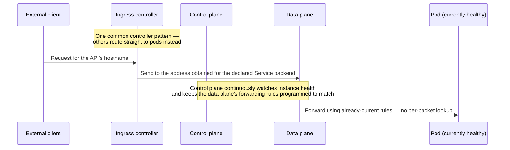

# Networking Moving Applications

**Part:** Part VI — Networks in Production

**Concept Level:** Level 8, per concept-graph.md

**Prerequisites:** Virtual interfaces and overlays (Ch. 26), DNS (Ch. 17), proxies (Ch. 16), load balancers (Ch. 22)

**New concepts introduced:** network namespace, pod, Container Network Interface (CNI), pod (container) address, service address and discovery, headless service, ingress and ingress controller, egress, east-west traffic, sidecar proxy, service mesh

---

## Opening Question

*How does communication work when applications move among containers and machines?*

## Real-World Story

A large company used to assign each employee a fixed desk with a labeled phone extension, and anyone wanting to reach that employee would dial their extension directly. Then the company adopted flexible seating: employees might sit at a different desk every day, or work from a different building entirely, depending on the week's needs. Dialing a specific desk's extension became useless — the person who used to answer that extension might not even be in the building today, and a different employee entirely might be sitting there instead.

The company's actual fix wasn't to abandon phone numbers. It was to give each *employee* — not each desk — a single stable number that the phone system quietly forwards to wherever that employee is currently sitting, updated automatically as their location changes. Callers keep dialing the same stable number forever; the company's phone system handles the increasingly complicated job of keeping track of where that number should currently ring.

Containerized applications move constantly — restarted after a crash, rescheduled onto a different physical machine, scaled up with new copies or down with fewer, all automatically, often without a human deciding exactly when or where. A networking model built around fixed, manually assigned addresses (the old fixed-desk-and-extension approach) breaks down immediately under that much routine, automatic movement — so container platforms build the same kind of solution the company did: stable identities that get continuously, automatically kept up to date with wherever the actual, moving instances currently are.

## Worked Example

Follow one external request — a customer hitting a company's public API — as it travels from the open Internet through to one of several constantly-changing backend instances actually capable of handling it.

The request first reaches an **ingress** point: infrastructure that accepts traffic from outside the cluster and routes it toward the correct internal destination, much like Chapter 16's reverse proxy but purpose-built for a container platform. Its rules are declared as configuration — which external hostname and path map to which internal **service**, named by identity, not by address. The running proxy that reads that configuration and does the work is the **ingress controller**; this walkthrough follows the common pattern where it forwards to the service's own stable **service address**, a fixed published address representing "the API" regardless of which instances currently back it.

Getting from "service" to "a specific live instance" is **service discovery**'s job: the platform's continuously updated record of which instances are healthy behind each service. Control-plane components (the same kind of control plane as Chapters 9 and 11) watch that record and program the data plane's forwarding rules to match, so when a packet addressed to the service arrives, the data plane already knows which live instance to send it to — no fresh lookup per packet. That reconciliation is automatic but not instantaneous: for a brief window after an instance fails, some traffic can still be aimed at it before every forwarding rule catches up.

The request ultimately reaches one healthy instance's own **pod address** — the network-layer address of a *pod*, the platform's unit of network identity, deliberately unstable and disposable: it changes the moment that instance is replaced. A pod can hold more than one container, and it's the pod, not each container inside it, that owns the **network namespace** and its address; containers sharing a pod share that namespace and reach each other over `localhost`, while staying isolated from every other pod's, even on the same machine.

If the backend then calls another internal service — a database, say — that's **east-west traffic**: between services inside the cluster, as opposed to the north-south traffic (like this request) crossing the cluster's edge. East-west and ingress/egress describe different things rather than opposite ones, a distinction the Common Misconceptions return to.

## Core Intuition

Container platforms solve constant, automatic movement the same way the company solved its flexible-seating problem: give every service a single stable identity that callers can rely on permanently, and build continuously-updated infrastructure that transparently keeps that stable identity pointed at wherever the actual, individually unstable instances currently are — so nothing calling the service ever needs to track individual instances' comings and goings directly.

## Technical Explanation

A **network namespace** is a kernel-provided isolated view of network state — its own interfaces, routing table, and sense of what "localhost" means — letting many isolated groups share one machine's hardware while each behaves as if it had its own private network stack, much as Chapter 26's virtual interfaces let many VMs share physical hardware. A **pod** — a group of one or more tightly coupled containers, the platform's unit of scheduling and network identity — ordinarily owns one such namespace and one **pod (container) address**; every container in the pod shares that namespace and address, reaching its pod-mates over `localhost` while staying isolated from every other pod. **Container Network Interface (CNI)** is the standardized plugin specification the platform invokes when a pod starts: a conforming plugin creates the interface connecting the pod's namespace to the broader network, assigns its address, and wires up its routing (then tears it all down when the pod stops). CNI names that specification and plugin — not the resulting interface, which is just the pod's own once CNI has set it up. The pod address itself is deliberately disposable: automatic scheduling can replace any instance at any time, so nothing durable should depend on one staying valid.

A **service address**, by contrast, is a stable, durable virtual address representing a *logical service* rather than any one instance — the "employee's phone number" of the opening story. Other services usually reach it by name through the platform's internal DNS (Chapter 17); an ingress controller at the boundary often skips DNS and reads the address straight from control-plane state it already watches. Either way, **service discovery** is what makes the address useful: the continuously updated record of which instances are healthy, which the control plane uses to keep the data plane's forwarding rules current. The data plane then does the fast per-packet forwarding, typically staying with one instance for the life of a connection or flow rather than re-balancing each request (Chapter 22's granularity point). A **headless service** is the deliberate exception: it skips the virtual address and lets DNS return individual instance addresses, for the rarer cases where a caller needs specific instances rather than "the service."

**Ingress** is a declared set of rules — which external host and path route to which internal service — at the cluster boundary; an **ingress controller** (or gateway) is the running infrastructure that reads them and does the work, typically with reverse-proxy and load-balancing behavior (Chapters 16, 22). The configuration names a service, not a path to it; how the controller actually reaches that service is its own choice, which the Common Misconceptions return to. **Egress** is the outbound mirror of ingress — but "inbound" and "outbound" mean something only relative to a named boundary, and that is exactly what separates ingress/egress from **east-west traffic**, another distinction the Common Misconceptions take up.

A **sidecar proxy** is a proxy deployed alongside an application's container, as an extra container in the same pod (and so the same namespace), mediating the pod's traffic to add cross-cutting behavior — encryption, retries, observability, policy — without the application implementing any of it. A **service mesh** is a coordinated system giving operators uniform control over how every service's traffic is secured, observed, and routed, built on top of the platform's existing networking rather than replacing it. Traditionally that's per-pod sidecars deployed platform-wide; newer "sidecarless" or ambient designs get the same uniform control from shared node-level proxies instead. Both are meshes — "a service mesh is just a lot of sidecars" describes only the traditional kind.

*Alt text: A sequence diagram showing one common ingress-controller pattern: the controller's configuration declares a Service backend by name and port, the controller obtains that Service's stable address from platform control-plane state, and sends traffic there. Separately, and continuously rather than per packet, a control plane watches which instances are healthy and keeps the data plane's forwarding rules current; the data plane then forwards each arriving packet using those already-programmed rules, with no fresh lookup on that packet's behalf. A labeled note flags this as one real controller pattern, not the only one — some ingress controllers instead read service-discovery information directly and route straight to a specific pod, bypassing the service address entirely.*

## Packet-Journey Checkpoint

If `example.net`'s article service runs on a container platform, the café laptop's HTTPS request from Chapter 20, once it reaches the provider's infrastructure (Chapter 26), would pass through an ingress point and be resolved via service discovery to a healthy pod. Where the external TLS terminates and whether a mesh proxy secures the internal hop to the article service's pod are deployment choices — commonly the ingress gateway terminates external TLS and a mesh (sidecar or shared) separately secures the internal leg, so that leg's encryption and routing happen outside the service's own application code.

## Common Misconceptions

### *A container is simply a tiny virtual machine*

**Why it's wrong:** Containers and VMs are both used to run isolated workloads, so they can appear to be different sizes of the same thing.

**Correct intuition:** A container shares the host's kernel rather than virtualizing a whole separate operating system (Chapter 26) — isolation at a different level, with different networking (namespaces, CNI-provisioned interfaces) than a VM's virtual interfaces. And the unit that owns that isolation is the *pod*, not each individual container: containers sharing a pod share one namespace and one address.

**Analogy:** Stable reception number for moving workers (Chapter 27) — the mechanism this chapter builds is about identity and discovery for moving workloads, a different problem than how much a workload is isolated.

### *A Kubernetes Service is a permanently running proxy process*

**Why it's wrong:** "Service" sounds like it should name one continuously running piece of software actually handling traffic.

**Correct intuition:** A Service is continuously-programmed state — a stable virtual address plus a live record of which instances are healthy — not a running process. A control plane watches that record and programs the data plane's forwarding rules; the data plane forwards using them. (An application-layer proxy in front of the Service can add per-request selection, but that's the proxy's doing, not the Service's.)

**Analogy:** The phone system's forwarding record isn't itself a person answering calls — it's the continuously updated instruction for where to send them.

### *Pod IP addresses are stable application identities*

**Why it's wrong:** An IP address elsewhere in this book (Chapter 6) has generally been treated as at least session-durable, so it's natural to expect the same here.

**Correct intuition:** A pod address is deliberately treated as unstable and disposable — nothing should depend on a specific instance's address remaining valid, which is exactly why service addresses and discovery exist as a separate, stable layer.

**Analogy:** The specific desk an employee sits at today isn't their identity — their phone number is.

### *Service discovery eliminates routing*

**Why it's wrong:** Resolving a service address to a specific healthy instance can feel like the entire routing problem is solved right there.

**Correct intuition:** Service discovery answers "which instance," but ordinary routing and forwarding (Chapters 9, 26) still has to actually deliver packets to whichever instance was chosen — discovery and delivery remain separate steps.

**Analogy:** Knowing an employee's current desk number doesn't walk the mail there by itself — the building's own delivery route still has to do that part.

### *A service mesh replaces the network beneath it*

**Why it's wrong:** A service mesh's proxies touch so much of a service's traffic that it can feel like the mesh has become the entire network.

**Correct intuition:** A service mesh is built on top of the platform's existing namespaces, pod addressing, and service discovery — it adds uniform cross-cutting control, but the underlying networking this chapter describes is still what actually carries every packet.

**Analogy:** Transit maps over common streets (Chapter 26) — a service mesh is another map layered on the same underlying infrastructure, not a replacement for the streets themselves.

### *"Egress" and "east-west" are two names for the same distinction*

**Why it's wrong:** Both come up when people discuss internal traffic, so it's tempting to treat "east-west" and "not-egress" as synonyms — as if a call either leaves the cluster (egress) or stays inside (east-west), one or the other.

**Correct intuition:** They answer different questions. **East-west** is positional — traffic between internal services, versus north-south traffic crossing the cluster edge. **Ingress/egress** is directional — inbound versus outbound relative to whatever boundary you've named. A backend calling a database is east-west across the whole cluster *and*, at the same time, egress from the backend's pod and ingress to the database's pod. Which of those you mean depends entirely on the boundary you're pointing at, so the useful discipline is to always name it: a cluster-edge egress control and a per-pod egress control are both "egress," and they do completely different jobs.

**Analogy:** A colleague walking from one office to another is "leaving their own office" and "entering the other" and "still inside the building" all at once — none of those contradict each other, they're just measured against different doorways.

### *"Ingress" names one running piece of software*

**Why it's wrong:** The worked example talks about a request "reaching an ingress point," which sounds like it's naming one concrete running thing.

**Correct intuition:** Ingress, in the platforms this chapter describes, is ordinarily a declared set of routing rules — which external host and path map to which internal service — configuration, not a process. An **ingress controller** (or gateway) is the separate, actually-running proxy infrastructure that reads those declared rules and does the real work of accepting and routing traffic; the rules and the thing executing them are two different pieces, provided by two different layers.

**Analogy:** A building directory listing which company occupies which floor isn't the security desk that actually checks visitors in and sends them there — one is the posted rule, the other is the staff enforcing it.

## Practical Implications

When reading a container-platform architecture diagram, distinguish a stable service address from any specific pod's address — "the service is unreachable," "this one instance is unhealthy," and "the ingress controller itself is down" are three separate investigations. When evaluating a service mesh, remember its proxies — sidecars or shared infrastructure — add real behavior (retries, encryption, policy) at a real network hop, not a purely abstract concept. And when writing traffic policy, name the boundary: "egress policy" can mean a control on what leaves the cluster edge or a per-workload control on which internal services a pod may call, and the word alone won't tell you which.

## Key Takeaway

**Container platforms separate unstable workload locations from stable service identities by continuously programming routing, translation, discovery, and proxy behavior.**

## What to Remember

- A pod, not each individual container, owns one network namespace and one address; containers sharing a pod reach each other over `localhost`.
- CNI is the plugin specification the platform calls to provision a pod's network interface, address, and routing — not a name for the resulting interface itself.
- A pod address is deliberately unstable and disposable, tied to one specific, replaceable instance.
- A service address is a stable virtual address for a logical service. A control plane watches which instances are healthy and keeps the data plane's forwarding rules current; the data plane just follows those rules, commonly staying with one instance per connection or flow rather than re-selecting per request.
- Ingress is declared routing configuration; an ingress controller (or gateway) is the separate running infrastructure that reads it and does the work — and different controllers implement it differently, some routing through a service's address, others straight to specific pods.
- East-west (between internal services) and ingress/egress (relative to a named boundary) are different dimensions, not opposites — the same internal call is east-west, egress from its source, and ingress to its destination; always name the boundary.
- A sidecar proxy adds cross-cutting behavior to one pod's traffic (not one individual container's) without changing its application code.
- A service mesh gives uniform, centrally-controlled traffic policy platform-wide, built on top of existing networking, not replacing it — traditionally via per-pod sidecars, though newer sidecarless/ambient designs use shared node-level proxies instead.

## The Next Obvious Question

*How can a network remain reachable, secure, and resilient under failure or attack?*

---

**Glossary terms added this chapter:** Network namespace, Pod, Container Network Interface (CNI), Pod (container) address, Service address, Service discovery, Headless service, Ingress, Ingress controller, Egress, East-west traffic, Sidecar proxy, Service mesh → append to `/glossary.md`

**Misconceptions logged this chapter:** k8s-service-stable-instance (enriched, see `/misconceptions.md`); two new in-chapter-only misconceptions added (east-west and egress as different dimensions rather than rival labels, Ingress-as-one-process) — not added to the master registry, following the established pattern for supplementary chapter-specific misconceptions

**Concept-graph entries checked off:** network-namespace, pod, container-network-interface, pod-address, service-address-and-discovery, headless-service, ingress-egress, east-west-traffic, sidecar-proxy, service-mesh → update `/concept-graph.yaml`, regenerate `/concept-graph.md`

**Diagrams used this chapter:** sequence (request resolving through ingress and service discovery to a live pod instance) → satisfies style-guide.md §4
