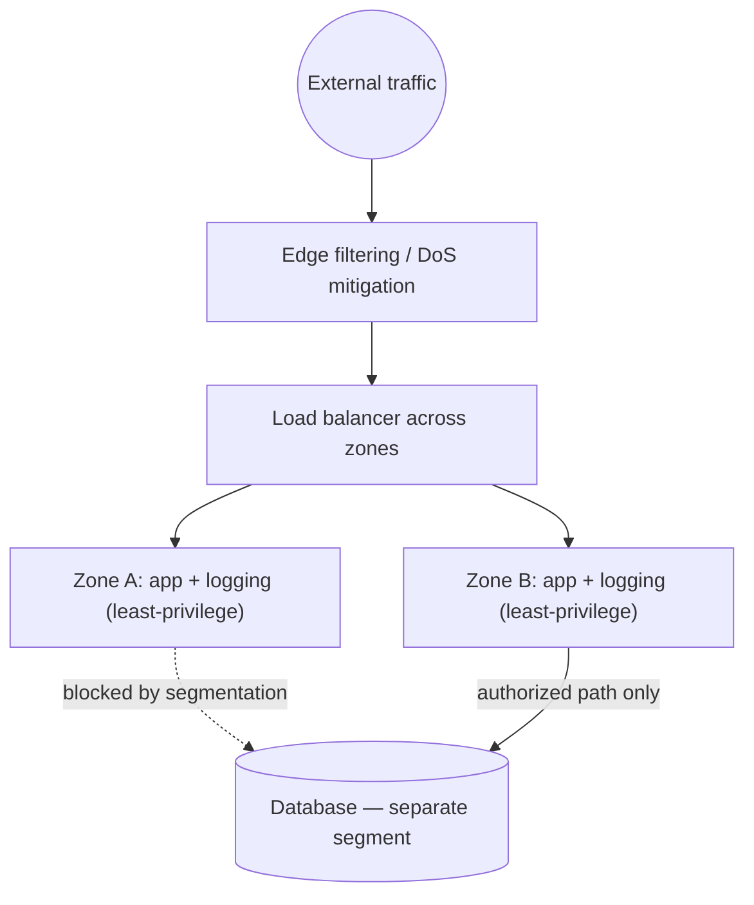

# Security and Resilience Are Architectural

**Part:** Part VI — Networks in Production

**Concept Level:** Level 9, per concept-graph.md

**Prerequisites:** Stateful firewalls (Ch. 16), administrative boundaries and failure domains (Ch. 5), redundancy intuition from replication (Ch. 22)

**New concepts introduced:** attack surface, segmentation, least privilege, zero trust, denial of service, redundancy, failure domain, failover, graceful degradation

---

## Opening Question

*How can a network remain reachable, secure, and resilient under failure or attack?*

## Real-World Story

A city trying to become genuinely safe doesn't build one enormous wall around its entire perimeter and stop there. A single wall, however tall, has exactly one property worth trusting: whether it's currently breached or not. Once anyone gets past it — a legitimate visitor, a delivery worker, an intruder who found one gap — they have unrestricted access to literally everything inside, because nothing beyond the wall was designed to check anyone twice.

A genuinely secure, resilient city instead has controlled doors on individual buildings, verified identity checks at points that actually matter, multiple alternate roads so one closure doesn't strand the whole city, backup emergency capacity, and — crucially — an explicit plan for what happens when something inevitably fails, because pretending failure won't happen is not the same as preventing it. No single one of these is "the" security measure. Security and resilience are the *combined property* of many independent, individually modest measures working together, not any single perimeter, however strong.

Network security modeled as one firewall at the edge makes exactly the wall's mistake: once past that one edge, unrestricted internal access follows. Real network security and resilience, like the city's, are architectural properties distributed across many independent mechanisms — not any single control point.

## Worked Example

Redesign a public API's architecture against three separate threats: an entire availability zone failing, an internal compromise attempting to move laterally through the system, and a sudden, massive traffic flood.

**Surviving a zone failure.** If every replica of the API and its database lives in one physical facility, that facility's failure — power outage, a physical incident, a botched maintenance operation — takes the entire service down at once, because every replica shares the same **failure domain**. Spreading replicas across multiple genuinely independent zones (Chapter 5's failure-domain boundaries, applied at a larger scale) means one zone's failure leaves the others still serving traffic, with **failover** — automatically redirecting traffic away from the failed zone — completing the resilience.

**Containing lateral movement.** Suppose an attacker compromises one low-privilege internal service — a logging component, say, with no legitimate reason to ever talk to the customer database directly. If the network's internal traffic is unrestricted once inside the perimeter, that compromised service can simply reach the database anyway, because nothing enforced otherwise. **Segmentation** — dividing the internal network into smaller zones with policy actually controlling what can reach what — combined with **least privilege** — granting each component only the specific access it genuinely needs, nothing more — means the compromised logging service, however thoroughly compromised, still cannot reach the database, because no rule ever permitted that path in the first place.

**Absorbing a traffic flood.** A **denial of service** attempt — traffic deliberately sent to overwhelm a service's capacity — doesn't have to be handled as complete success or complete failure. Redundancy and load-balancing infrastructure (Chapter 22) can absorb some of the flood, upstream filtering can drop clearly illegitimate traffic before it ever reaches the application, and — for whatever load genuinely gets through — the system can practice **graceful degradation**: deliberately shedding lower-priority functionality (recommendations, non-critical analytics) to keep the core function (actually serving the primary request) working, rather than everything failing together as one undifferentiated collapse.

## Core Intuition

Security and resilience aren't things a network *has*, gained from one sufficiently strong control point — they're properties that *emerge* from many independent, deliberately layered mechanisms, each limiting what a single failure or compromise can actually reach or accomplish. A system designed this way degrades gracefully and contains damage when any one part fails; a system relying on one perimeter or one strong point fails completely the moment that single point does.

## Technical Explanation

**Attack surface** is the total set of points where an unauthorized actor could attempt to interact with a system — every open port, exposed service, and reachable internal path counts, which is why segmentation and least privilege (below) work partly by shrinking this surface directly, not just by adding detection after the fact.

**Segmentation** divides a network into smaller zones with real policy — not just addressing — enforcing what traffic is permitted to cross between them, building directly on Chapter 5's administrative boundaries and Chapter 16's stateful firewalls, but applied deliberately *inside* a network's perimeter, not just at its edge. **Least privilege** is the principle of granting each component, service, or user only the specific access genuinely required for its function, and no more — the reason the compromised logging service in the worked example couldn't reach the database wasn't luck, it was the direct consequence of that access never having been granted.

**Zero trust** combines these into an explicit design philosophy: network location — being "inside" the perimeter — is deliberately treated as insufficient evidence of trustworthiness on its own, and access is instead verified based on identity, policy, and context for each request, regardless of where it originates. This is not the same as trusting nobody or blocking everything, a common overcorrection; it's replacing "trusted because internal" with "verified because checked," which can still grant broad, smooth access to anything actually authorized.

A **denial of service (DoS)** attempt aims to exhaust a system's capacity — bandwidth, connection state, processing time — so it can no longer serve legitimate requests; a **distributed** denial of service (DDoS) does this from many sources simultaneously, which is precisely why the worked example's flood-absorption strategy layers several defenses (filtering, redundancy, degradation) rather than relying on any single one to fully stop it.

**Redundancy** means maintaining more capacity or more independent copies than the minimum strictly required for normal operation, so that some can be lost without total failure — but redundancy only actually delivers resilience if the redundant components sit in genuinely independent **failure domains** (Chapter 5): redundant servers that all depend on the same single power feed aren't independently redundant against a power failure, no matter how many of them there are. **Failover** is the mechanism that actually acts on redundancy during a failure — automatically detecting a failed component and redirecting traffic to a healthy one — and needs to be an actively exercised, tested capability, not merely a theoretical possibility nobody has verified actually works.

**Graceful degradation** is a system deliberately shedding lower-priority work under stress to protect its core function, rather than treating "working perfectly" and "completely failed" as the only two possible states — a resilience strategy that acknowledges overload can happen and plans specifically for it, rather than assuming enough capacity will always prevent it.

*Alt text: A flowchart showing external traffic passing through edge filtering and a load balancer spanning two independent zones; one zone's logging component is explicitly blocked by segmentation from reaching the database, while the application component's authorized path to the database remains open — illustrating least privilege enforced by network segmentation rather than trust based on being "inside."*

## Packet-Journey Checkpoint

The café laptop's HTTPS request to `example.net` in Chapter 20 likely crosses at least one segmentation boundary and DoS-mitigation layer before reaching the actual article service, entirely invisibly to the laptop itself — none of this changes what the laptop experiences on a normal request, but it's precisely what keeps that same request working reliably when the service is simultaneously under attack or partial failure elsewhere.

## Common Misconceptions

### *A private network is trusted by definition*

**Why it's wrong:** "Inside the perimeter" has historically been treated as the definition of safe.

**Correct intuition:** Zero-trust principles treat network location as insufficient evidence of trust; access still requires verification, precisely because a compromised internal component (like the worked example's logging service) is already "inside" by definition.

**Analogy:** Controlled doors, not one wall (Chapter 28) — a city doesn't grant unrestricted access to every building just because someone made it past the outer gate.

### *Zero trust means trusting nobody or blocking everything*

**Why it's wrong:** "Zero" sounds like it should mean an absolute, universal denial.

**Correct intuition:** Zero trust replaces "trusted because internal" with "verified because checked" — legitimate, authorized access is still granted smoothly, just based on actual verification rather than network location alone.

**Analogy:** A building's controlled door still lets in everyone with a valid badge — it just checks the badge instead of assuming everyone past the front gate belongs everywhere.

### *A firewall is a complete security architecture*

**Why it's wrong:** A firewall is often the most visible, actively configured security control, making it feel like the primary defense.

**Correct intuition:** A firewall is one component among many (segmentation, least privilege, zero trust, redundancy) — relying on it alone repeats the single-wall mistake this chapter opens with.

**Analogy:** One wall around a city's perimeter, however tall, is not the same as a genuinely secure city.

### *Redundancy automatically creates resilience*

**Why it's wrong:** Simply having multiple copies of something intuitively feels protective.

**Correct intuition:** Redundancy only helps if failure domains are genuinely independent and failover is actually exercised — redundant components sharing one underlying failure domain (like one power feed) can all fail together despite appearing redundant.

**Analogy:** Several alternate roads all built through the same single bridge aren't actually alternate at all if that bridge closes.

### *Encryption prevents denial-of-service attacks*

**Why it's wrong:** Since encryption (Chapter 18) is the go-to answer for "how do we secure this," it can feel like it should cover attacks generally.

**Correct intuition:** Encryption protects confidentiality and integrity of content; it does nothing to stop an attacker from simply sending enough traffic, encrypted or not, to exhaust a system's capacity — DoS mitigation requires entirely separate mechanisms.

**Analogy:** A sealed, tamper-evident envelope's contents being unreadable doesn't stop someone from burying a mailroom under an overwhelming volume of envelopes.

## Practical Implications

When evaluating a system's security claims, ask what's actually enforced at each internal boundary, not just at the edge — "we have a firewall" says little about lateral movement containment. When evaluating resilience claims, ask specifically whether redundant components share any underlying failure domain, and whether failover has actually been tested under real failure conditions rather than assumed to work.

## Key Takeaway

**Secure, resilient networking comes from limiting trust, constraining blast radius, verifying access, and designing for components to fail.**

## What to Remember

- Attack surface is every point where unauthorized interaction could be attempted — segmentation and least privilege shrink it directly.
- Segmentation enforces policy between internal zones, not just at the network's outer edge.
- Least privilege grants each component only the access it genuinely needs.
- Zero trust verifies access based on identity and context, not network location alone — it isn't "trust nobody."
- Redundancy only delivers resilience when redundant components sit in genuinely independent failure domains.
- Failover must be an actively tested capability, not an assumed one.
- Graceful degradation sheds lower-priority work under stress to protect a system's core function.

## The Next Obvious Question

*When something breaks, how can we identify the failing layer rather than guess?*

---

**Glossary terms added this chapter:** Attack surface, Segmentation, Least privilege, Zero trust, Denial of service (DoS/DDoS), Redundancy, Failure domain (production sense), Failover, Graceful degradation → append to `/glossary.md`

**Misconceptions logged this chapter:** private-network-trusted-by-default, redundancy-automatic-resilience (both enriched and re-analogized, see `/misconceptions.md`) → append to `/misconceptions.md`

**Concept-graph entries checked off:** attack-surface, segmentation-least-privilege, zero-trust, denial-of-service, redundancy-and-failover, graceful-degradation → update `/concept-graph.yaml`, regenerate `/concept-graph.md`

**Diagrams used this chapter:** topology (segmentation blocking a compromised low-privilege service from reaching the database) → satisfies style-guide.md §4
