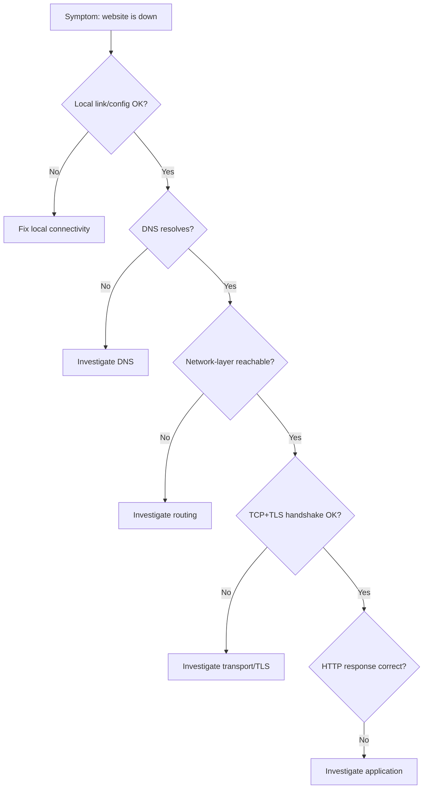

# Seeing and Troubleshooting the Network

**Part:** Part VI — Networks in Production

**Concept Level:** Level 9, per concept-graph.md

**Prerequisites:** ICMP (Ch. 10), TLS handshake (Ch. 18), the full café packet journey (Ch. 20), layered cooperation (Ch. 1)

**New concepts introduced:** symptom, hypothesis, scope, active probe, passive observation, logs, metrics, traces, packet capture, systematic troubleshooting method

---

## Opening Question

*When something breaks, how can we identify the failing layer rather than guess?*

## Real-World Story

A patient arrives describing one vague symptom: persistent fatigue. A poor diagnostic approach would be to guess at random treatments — try this medication, then that one, see what sticks — hoping something happens to work without ever understanding why. A competent doctor instead works through a **differential diagnosis**: starting from the vague symptom, forming a specific, testable hypothesis about one possible cause, ordering the smallest test that could confirm or rule out that specific hypothesis, and using the result to narrow toward the next, more specific hypothesis — anemia, a thyroid condition, a sleep disorder, each ruled in or out by a targeted test, not by guesswork or by running every conceivable test at once.

"The website is down" is a networking version of "I'm tired": true, real, and almost useless on its own for actually finding the cause, because dozens of genuinely different failures — from a broken local Wi-Fi connection all the way to a misconfigured origin server thousands of miles away — can produce that exact same vague symptom. Randomly restarting services, changing configuration, or trying fixes without a specific hypothesis about which layer has actually failed is exactly the ineffective medicine practiced by trial and error, and this book's entire cumulative model exists in part to make the disciplined alternative possible.

## Worked Example

Investigate "the website is down," narrowing through the same layers this book built, chapter by chapter, from Chapter 1 through Chapter 20 — turning one vague symptom into a specific, targeted sequence of small tests.

**Local link and configuration (Chapters 2-7).** Is the device actually connected to a network at all? Does it have a valid IP address, gateway, and DNS resolver configured? A quick check of the device's own network status answers this specific hypothesis in seconds, before considering anything further away.

**Name resolution (Chapter 17).** Does the hostname actually resolve to an IP address? A tool like `dig` or `nslookup` tests exactly this hypothesis, in isolation from every later step — if resolution itself fails, nothing downstream even has a chance to succeed, and there's no point yet testing routing, TLS, or the application.

**Routing and reachability (Chapters 8-11).** Assuming a destination address was obtained, is that address actually reachable at the network layer? A basic reachability probe tests specifically this — success here rules out a whole category of failures (routing, physical connectivity) without yet touching anything above the network layer.

**Transport and encryption (Chapters 12-15, 18).** Can a TCP connection actually be established to the right port, and does a TLS handshake complete successfully? A tool that attempts exactly this connection, nothing more, isolates transport- and security-layer failures from anything happening above them.

**Application response (Chapter 19).** Finally, does the actual HTTP exchange succeed, and does the server return the expected status code and content? This is the very last hypothesis to test, deliberately — testing it first, before ruling out everything beneath it, risks misattributing a lower-layer failure to "the application" simply because that's the most visible symptom.

Five hypotheses, five small, targeted tests, each ruling an entire category of causes in or out — instead of one vague symptom and a guess.

## Core Intuition

Effective troubleshooting isn't about knowing more commands; it's about converting one vague symptom into a specific, ordered sequence of hypotheses, each testable with the smallest possible piece of evidence, narrowing systematically from the lowest layer outward (or in whichever order actually rules out the most possibilities fastest) rather than guessing at fixes or testing everything simultaneously.

## Technical Explanation

A **symptom** is the vague, user-visible observation that triggers an investigation ("the website is down") — genuinely important as a starting point, but rarely specific enough to point directly at a cause. A **hypothesis** is a specific, falsifiable claim about where the failure actually lives ("DNS resolution for this hostname is failing"), narrow enough that one small, targeted test can meaningfully confirm or rule it out. **Scope** is the deliberate boundary of what a given hypothesis and test are actually checking — keeping a test narrowly scoped (testing name resolution alone, without also touching routing or the application) is precisely what makes its result actually informative about *which* layer failed.

Two broad categories of evidence support hypothesis testing. **Active probes** are deliberately generated test traffic sent specifically to check something — an echo request testing reachability, a deliberate connection attempt testing whether a port is actually listening — that wouldn't have happened without someone or something explicitly triggering it. **Passive observation** examines evidence already being produced by normal operation without generating any new traffic: **logs** (records of discrete events, like a request being received or an error occurring), **metrics** (aggregated numerical measurements over time, like request rate or error percentage), and **traces** (records connecting the individual steps of one specific request as it moved through multiple systems, letting an investigator follow one particular request's full journey rather than only seeing aggregate patterns).

**Packet capture** is a more detailed, lower-level form of passive (or sometimes deliberately triggered) observation: recording the actual frames and packets crossing a specific point on the network, letting an investigator inspect real header fields, timing, and — for unencrypted traffic — payload content directly, though TLS (Chapter 18) means most modern application payload captured this way is unreadable ciphertext, limiting what a capture alone can reveal about encrypted exchanges.

The **systematic troubleshooting method** this chapter's worked example demonstrates combines these: start from the vague symptom, form the most useful next hypothesis (often, but not rigidly, working from lower layers toward higher ones, since a lower-layer failure explains and masks everything above it), choose the smallest test — active probe or passive observation — that can confirm or rule out that specific hypothesis, and repeat, narrowing the remaining possibility space with each result, until the actual failing layer and mechanism are identified with real evidence rather than assumed.

*Alt text: A decision-tree flowchart starting from the vague symptom "website is down," testing five hypotheses in order from local connectivity through DNS, network reachability, transport/TLS, and finally the application layer — each "no" answer identifies a specific failing layer, while each "yes" narrows the search further up the stack.*

## Packet-Journey Checkpoint

If the café laptop's request to `example.net` from Chapter 20 had failed at any point, this chapter's method is precisely how to find where: confirm Wi-Fi association and local configuration first (Chapters 4, 7), then DNS resolution (Chapter 17), then reachability to the resolved address (Chapters 9-11), then the TCP and TLS handshakes (Chapters 14, 18), and only then the HTTP exchange itself (Chapter 19) — the same full journey traced in Chapter 20, now walked deliberately backward from a failure rather than forward from success.

## Common Misconceptions

### *A successful `ping` proves an application is healthy*

**Why it's wrong:** `ping`'s reachability check is often the first (and sometimes only) troubleshooting step people reach for, and a successful reply feels reassuring.

**Correct intuition:** `ping` only tests ICMP reachability at the network layer (Chapter 10) — it says nothing about whether transport, TLS, or the application itself is actually working correctly, all of which sit at layers a ping never touches.

**Analogy:** Medical differential diagnosis (Chapter 29) — confirming a patient has a pulse doesn't rule out every other possible condition.

### *A failed `ping` proves a host is unreachable*

**Why it's wrong:** A failed reachability check feels like it should mean the destination genuinely can't be reached at all.

**Correct intuition:** ICMP may be deliberately filtered or rate-limited by firewalls (Chapter 16) independently of whether the host and its actual applications are reachable — a failed ping can be entirely consistent with a perfectly healthy, reachable web server.

**Analogy:** A doctor's office not answering its main phone line doesn't prove the office is closed — it may simply not accept calls on that specific line.

### *`traceroute` reveals the exact forward and return path*

**Why it's wrong:** A tool that lists a sequence of hops feels like it should show the complete, exact round-trip route.

**Correct intuition:** Real paths can be asymmetric — the return path can differ entirely from the forward path — and load balancing across multiple equivalent routes can make repeated traceroute runs show different hops for the same destination.

**Analogy:** Watching one specific delivery truck's route out doesn't tell you the driver takes the identical route back.

### *Packet capture always shows plaintext application data*

**Why it's wrong:** Packet capture is often introduced as the tool that shows "exactly what's on the wire," which sounds maximally revealing.

**Correct intuition:** TLS-protected traffic (the overwhelming majority of modern Web traffic, per Chapter 18) appears as encrypted ciphertext in a capture — headers and metadata below the encryption boundary remain visible, but application payload generally does not, without separately available decryption keys.

**Analogy:** Watching a sealed, addressed envelope travel through a mail system shows exactly where and when it moved, without revealing a single word of its contents.

### *Restarting components is a diagnosis*

**Why it's wrong:** Restarting something and having the symptom disappear feels like it resolved the problem.

**Correct intuition:** A restart can clear a symptom's immediate effect (a stuck process, exhausted memory) without ever identifying — or fixing — the actual underlying cause, which can simply recur.

**Analogy:** Medical differential diagnosis — a fever-reducing medication can make a patient feel better temporarily without treating whatever infection is actually causing the fever.

## Practical Implications

When investigating a real outage, resist testing the application layer first just because it's the most visible symptom — ruling out lower layers first (or whichever order most efficiently narrows the possibility space) prevents wasted effort on the wrong hypothesis. When someone reports "the network is broken," ask for the specific symptom and scope before reaching for any tool — a targeted hypothesis is worth more than a burst of unfocused activity.

## Key Takeaway

**Effective troubleshooting turns a vague symptom into layer-specific hypotheses and gathers the smallest piece of evidence that can eliminate each one.**

## What to Remember

- A vague symptom needs to become a specific, testable hypothesis before it's genuinely actionable.
- Scope keeps a test narrow enough that its result actually identifies which layer failed.
- Active probes generate deliberate test traffic; passive observation examines evidence already being produced.
- Logs, metrics, and traces are three distinct kinds of passive evidence, suited to different questions.
- Packet capture shows real traffic, but TLS encryption hides application payload from it.
- `ping` and `traceroute` each test a narrow, specific thing — not overall application health or the exact path.
- Systematic troubleshooting narrows a vague symptom to a specific layer through small, targeted, ordered tests.

## The Next Obvious Question

*How can this mental model be used to understand whatever networking system comes next?*

---

**Glossary terms added this chapter:** Symptom, Hypothesis (troubleshooting), Scope (troubleshooting), Active probe, Passive observation, Logs, Metrics, Traces, Packet capture, Systematic troubleshooting method → append to `/glossary.md`

**Misconceptions logged this chapter:** ping-success-proves-app-healthy, ping-failure-proves-host-down (both enriched, see `/misconceptions.md`) → append to `/misconceptions.md`

**Concept-graph entries checked off:** hypothesis-driven-troubleshooting, active-passive-observation, logs-metrics-traces, packet-capture, systematic-troubleshooting-method → update `/concept-graph.yaml`, regenerate `/concept-graph.md`

**Diagrams used this chapter:** state-snapshot (decision-tree of layer-by-layer hypotheses narrowing "website is down") → satisfies style-guide.md §4
